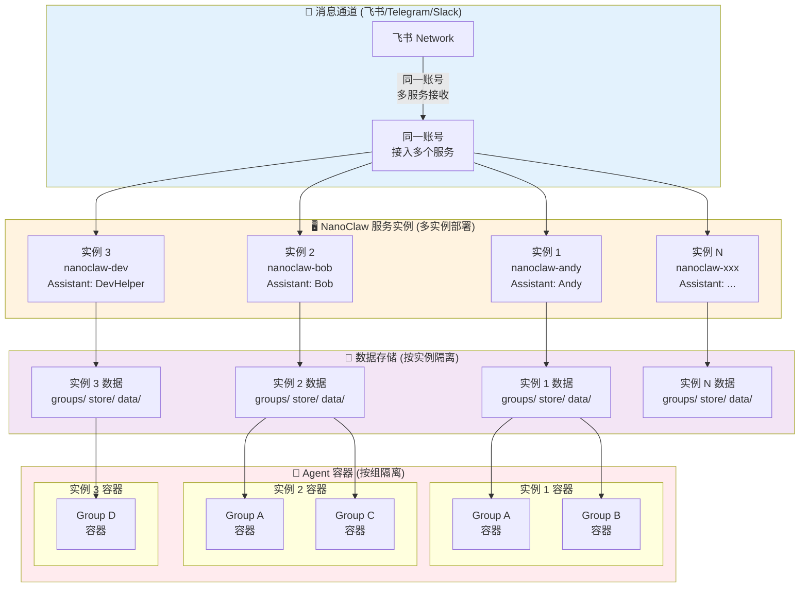
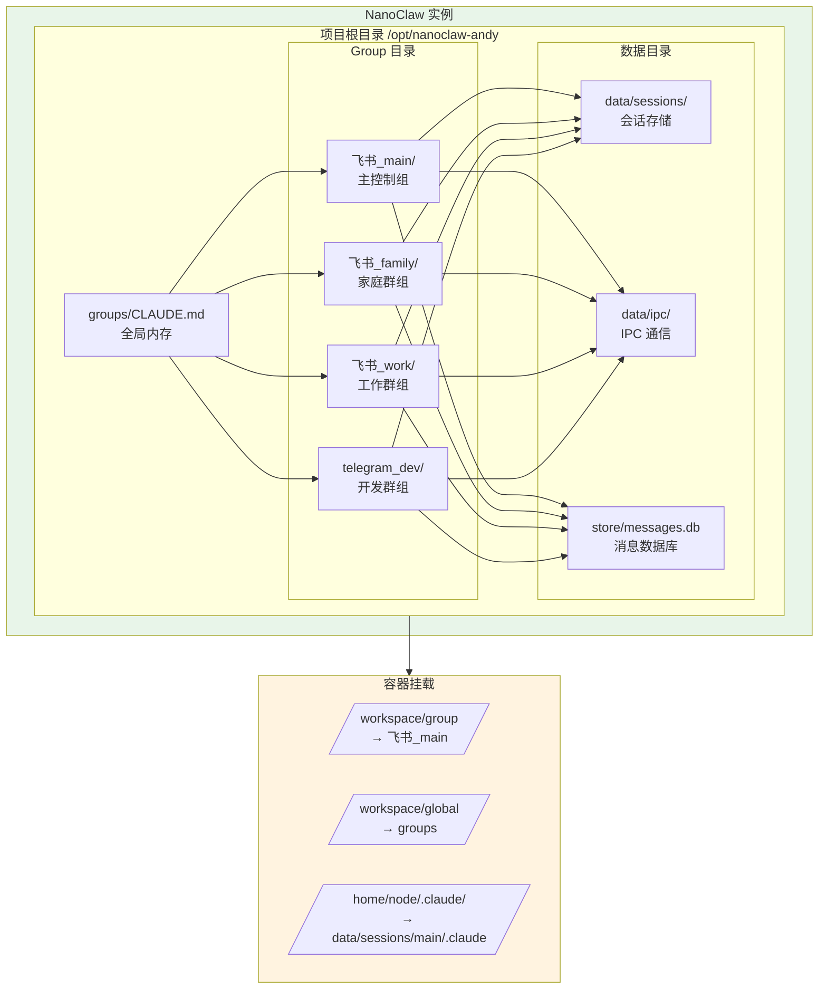
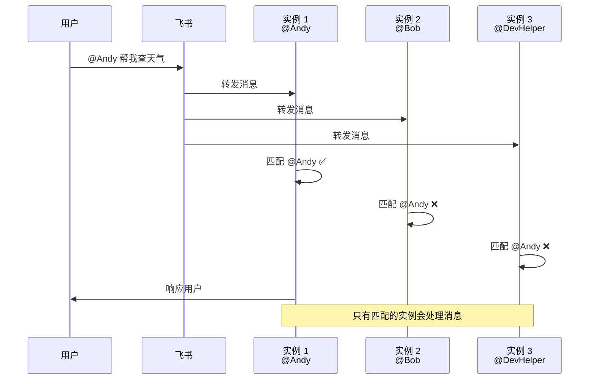
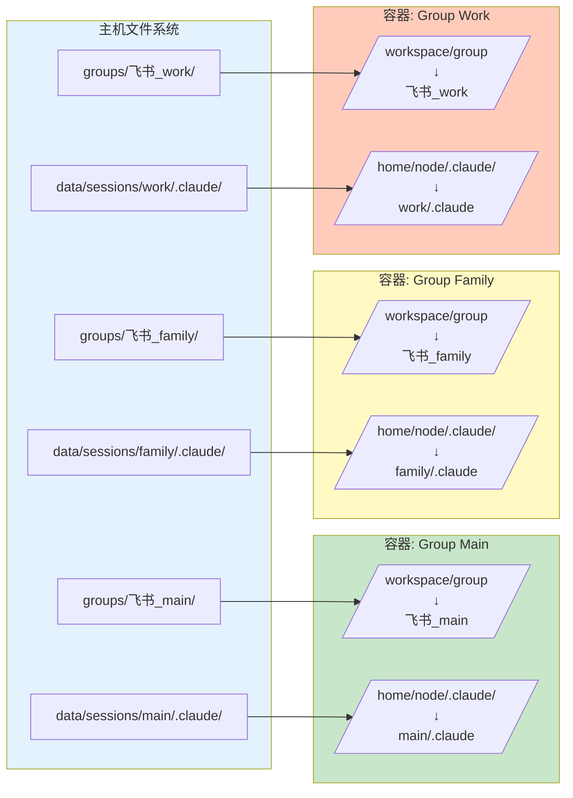

# NanoClaw 多 Agent 架构与数据隔离

展示 NanoClaw 如何通过多服务实例实现多 Agent 接入，以及通过目录挂载实现数据隔离的设计。

---

## 多实例部署架构



---

## 设计说明

### 1. 多 Agent 接入策略

**问题：** 如何让同一个 飞书 账号服务多个不同的 Agent？

**解决方案：** 部署多个 NanoClaw 实例，每个实例对应一个 Agent

| 实例 | Assistant Name | 触发词 | 用途 |
|------|---------------|--------|------|
| `nanoclaw-andy` | Andy | `@Andy` | 通用助手 |
| `nanoclaw-bob` | Bob | `@Bob` | 技术助手 |
| `nanoclaw-dev` | DevHelper | `@DevHelper` | 开发助手 |

**优势：**
- ✅ 无需修改 gateway 代码
- ✅ 每个实例独立运行、独立配置
- ✅ 故障隔离（一个实例崩溃不影响其他）
- ✅ 易于扩展和维护

**实现方式：**
```bash
# 实例 1 - Andy
cd /opt/nanoclaw-andy
ASSISTANT_NAME=Andy npm start

# 实例 2 - Bob
cd /opt/nanoclaw-bob
ASSISTANT_NAME=Bob npm start

# 实例 3 - DevHelper
cd /opt/nanoclaw-dev
ASSISTANT_NAME=DevHelper npm start
```

---

### 2. Group 数据隔离

**隔离层次：**



**隔离机制：**

| 隔离维度 | 实现方式 | 说明 |
|---------|---------|------|
| **实例级隔离** | 独立项目目录 | 每个 nanoclaw 实例有独立的 `groups/`、`data/`、`store/` |
| **组级隔离** | 独立 group 目录 | `groups/{channel}_{group-name}/` |
| **会话隔离** | 独立 session 目录 | `data/sessions/{group}/.claude/` |
| **容器隔离** | 独立挂载点 | 每个容器只挂载自己的 group 目录 |

---

### 3. 消息路由与触发词匹配



**触发词配置：**
```typescript
// 实例 1: Andy
export const ASSISTANT_NAME = 'Andy';
export const TRIGGER_PATTERN = new RegExp(`^@Andy\\b`, 'i');

// 实例 2: Bob
export const ASSISTANT_NAME = 'Bob';
export const TRIGGER_PATTERN = new RegExp(`^@Bob\\b`, 'i');

// 实例 3: DevHelper
export const ASSISTANT_NAME = 'DevHelper';
export const TRIGGER_PATTERN = new RegExp(`^@DevHelper\\b`, 'i');
```

---

### 4. 容器挂载隔离

**每个 Group 的容器挂载配置：**



**挂载规则：**

| 主机路径 | 容器路径 | 访问权限 | 说明 |
|---------|---------|---------|------|
| `groups/飞书_main/` | `/workspace/group` | 读写 | 当前组的目录 |
| `groups/CLAUDE.md` | `/workspace/global` | 只读 | 全局内存 |
| `data/sessions/main/.claude/` | `/home/node/.claude/` | 读写 | 会话数据 |
| `data/env/env` | `/workspace/env-dir/env` | 只读 | 环境变量 |

**隔离保证：**
- ✅ Group A 的容器无法访问 Group B 的文件
- ✅ 不同实例的数据完全隔离
- ✅ 容器崩溃或被攻击不影响其他组
- ✅ 资源限制可按组配置

---

## 部署示例

### 场景：部署 3 个不同 Agent

```bash
# 1. 安装三个实例
git clone https://github.com/your-repo/nanoclaw.git /opt/nanoclaw-andy
git clone https://github.com/your-repo/nanoclaw.git /opt/nanoclaw-bob
git clone https://github.com/your-repo/nanoclaw.git /opt/nanoclaw-dev

# 2. 配置不同的 Assistant Name
# /opt/nanoclaw-andy/.env
ASSISTANT_NAME=Andy
CLAUDE_CODE_OAUTH_TOKEN=sk-ant-oat01-xxx

# /opt/nanoclaw-bob/.env
ASSISTANT_NAME=Bob
CLAUDE_CODE_OAUTH_TOKEN=sk-ant-oat01-yyy

# /opt/nanoclaw-dev/.env
ASSISTANT_NAME=DevHelper
CLAUDE_CODE_OAUTH_TOKEN=sk-ant-oat01-zzz

# 3. 共享 飞书 认证
# 所有实例使用相同的 飞书 session
cp /opt/nanoclaw-andy/store/auth/* /opt/nanoclaw-bob/store/auth/
cp /opt/nanoclaw-andy/store/auth/* /opt/nanoclaw-dev/store/auth/

# 4. 启动服务
cd /opt/nanoclaw-andy && npm start &
cd /opt/nanoclaw-bob && npm start &
cd /opt/nanoclaw-dev && npm start &

# 5. 配置服务管理 (systemd)
sudo systemctl enable nanoclaw-andy
sudo systemctl enable nanoclaw-bob
sudo systemctl enable nanoclaw-dev
sudo systemctl start nanoclaw-andy nanoclaw-bob nanoclaw-dev
```

---

## 数据隔离总结

### 隔离边界

```
┌─────────────────────────────────────────────────────────────┐
│  物理隔离层：独立 NanoClaw 实例                              │
│  ┌─────────────┐  ┌─────────────┐  ┌─────────────┐         │
│  │ Instance 1  │  │ Instance 2  │  │ Instance 3  │         │
│  │ @Andy       │  │ @Bob        │  │ @DevHelper  │         │
│  └─────────────┘  └─────────────┘  └─────────────┘         │
└─────────────────────────────────────────────────────────────┘
         ↓                   ↓                   ↓
┌─────────────┐    ┌─────────────┐    ┌─────────────┐
│ 目录隔离层  │    │ 目录隔离层  │    │ 目录隔离层  │
│ groups/     │    │ groups/     │    │ groups/     │
│ ├─ main/    │    │ ├─ main/    │    │ ├─ main/    │
│ ├─ family/  │    │ ├─ team/    │    │ ├─ dev/     │
│ └─ work/    │    │ └─ project/ │    │ └─ support/ │
└─────────────┘    └─────────────┘    └─────────────┘
         ↓                   ↓                   ↓
┌─────────────┐    ┌─────────────┐    ┌─────────────┐
│ 容器隔离层  │    │ 容器隔离层  │    │ 容器隔离层  │
│ Docker 挂载 │    │ Docker 挂载 │    │ Docker 挂载 │
│ 独立挂载点  │    │ 独立挂载点  │    │ 独立挂载点  │
└─────────────┘    └─────────────┘    └─────────────┘
```

### 隔离保证

| 隔离类型 | 实现方式 | 保护内容 |
|---------|---------|---------|
| **实例隔离** | 独立进程、独立目录 | 不同 Agent 的配置、数据、运行状态 |
| **组隔离** | 独立 group 目录 | 不同用户/群组的对话历史、文件、记忆 |
| **会话隔离** | 独立 session 目录 | Claude 会话上下文、对话历史 |
| **容器隔离** | 独立容器、独立挂载 | 运行时环境、文件系统访问、进程空间 |

---

**文档版本:** 1.0
**最后更新:** 2025-03-23
**相关文档:** [SYSTEM_LAYERS.md](SYSTEM_LAYERS.md) | [ARCHITECTURE.md](ARCHITECTURE.md)
