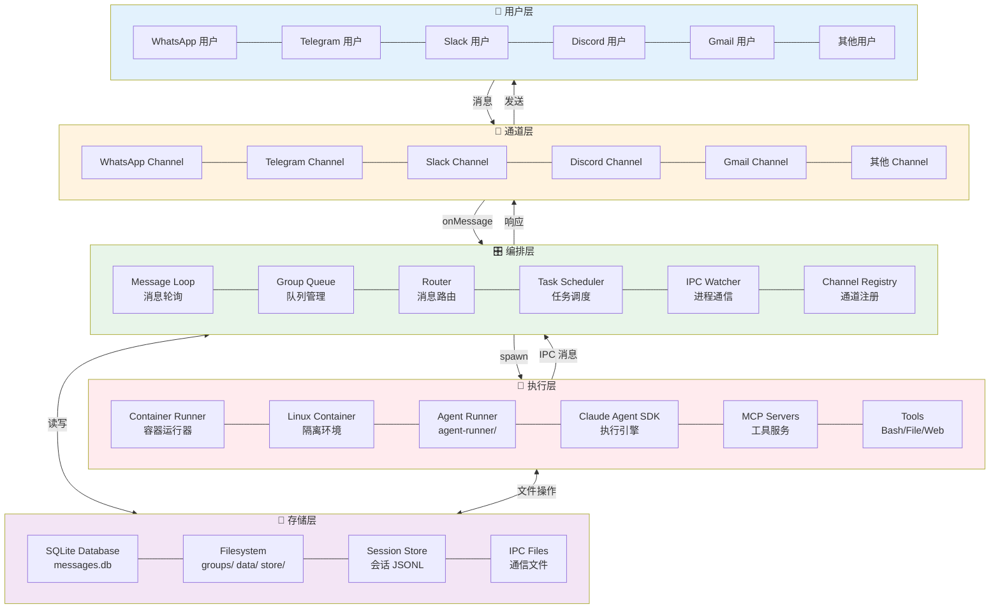

# NanoClaw 系统分层视图

简化的系统架构分层视图，展示各层包含的组件。

---

## 系统分层视图



---

## 层次说明

### 📍 用户层 (User Layer)
**包含:** 各个消息通道的终端用户
- WhatsApp 用户
- Telegram 用户
- Slack 用户
- Discord 用户
- Gmail 用户
- 其他通道用户

**职责:** 通过各自的消息应用发送和接收消息

---

### 🔌 通道层 (Channel Layer)
**包含:** 各消息通道的实现
- WhatsApp Channel (Baileys)
- Telegram Channel (Bot API)
- Slack Channel (Web API + Socket Mode)
- Discord Channel (Bot API)
- Gmail Channel (Gmail API)
- 其他扩展通道

**职责:**
- 连接消息服务
- 接收用户消息并存入数据库
- 发送响应消息到用户
- 自注册到 Channel Registry

---

### 🎛️ 编排层 (Orchestrator Layer)
**包含:** Host 进程中的核心组件

| 组件 | 文件 | 职责 |
|------|------|------|
| Message Loop | `src/index.ts` | 每 2 秒轮询数据库，处理未处理消息 |
| Group Queue | `src/group-queue.ts` | 按组管理消息队列，控制并发 |
| Router | `src/router.ts` | 消息验证、对话追赶、Agent 调用 |
| Task Scheduler | `src/task-scheduler.ts` | 每 60 秒检查到期任务 |
| IPC Watcher | `src/ipc.ts` | 监听容器 IPC 消息和任务 |
| Channel Registry | `src/channels/registry.ts` | 管理已注册的通道工厂 |

**职责:**
- 协调消息流
- 管理容器生命周期
- 调度定时任务
- 路由消息到正确的组

---

### 💾 存储层 (Storage Layer)
**包含:** 持久化存储组件

| 组件 | 位置 | 内容 |
|------|------|------|
| SQLite Database | `store/messages.db` | 消息、聊天、任务、会话、路由状态 |
| Filesystem | `groups/` | 全局内存、组内存、日志、用户文件 |
| Session Store | `data/sessions/{group}/.claude/` | 会话 JSONL 文件 |
| IPC Files | `data/ipc/` | 容器与主机通信文件 |

**职责:**
- 持久化所有消息和状态
- 存储会话历史
- 保存用户记忆和文件

---

### 🐳 执行层 (Execution Layer)
**包含:** 容器化的 Agent 执行环境

| 组件 | 位置 | 职责 |
|------|------|------|
| Container Runner | `src/container-runner.ts` | 创建和管理容器 |
| Linux Container | Docker/Podman/Apple Container | 隔离的 Linux 环境 |
| Agent Runner | `container/agent-runner/` | 容器内查询循环和 IPC |
| Claude Agent SDK | `@anthropic-ai/claude-agent-sdk` | Agent 执行引擎 |
| MCP Servers | 动态加载 | nanoclaw（调度器）、其他扩展 |
| Tools | 内置 + MCP | Bash、文件操作、Web、浏览器等 |

**职责:**
- 在隔离环境中运行 Agent
- 提供工具和能力
- 通过 IPC 与主机通信

---

## 层间交互流程

```
用户发送消息
    ↓
通道层接收并存入 SQLite
    ↓
编排层轮询发现新消息
    ↓
编排层查询存储层获取上下文
    ↓
编排层启动执行层容器
    ↓
执行层 Agent 处理并使用工具
    ↓
执行层通过 IPC 返回响应
    ↓
编排层通过通道层发送响应
    ↓
用户接收响应
```

---

## 技术栈总结

| 层级 | 技术 |
|------|------|
| 用户层 | WhatsApp、Telegram、Slack、Discord、Gmail 等应用 |
| 通道层 | Baileys、node-telegram-bot-api、@slack/web-api 等 |
| 编排层 | Node.js 20+、TypeScript、better-sqlite3、Pino |
| 存储层 | SQLite、文件系统 |
| 执行层 | Docker/Podman、Claude Agent SDK、MCP |

---

**文档版本:** 1.0
**最后更新:** 2025-03-23
**相关文档:** [SPEC.md](SPEC.md) | [ARCHITECTURE.md](ARCHITECTURE.md)
