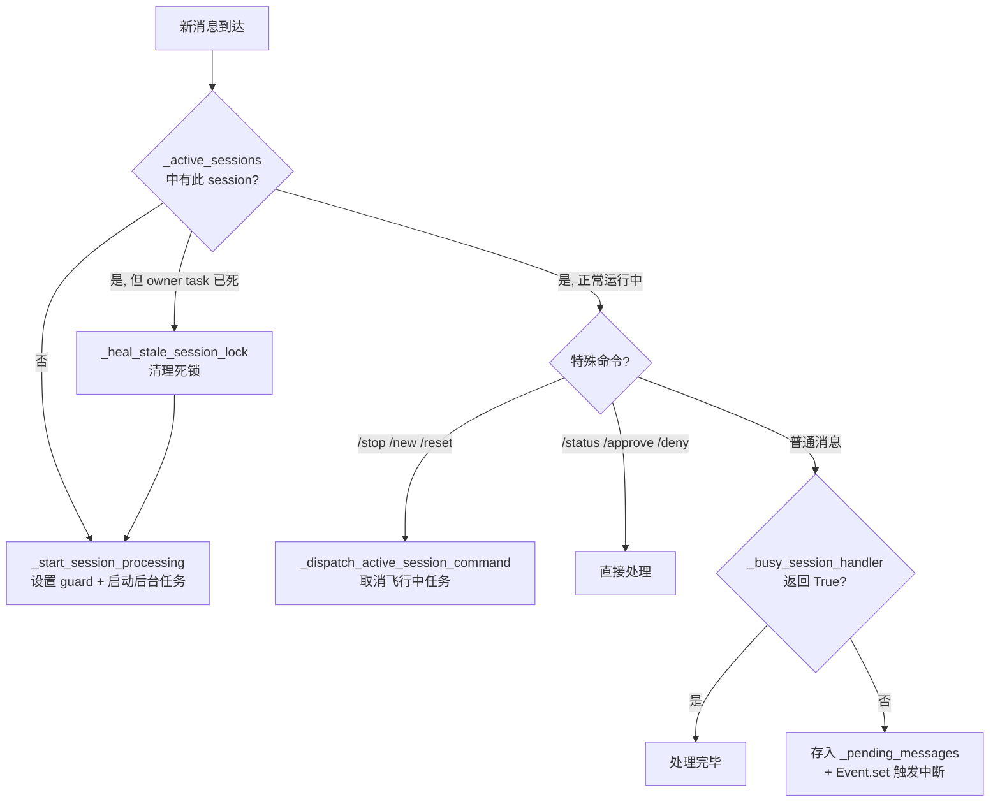
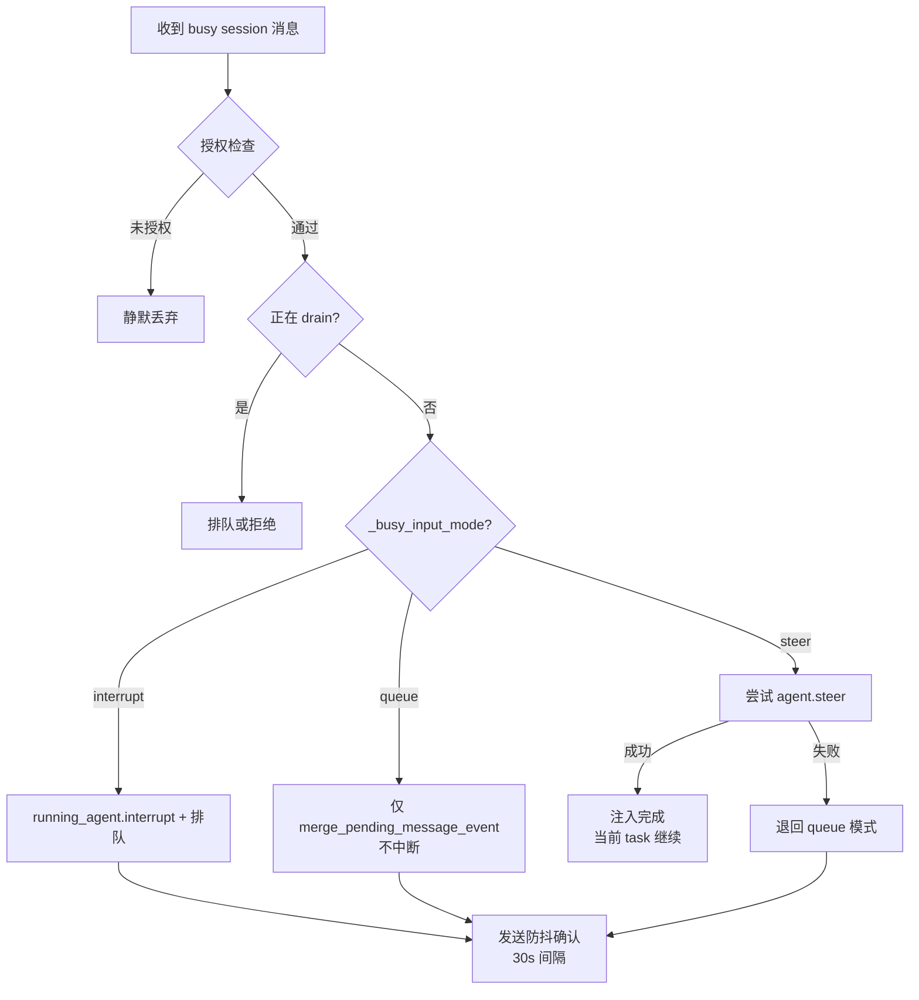
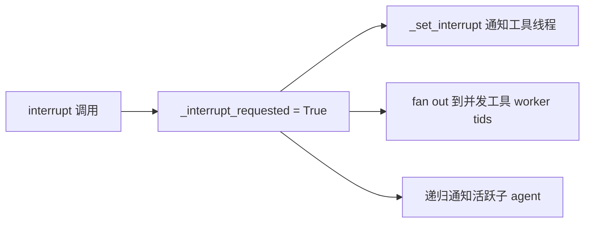
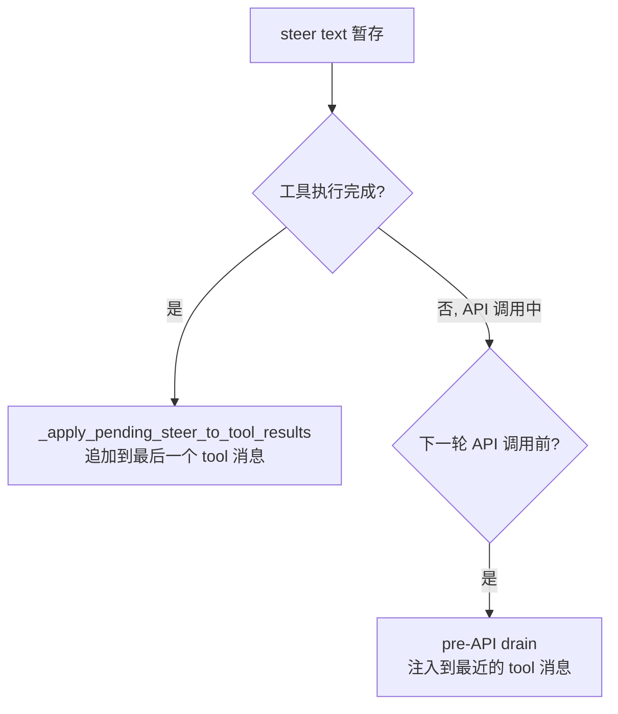
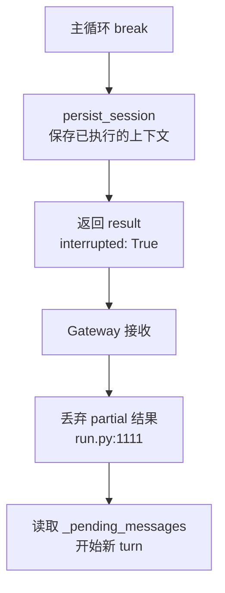
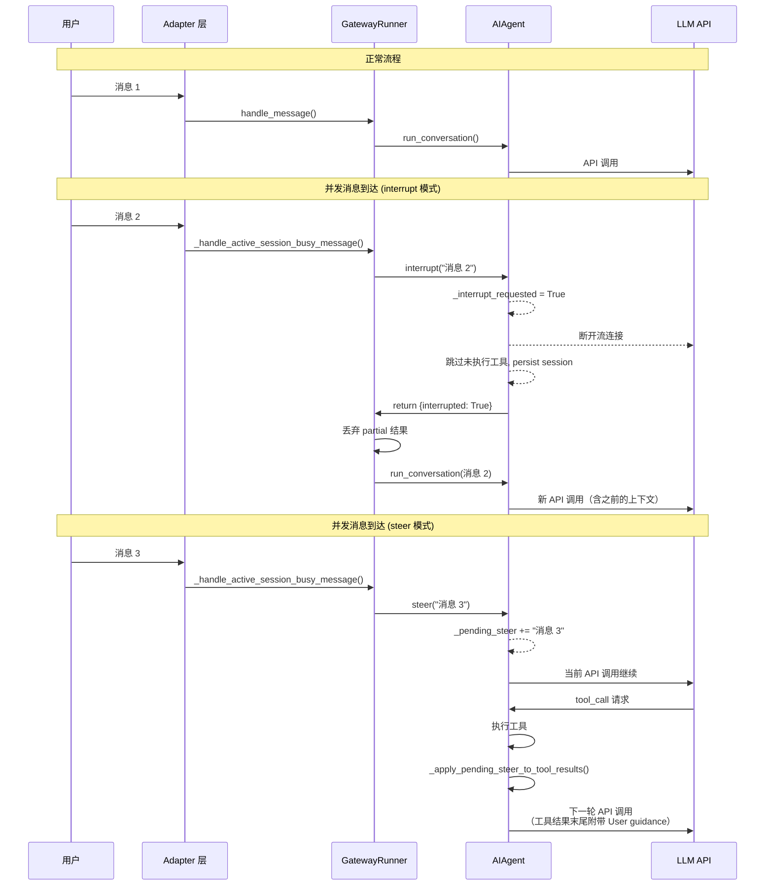

# Hermes Agent 并发消息处理机制

分析 Hermes Agent 在正在执行任务过程中收到新消息时的处理逻辑，包括中断、排队、引导注入三种模式。

---

## 三种处理模式

由 `display.busy_input_mode` 配置（`gateway/run.py:1154`），也可通过环境变量 `HERMES_GATEWAY_BUSY_INPUT_MODE` 设置：

| 模式 | 行为 | task 是否继续 |
|------|------|:---:|
| **interrupt**（默认） | 立即中断当前运行，处理新消息 | **丢弃** |
| **queue** | 不中断，新消息排队等待下一轮 | 继续 |
| **steer** | 注入文本到当前运行中途，不中断 | 继续 |

---

## 系统架构总览

```mermaid
graph TD
    subgraph L1["Adapter 层 (base.py)"]
        A1[_active_sessions<br/>Session 互斥锁] --- A2[_pending_messages<br/>排队消息槽] --- A3[_session_tasks<br/>后台任务追踪] --- A4[_heal_stale_session_lock<br/>死锁自愈]
    end

    subgraph L2["GatewayRunner 层 (run.py)"]
        B1[_running_agents<br/>Agent 实例表] --- B2[_AGENT_PENDING_SENTINEL<br/>异步间隙哨兵] --- B3[_session_run_generation<br/>代际校验] --- B4[_busy_input_mode<br/>模式分发]
    end

    subgraph L3["AIAgent 层 (run_agent.py)"]
        C1[interrupt()<br/>中断标志] --- C2[steer()<br/>注入暂存] --- C3[主循环检查点<br/>~20 处] --- C4[工具线程<br/>中断传播]
    end

    L1 -->|set_busy_session_handler| L2
    L2 -->|agent.interrupt/steer| L3
```

---

## Layer 1: Adapter 层 — Session 互斥锁

**文件:** `gateway/platforms/base.py`

### 核心数据结构

| 字段 | 类型 | 用途 |
|------|------|------|
| `_active_sessions` | `Dict[str, asyncio.Event]` | Session 级互斥锁，每个活跃 session 一个 Event |
| `_pending_messages` | `Dict[str, MessageEvent]` | 排队中的跟进消息 |
| `_session_tasks` | `Dict[str, asyncio.Task]` | 追踪每个 session 的后台任务 |

### 消息入口: `handle_message()` (`base.py:2660`)



### Stale Lock 自愈 (`_heal_stale_session_lock`, `base.py:2458`)

当 `_active_sessions` 中有条目但对应的 `_session_tasks` 已完成或取消时（split-brain），自动清理死锁条目。

```python
def _heal_stale_session_lock(self, session_key: str) -> bool:
    task = self._session_tasks.get(session_key)
    if task is not None and not task.done():
        return False  # Task is still alive, no healing needed
    # Clean up stale entries
    self._active_sessions.pop(session_key, None)
    self._pending_messages.pop(session_key, None)
    self._session_tasks.pop(session_key, None)
    return True
```

### 后台任务链 (`_process_message_background`, `base.py:2803`)

每个 session 在 adapter 层有一个后台任务链。消息处理完成后检查 `_pending_messages`：

```python
if session_key in self._pending_messages:
    pending_event = self._pending_messages.pop(session_key)
    # 不退锁（保留 _active_sessions 条目），spawn 新任务
    drain_task = asyncio.create_task(
        self._process_message_background(pending_event, session_key)
    )
```

不退锁的原因：若先删锁再创建任务，并发消息可能趁虚而入 spawn 重复 agent。

---

## Layer 2: GatewayRunner 层 — 模式分发

**文件:** `gateway/run.py`

### 核心数据结构

| 字段 | 类型 | 用途 |
|------|------|------|
| `_running_agents` | `Dict[str, AIAgent]` | 当前运行的 agent 实例 |
| `_AGENT_PENDING_SENTINEL` | `object` | 哨兵对象，agent 创建前占位 |
| `_running_agents_ts` | `Dict[str, float]` | Agent 启动时间戳 |
| `_pending_messages` | `Dict[str, str]` | 文本排队消息 |
| `_queued_events` | `Dict[str, List]` | `/queue` 命令的 FIFO 溢出表 |
| `_session_run_generation` | `Dict[str, int]` | 单调递增的 turn token |

### 哨兵机制 (`_AGENT_PENDING_SENTINEL`, `run.py:671`)

```python
# 在 await 之前设置哨兵，防止异步间隙竞态
self._running_agents[_quick_key] = _AGENT_PENDING_SENTINEL
self._running_agents_ts[_quick_key] = time.time()
# ... 然后才 await 创建 agent
```

如果新消息到达时发现 `_running_agents[key] is _AGENT_PENDING_SENTINEL`（agent 尚未就绪），消息直接排队。

### 模式分派 (`_handle_active_session_busy_message`, `run.py:2466`)



### Run Generation 代际校验 (`run.py:13060`)

每次顶层 gateway turn 分配单调递增 token，`/stop`/`/new` 会 invalidate 旧 generation：

```python
def _begin_session_run_generation(self, session_key):
    self._session_run_generation[session_key] = \
        self._session_run_generation.get(session_key, 0) + 1

def _invalidate_session_run_generation(self, session_key):
    self._session_run_generation[session_key] = \
        self._session_run_generation.get(session_key, 0) + 1
```

旧 run 的结果在修改状态前检查 `_is_session_run_current()`，防止过期结果污染新 session。

### Staleness 驱逐 (`run.py:5448`)

使用 `HERMES_AGENT_TIMEOUT`（默认 1800s）和 `agent.get_activity_summary()` 检测 hung/crashed agent，超时的 agent 条目被 `_release_running_agent_state()` 清除。

---

## Layer 3: AIAgent 层 — 中断与注入

**文件:** `run_agent.py`

### interrupt()  (`run_agent.py:4796`)



- 设置 `_interrupt_requested = True`
- `_set_interrupt(True, execution_thread_id)` 信号工具终止
- Fan out 到 `_tool_worker_threads` 中的每个 worker tid
- 递归传播到 `_active_children` 中的所有子 agent

### steer() (`run_agent.py:4897`)

```python
def steer(self, text: str) -> bool:
    # 仅暂存文本到 _pending_steer，不设任何中断标志
    with self._pending_steer_lock:
        if self._pending_steer:
            self._pending_steer += "\n" + text  # 多次 steer 拼接
        else:
            self._pending_steer = text
```

**不设 `_interrupt_requested`，不干扰任何正在执行的操作。**

### Steer 注入的两个消费点



注入格式：
```
User guidance: {steer 文本}
```

追加到 `role: "tool"` 消息的 content 末尾，保持 role alternation 不变。

### ~20 个中断检查点

| 阶段 | 位置 | 行为 |
|------|------|------|
| Streaming API 前 | `:6346, :7219` | 抛 `InterruptedError` |
| Streaming 接收中 | `:6353, :7392, :7598` | `break` 终止流 |
| 非 Streaming API 中 | `:7016` | 强制关闭 HTTP 连接 + 抛异常 |
| Bedrock stream | `:7286, :7295` | 轮询检查 + 抛异常 |
| Stream retry 前 | `:7644` | 抛 `InterruptedError` |
| 工具执行前（并发） | `:10048` | 跳过所有工具，填 skip 占位 |
| 工具执行中（并发） | `:10288` | Cancel 未启动的 future |
| 工具注册竞态窗口 | `:10183` | 为 worker tid 补设中断信号 |
| 工具执行前（串行） | `:10445` | 跳过剩余工具 |
| 工具执行后（串行） | `:10844` | 跳过剩余工具 |
| 主循环顶部 | `:11504` | `interrupted=True` + `break` |
| 错误处理中 | `:13092` | 终止重试 |
| 重试等待中 | `:12171, :13681` | 200ms 轮询 + 终止 |

### 中断后流程



关键代码（`gateway/run.py:1111`）：
```python
if api_calls > 0 and not agent_result.get("interrupted"):
    # 只有非中断的空响应才报 warning
    return "⚠️ Processing completed but no response was generated..."
# 中断情况: 直接 fallthrough，处理新消息
```

---

## 完整消息生命周期



---

## 排队与 FIFO 体系

### 默认文本排队

文本消息合并到 `_pending_messages[session_key]`，换行拼接：

```python
# merge_pending_message_event (base.py:1079)
existing_text + "\n" + new_text
```

### /queue 命令 FIFO

`/queue` 语义：每次调用产生独立 turn，不合并。

```
_pending_messages[session_key]  ← 队头（单槽）
_queued_events[session_key]     ← 溢出表（FIFO list）
```

消费顺序：队头 → 溢出表逐一出队晋升到队头 → 继续

### 图片跟进

图片消息（PHOTO 类型）合并 media_urls 和 media_types，不触发中断。

### Telegram 跟进宽限期

`HERMES_TELEGRAM_FOLLOWUP_GRACE_SECONDS`（默认 3s）内的文本消息自动排队不中断，用于防止 Telegram 分批发送导致的误中断。

---

## 特殊命令绕过

以下命令在 agent busy 时直接处理，不走 interrupt/queue：

| 命令 | 行为 |
|------|------|
| `/stop` | `_interrupt_and_clear_session()` 硬终止 + 释放锁 |
| `/new`, `/reset` | 中断当前 task + 清空队列 + 开新 session |
| `/status` | 返回 `agent.get_activity_summary()` |
| `/approve`, `/deny` | 路由到审批处理器 |
| `/steer <text>` | `agent.steer()` 注入 |
| `/background`, `/help`, `/commands` | 直接返回信息，不中断 |

---

## 三种模式选择建议

| 场景 | 推荐模式 |
|------|----------|
| 交互式对话（用户期望即时响应） | `interrupt`（默认） |
| 长任务不希望被打断（批量处理） | `queue` |
| 用户想在任务中途给引导（纠正方向） | `steer` |
