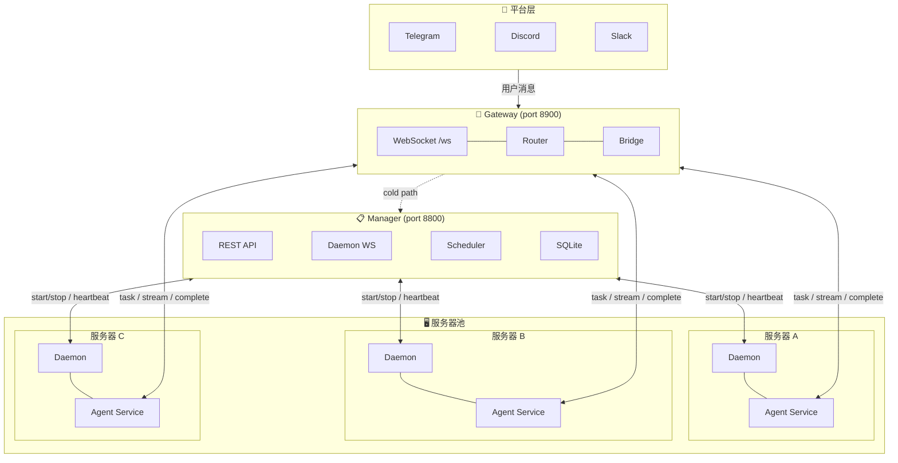

# Hermes Distributed — 当前架构

## Intuition

把 Hermes Agent（单进程 CLI 工具）拆成三个独立服务，通过 WebSocket 实时通信。类似把「一个人干所有活」拆成「前台接单 + 后台干活 + 经理调度」，支持多服务器横向扩展。

## 核心结构



## 通信链路

三条独立链路，全部 JSON over WebSocket：

| # | 方向 | 协议 | 端口 | 用途 |
|---|------|------|------|------|
| 1 | Agent Service ↔ Gateway | WebSocket | 8900/ws | task dispatch, response, stream, approval, interrupt |
| 2 | Gateway → Manager | REST | 8800 | 创建/销毁 agent, 查询状态, disconnect |
| 3 | Daemon → Manager | WebSocket | 8800/ws | 注册, heartbeat, start/stop agent, 日志上报 |

## 消息协议

全部定义在 `gateway/message_types.py`，每个消息是 dataclass + `to_dict()/from_dict()`：

**Link 1: Gateway ↔ Agent Service（11 种）**

| 类型 | 方向 | 关键字段 |
|------|------|---------|
| `hello` | Agent → Gateway | group_id, profile, model, toolsets, capabilities |
| `task` | Gateway → Agent | group_id, message, sender, media, reply_to |
| `stream` | Agent → Gateway | group_id, token（增量文本） |
| `progress` | Agent → Gateway | group_id, tool, preview, emoji |
| `complete` | Agent → Gateway | group_id, final_response, api_calls, tokens, cost_usd |
| `error` | Agent → Gateway | group_id, message, fatal |
| `approval_request` | Agent → Gateway | group_id, request_id, command, reason |
| `approved` | Gateway → Agent | group_id, request_id |
| `denied` | Gateway → Agent | group_id, request_id, reason |
| `interrupt` | Gateway → Agent | group_id |
| `heartbeat` | 双向 | （无额外字段） |
| `session_restore` | Gateway → Agent | group_id, history, session_id |

**Link 3: Daemon → Manager（7 种）**

| 类型 | 方向 | 关键字段 |
|------|------|---------|
| `register` | Daemon → Manager | server_id, hostname, cpu_cores, mem_total_gb |
| `heartbeat` | Daemon → Manager | running_agents[], mem_used_gb, cpu_percent |
| `agent_started` | Daemon → Manager | group_id, pid, status |
| `agent_stopped` | Daemon → Manager | group_id, pid, exit_code, reason |
| `log` | Daemon → Manager | group_id, pid, stream, line |
| `start_agent` | Manager → Daemon | group_id, profile, gateway_url, hermes_home |
| `stop_agent` | Manager → Daemon | group_id, force |

## 关键设计决策

### Cold Path（无 Agent 在线时的创建流程）

```
平台消息 → Gateway 收到 task → Router 无对应 agent
    → ManagerClient.create_agent(group_id)
    → Manager: select_best_server() (选择负载最低的服务器)
    → Manager: send start_agent to daemon WebSocket
    → daemon: subprocess.Popen(agent_service.py)
    → Agent: WebSocket connect → send hello
    → Gateway: 注册 agent → dispatch queued task
```

### group_id 统一标识

所有消息通过 `group_id` 路由。格式：`{platform}:{type}:{id}`

- `telegram:group:1001234567890`（群聊）
- `discord:channel:1234567890`

### Hermes Plugin 集成（零改动原则）

Agent Service 有两种运行方式：

1. **独立脚本**：`python -m agent.agent_service --gateway-url ws://...`（Phase 1）
2. **Hermes 插件**：`hermes gateway` + plugin（Phase 3）

插件 monkey-patch `GatewayRunner._create_adapter()`，当 config 中有 `hermes_distributed_gateway_url` 时注入 `InternalWSAdapter`。使用 `Platform.WEBHOOK` 枚举值（不能改 Hermes 代码）。

### Session 持久化与恢复

- Agent 每次 complete 后，Gateway 通过 Manager REST 保存 session history 到 SQLite
- Agent 重连时，Gateway 自动从 Manager 加载 history，发送 `session_restore` 消息
- 支持跨服务器恢复（新 Agent 实例从共享 DB 读取历史）

### Idle Reclaim（空闲回收）

Manager scheduler 每 60s 扫描：
1. **Health check**：daemon heartbeat 超过 90s → 标记 server lost → 所有 agent 标记 lost
2. **Idle reclaim**：agent last_active 超过 30min → 发送 stop_agent 给 daemon → daemon SIGTERM 子进程

### Approval Gate（审批门）

Agent 执行危险命令时，thread → asyncio 跨线程桥接：

```
Agent thread → call_soon_threadsafe(stream_queue.put, approval_request_dict)
Gateway sender task → ws.send_json(approval_request)
用户批准 → Gateway ws.send_json(approved)
Agent loop → ws.receive → call_soon_threadsafe(gate.approve)
Agent thread → asyncio.run(gate.request) resolves
```

## 项目文件结构

```
hermes-distributed/
├── gateway/
│   ├── adapters/              # Phase 4: 平台适配器
│   │   ├── base.py            # PlatformAdapter 接口 + resolve_group_id
│   │   ├── mock.py            # 测试用 MockAdapter
│   │   └── telegram.py        # Telegram 适配器（python-telegram-bot）
│   ├── manager_client.py       # Phase 2: Gateway → Manager REST 客户端
│   ├── message_types.py       # 所有协议消息类型（15+ dataclasses）
│   ├── config.py              # GatewayConfig（含 manager_url）
│   ├── router.py              # group_id → agent_ws 路由 + cold path
│   ├── bridge.py              # Agent 响应 → 平台适配器分发
│   └── server.py              # aiohttp WebSocket server
├── manager/
│   ├── config.py              # ManagerConfig
│   ├── registry.py            # SQLite: servers, agents, logs, sessions 四表
│   └── server.py              # REST + WebSocket + scheduler + main()
├── agent/
│   ├── agent_service.py       # Phase 1: 独立 Agent Service（import Hermes）
│   ├── daemon.py              # Phase 2: 进程管理器（subprocess + log collection）
│   └── plugin/               # Phase 3: Hermes 插件
│       ├── plugin.yaml        # 插件清单
│       ├── __init__.py        # register(): monkey-patch _create_adapter
│       └── ws_adapter.py     # InternalWSAdapter (BasePlatformAdapter 子类)
├── tests/                    # 16 个测试文件, 176 tests
└── pyproject.toml
```

## SQLite Schema (Manager)

```sql
servers    — server_id(PK), hostname, status, cpu_cores, mem_total_gb, last_heartbeat
agents     — group_id(PK), server_id, pid, status, profile, model, last_active_at
logs       — id(PK), group_id, pid, timestamp, stream, line
sessions   — group_id(PK), session_id, history(JSON), updated_at
```

## 测试概况

| 测试文件 | 数量 | 覆盖 |
|---------|------|------|
| test_message_types.py | 18 | 协议序列化、解析、错误处理 |
| test_router.py | 10 | 注册、dispatch、pending queue |
| test_bridge.py | 10 | stream/complete/error/approval/progress |
| test_agent_service.py | 18 | hello 构建、ApprovalGate、InterruptFlag |
| test_config.py | 7 | 默认值、dict/yaml 加载、profile 映射 |
| test_integration.py | 7 | Gateway WebSocket 端到端 |
| test_manager_messages.py | 14 | daemon/manager 协议消息 |
| test_registry.py | 17 | SQLite CRUD、idle 检测、负载均衡 |
| test_manager_rest.py | 7 | REST API 端点 |
| test_manager_integration.py | 7 | daemon WS + REST 联动 |
| test_gateway_manager.py | 5 | REST 客户端 + cold path |
| test_daemon.py | 6 | 配置构建、ChildRegistry、命令解析 |
| test_ws_adapter.py | 11 | InternalWSAdapter + ApprovalGate |
| test_adapters.py | 20 | 适配器接口 + mock + group_id 解析 |
| test_session.py | 9 | SessionRestoreMessage + 存储恢复 |
| test_full_integration.py | 6 | Manager + daemon 冷路径端到端 |
| test_plugin_integration.py | 4 | 插件加载 + manifest 验证 |

**总计：176 tests, 0 failures**

## 运行命令

```bash
# 全部测试
cd hermes-distributed && PYTHONPATH=. python3 -m pytest tests/ -v

# 单文件
PYTHONPATH=. python3 -m pytest tests/test_router.py -v
```

## Related

* [[Agent Collaboration Patterns]] — 多 Agent 协作模式对比（HiClaw 层级 vs Clawith 对等网）
* [[Multi Agent Isolation]] — NanoClaw 的多实例隔离方案
* [[Group Chat Memory Mechanism]] — OpenClaw 的 session key 隔离机制
* [[Enterprise Agent Service Model]] — Agent 角色 vs 实例的概念模型
* [[Group Isolation Design]] — Hermes 群组隔离与沙箱设计

## Tags

#architecture #distributed-system #hermes
