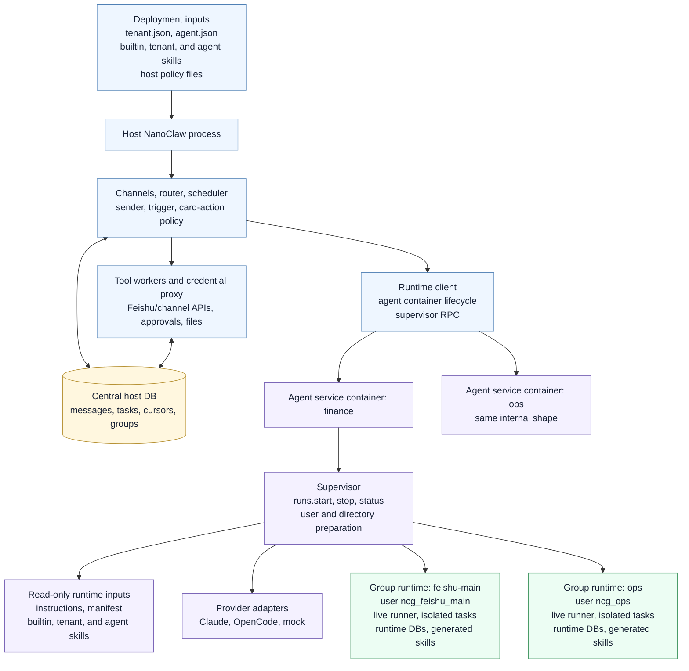
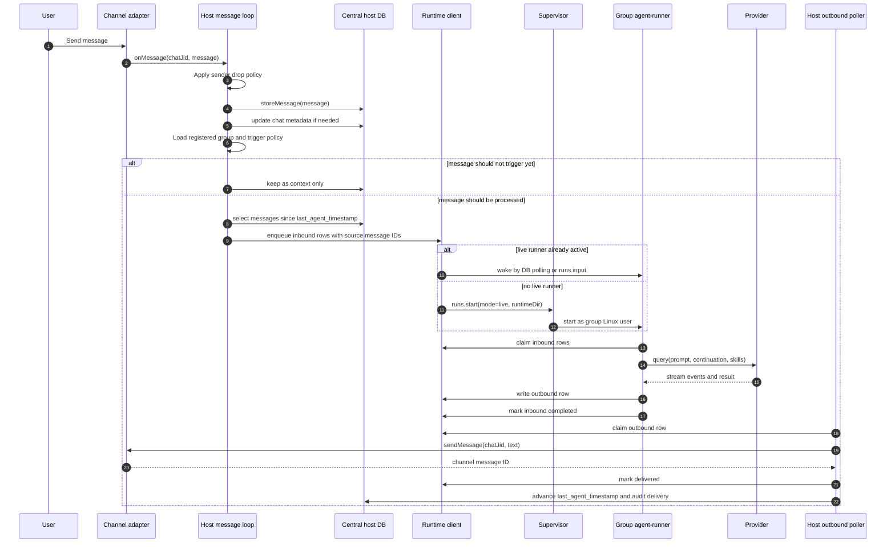
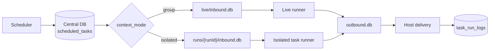
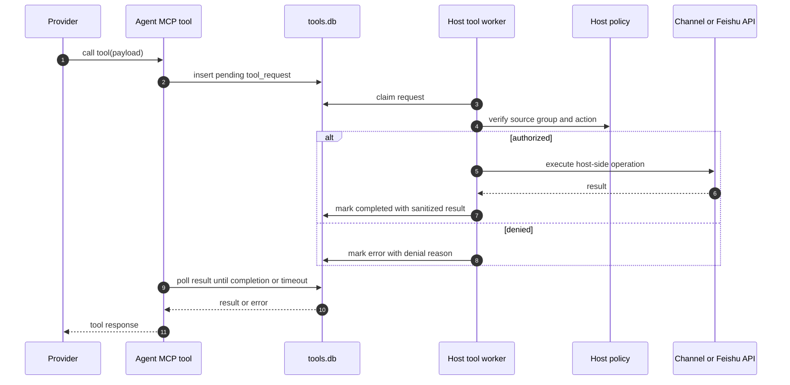
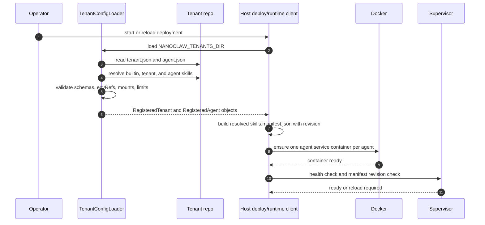
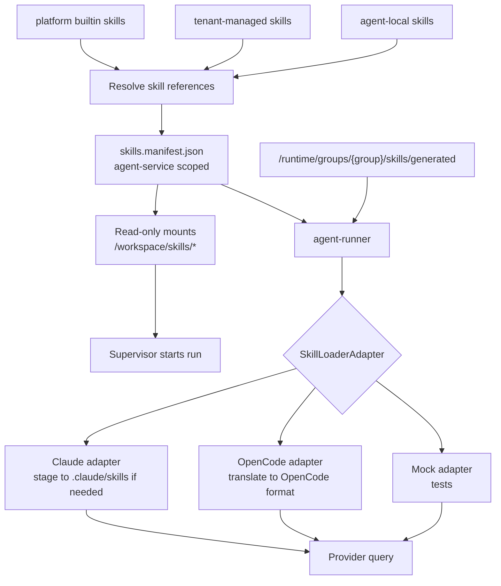
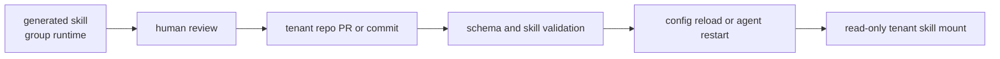

# Target Architecture Details

This document expands the Version 2.0 target architecture. It is the reference
for how the final runtime is wired, how messages move through the system, and
how tenant configuration and skills are deployed, loaded, and used.

## Architecture Overview

Final runtime shape:

- The host NanoClaw process owns channels, routing, policy, central state,
  deployment config loading, tool workers, and runtime control.
- Each agent service gets one Docker container.
- The agent container owns a supervisor and runs one or more group processes.
- Each group process runs as a distinct Linux user inside that agent container.
- Normal messages, tool requests, provider continuation, and control signals use
  DB-backed IPC.
- Tenant and agent skills are mounted read-only. Group-generated skills are
  runtime-local and writable only by that group user.



The overview uses a vertical spine with a few side capabilities. The message,
scheduled task, tool, and skill-loading sections below show the detailed
interactions.

## Component Responsibilities

Host process:

- receives channel events and stores authoritative message history
- applies sender allowlists, trigger rules, card-action routing, and main-group
  privileges
- owns `registered_groups`, task state, router cursors, and channel metadata
- loads tenant and agent config, resolves skill manifests, and starts/updates
  agent service containers
- writes runtime inbound rows and polls runtime outbound rows
- runs host-side tool workers for channel, Feishu, approval, file, and task
  operations
- owns provider and channel credentials, either through a credential proxy or
  scoped per-run tokens

Agent service container:

- runs the supervisor for one configured agent service
- hosts the provider adapter code and agent-runner runtime code
- mounts resolved builtin, tenant, and agent skill roots read-only
- exposes a supervisor socket under `/runtime/supervisor/supervisor.sock`
- creates and manages per-group Linux users
- starts live and isolated task processes with `setpriv`, `gosu`, or `su-exec`
- records process metadata and logs under the agent runtime root

Group process:

- runs as its own Linux user
- reads inbound work from its runtime directory
- invokes the selected provider with the configured skill loader
- writes outbound responses and tool requests to runtime DBs
- writes generated skills only under its group runtime directory
- cannot read another group's runtime DBs or generated skills

## Runtime Units and Data Ownership

Tenant:

- deployment, configuration, and skill-management layer
- may own multiple agent services
- is not a runtime isolation unit

Agent service:

- one Docker service/container
- one provider/model/default limit set
- one resolved readonly skill manifest
- many groups

Group:

- one Linux user inside an agent service container
- one live runtime directory
- zero or more isolated task runtime directories
- group-local generated skills and memory

Run:

- one live or isolated process lifecycle
- one set of runtime DBs
- one provider continuation namespace

## Runtime Directory Layout

Host path:

```text
data/runtime/agents/<agent>/
  supervisor/
    supervisor.sock
    runs.json
  groups/
    <group>/
      live/
        inbound.db
        outbound.db
        state.db
        tools.db
        files/
        downloads/
      runs/
        <runId>/
          inbound.db
          outbound.db
          state.db
          tools.db
          files/
          downloads/
      skills/
        generated/
  logs/
    <group>/
```

Container path:

```text
/runtime/
  supervisor/
  groups/
  logs/
/workspace/
  agent/
    agent.json
    instructions.md
    skills.manifest.json
  skills/
    builtin/
    tenant/<tenant>/
    agent/<agent>/
```

## Normal Message Processing Flow

Normal inbound messages move from channel event to host DB to runtime DB to
provider to outbound runtime DB to channel delivery.



Key rules:

- The host DB remains authoritative for source message history and cursors.
- Runtime inbound rows carry source message IDs for idempotent retry.
- If a run fails before user-visible output is delivered, the host rolls back
  `last_agent_timestamp[chat_jid]`.
- If output was delivered and a later provider error happens, the host does not
  rollback the cursor.
- Active follow-up messages are written as new inbound rows. Providers with push
  support can receive them during the active query; other providers process them
  in the next loop.

## Scheduled Task Flow

Group-context scheduled task:

1. Scheduler reads due tasks from the central host DB.
2. Host formats the task as a synthetic inbound message for the target group.
3. Host uses the same live runtime path as normal messages.
4. The task can use existing live conversation continuation.
5. Task result is delivered through the host outbound poller.

Isolated scheduled task:

1. Scheduler reads due task from the central host DB.
2. Host creates `runs/<runId>/` under the group runtime directory.
3. Host writes the task prompt to that run's `inbound.db`.
4. Supervisor starts an `isolated-task` runner as the same group Linux user.
5. Runner does not read live conversation history or live continuation.
6. Runner exits after result or error.
7. Host records `task_run_logs` and updates `scheduled_tasks`.



## Tool Request Flow

Tools are invoked by provider-visible MCP tools, but host capabilities remain
host-side.



Tool workers validate the source runtime identity rather than trusting group IDs
inside the request payload. File tools return runtime file IDs or container paths
under the run directory, not host paths.

## Tenant Configuration Deployment Flow

Tenant config is deployment input. It is read, validated, normalized, and turned
into an agent service deployment plan.

Recommended source layout:

```text
nanoclaw-tenants/
  tenants/
    acme/
      tenant.json
      skills/
        acme-approval/
          SKILL.md
          manifest.json
      agents/
        finance/
          agent.json
          instructions.md
          skills/
            finance-local/
              SKILL.md
        ops/
          agent.json
          instructions.md
```

Example `agent.json`:

```json
{
  "id": "finance",
  "tenant": "acme",
  "provider": "opencode",
  "model": "anthropic/claude-sonnet-4",
  "instructions": "./instructions.md",
  "skills": [
    "builtin:welcome",
    "tenant:acme-approval",
    "agent:finance-local"
  ],
  "envRefs": ["ANTHROPIC_API_KEY"],
  "limits": {
    "memoryMb": 1024,
    "pids": 256,
    "concurrentTasksPerGroup": 1
  }
}
```

Deployment sequence:



The loader should fail fast for missing skills, duplicate IDs, invalid secret
values, invalid mount scope, or manifest revision mismatch unless the operator
explicitly enables a compatibility mode.

## Skill Deployment and Loading Flow

Resolved skills become read-only inputs to the agent service. Group-generated
skills are appended at run start.



Loading steps:

1. Tenant loader resolves `builtin:`, `tenant:`, and `agent:` references.
2. Host writes or mounts a normalized `skills.manifest.json`.
3. Runtime driver starts or updates the agent service container with read-only
   skill mounts.
4. Supervisor validates the manifest revision before starting a run.
5. Agent-runner reads the manifest and resolves the group generated skill root.
6. Provider-specific `SkillLoaderAdapter` prepares provider-native skill paths.
7. Provider query runs with the prepared skill configuration.

Manifest shape:

```json
{
  "tenant": "acme",
  "agent": "finance",
  "revision": "sha256:...",
  "skills": [
    {
      "id": "welcome",
      "scope": "builtin",
      "containerPath": "/workspace/skills/builtin/welcome",
      "entry": "SKILL.md",
      "readonly": true
    },
    {
      "id": "acme-approval",
      "scope": "tenant",
      "containerPath": "/workspace/skills/tenant/acme/acme-approval",
      "entry": "SKILL.md",
      "readonly": true
    }
  ],
  "generatedSkillRoot": "/runtime/groups/${group}/skills/generated"
}
```

## Skill Authoring and Promotion Flow

Group-generated skill:

1. Group process or reporter/local API writes under
   `/runtime/groups/<group>/skills/generated/<skill>/`.
2. Only that group user and supervisor can read/write it.
3. The skill is visible to future runs for that group.
4. It is not copied into the tenant repository automatically.

Promotion to tenant skill:



Promotion must be explicit so tenant repositories remain the source of truth for
shared business behavior.

## Skill Reload Semantics

Initial implementation:

- restart the affected agent service container when tenant or agent skills
  change
- reject starting new runs if the mounted manifest revision does not match host
  config
- allow existing runs to finish or stop them through supervisor policy

Later optimization:

- supervisor `skills.reload` can update manifests without restarting the
  container, but only if provider adapters can reload safely.

## Failure and Recovery Behavior

Host restart:

- central DB retains messages, tasks, groups, and cursors
- runtime DB rows remain on disk
- host scans pending inbound/outbound rows and central cursor state
- stale supervisor run records are reconciled on reconnect

Agent container restart:

- supervisor starts, reads `runs.json`, and marks stale PIDs exited
- host can restart live group runs as needed
- pending inbound rows remain claimable
- pending outbound rows remain deliverable

Provider failure:

- provider adapter emits structured error
- inbound rows are marked `error` or returned to `pending` according to retry
  policy
- host cursor rollback follows the "output delivered or not" rule

Tool worker failure:

- pending tool rows are retryable until timeout
- claimed rows older than a lease timeout return to pending or become timeout
- denied requests complete with explicit tool errors

## Operational Status View

The final status command should report:

- host process health
- connected channels
- central DB path and cursor summary
- configured tenants and agent services
- agent container health
- supervisor socket health
- active run count per agent and group
- runtime DB queue depths
- per-group user and permission checks
- skill manifest revisions
- legacy file IPC compatibility state
- rollback driver availability

## Final Implementation Checks

- one Docker service exists per agent service, not per group
- group live runs share the agent service container but run as distinct users
- runtime DB files are not world-writable
- tenant and agent skills are read-only in the container
- generated skills are group-local
- normal messages preserve trigger, sender, card action, attachment, and cursor
  semantics
- scheduled task context modes match NanoClaw 1.0 behavior
- tool requests enforce host-side authorization
- provider credentials are not present in group-readable files or DB rows
- OpenCode and Claude both satisfy the same `AgentProvider` event contract
- `docker-per-group` rollback remains selectable
