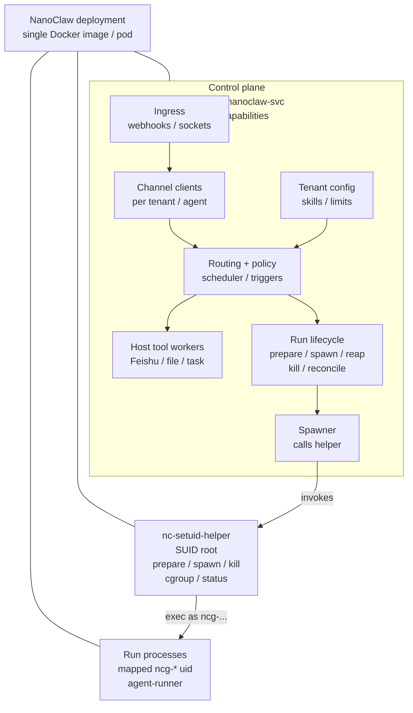
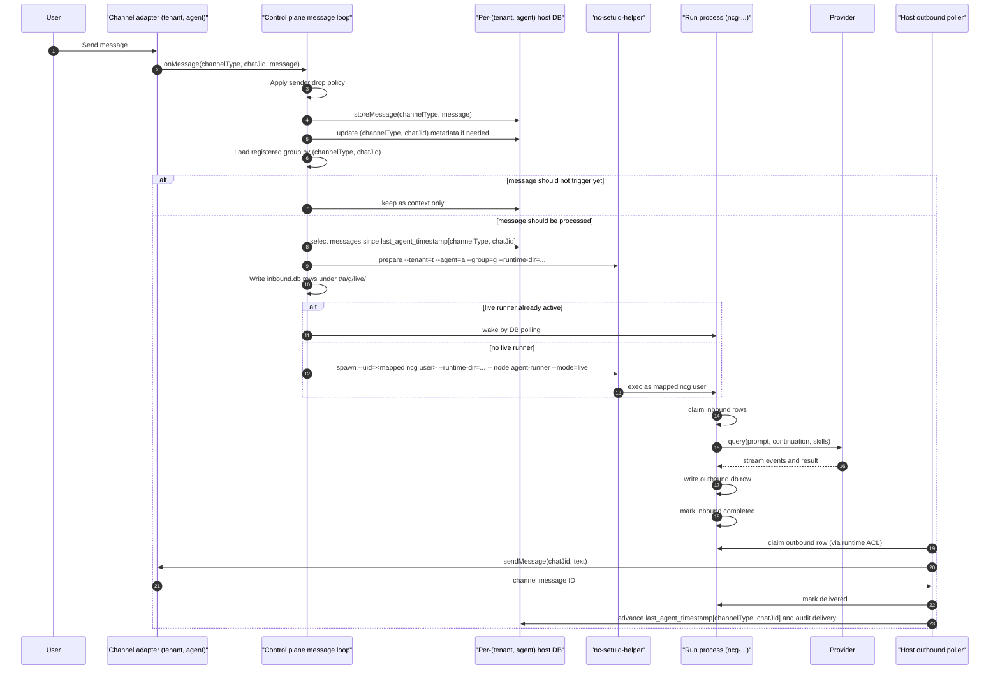
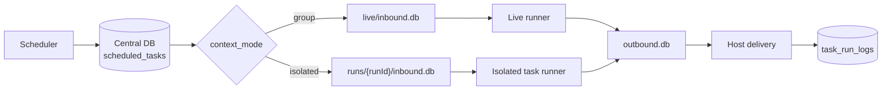
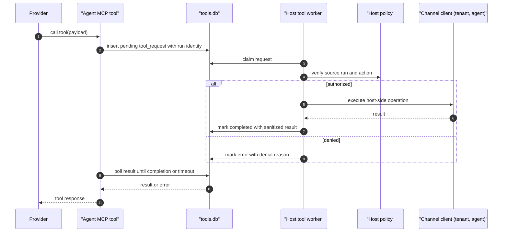
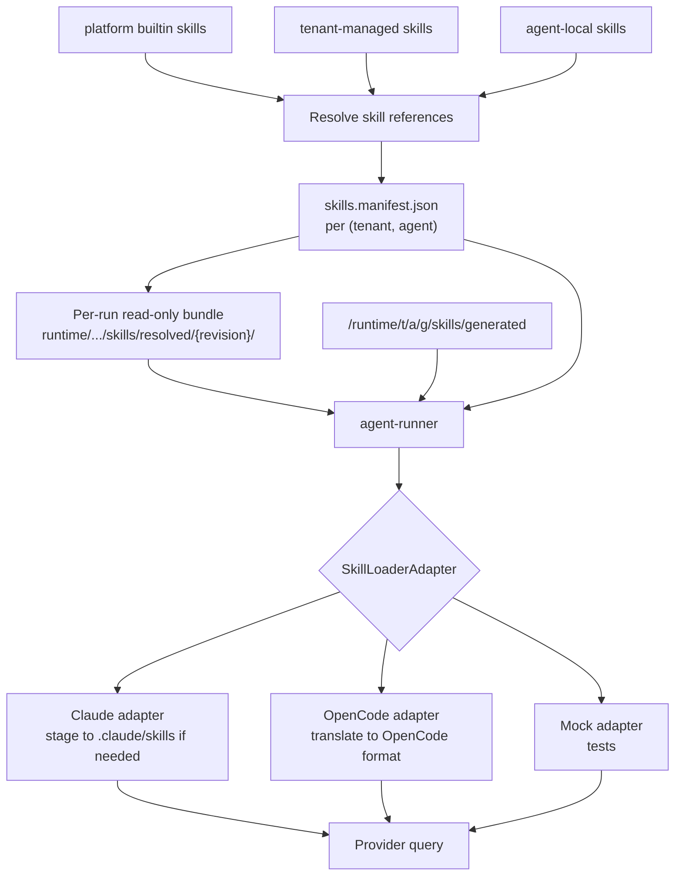
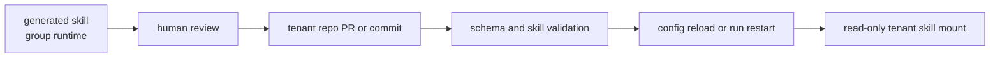

# 目标架构细节

本文展开 NanoClaw 2.0 目标架构，作为 runtime 如何接线、消息如何流经系统，以及 tenant configuration、channels、skills 如何部署和加载的参考。

这些决策背后的设计理由见 [`../superpowers/specs/2026-06-16-multi-tenant-host-direct-isolation-design.md`](../superpowers/specs/2026-06-16-multi-tenant-host-direct-isolation-design.md)。单项决策见 [ADR.md](./ADR.md)。

## 架构概览



概览可以简化为一条纵向主线：控制平面 → helper → 运行进程。辅助平面（channel connections、tool workers、scheduler）与控制平面并列。

## 组件职责

### 控制平面进程

控制平面以 `uid=nanoclaw-svc` 运行，不持有 Linux capabilities。它负责：

- 通过 per-(tenant, agent) channel instances 接收 channel events。
- 通过共享 HTTP server 接收 inbound webhooks。
- 在 per-`(tenant, agent)` host DBs 中存储权威 message history。
- 执行 sender allowlists、trigger rules、card-action routing、main-group privileges、approval allowlists、mount allowlists。
- 拥有 `registered_groups`、task state、router cursors、channel metadata。
- 从 `NANOCLAW_TENANTS_DIR` 加载 tenant 和 agent config，并解析 skill manifests。
- 通过 `nc-setuid-helper` spawn、monitor、reap 和 kill run processes。
- 运行 host-side tool workers，用于 channel、Feishu、approval、file 和 task 操作。
- 在内存中持有 provider 和 channel credentials；启动时从 `0600` 文件读取。
- 暴露 reporter/local API 用于监控。

### Helper：nc-setuid-helper

Helper 是安装在 `/usr/lib/nanoclaw/nc-setuid-helper` 的 SUID root C binary（mode 4750，owner=root，group=nc-priv）。只有 `nanoclaw-svc`（`nc-priv` 唯一成员）可以调用它。它暴露五个操作：

```
nc-setuid-helper prepare --tenant=<t> --agent=<a> --group=<g> --runtime-dir=<dir>
nc-setuid-helper spawn  --uid=<u> --gid=<g> --cgroup=<path> --runtime-dir=<dir> -- <cmd...>
nc-setuid-helper kill   --pid=<p> --signal=<sig> --uid=<u> --runtime-dir=<dir> --cgroup=<path> --start-time=<ticks>
nc-setuid-helper cgroup --path=<path> --mem=<mb> --pids=<n> --cpu=<shares>
nc-setuid-helper status --pid=<p> --uid=<u> --runtime-dir=<dir> --cgroup=<path> --start-time=<ticks>
```

校验：

- `prepare` 校验 `(tenant, agent, group)`，推导抗碰撞 Linux username，缺失时创建 user/group，创建或修复 runtime tree，应用 ACLs 和 modes，预创建 runtime DB files，并在 `/var/lib/nanoclaw/users.db`（root 拥有，mode 0600）中记录 mapping。
- `spawn` 的 `--uid` 和 `--gid` 必须匹配 `^ncg-`，并对应 `prepare` 记录的精确 tuple mapping。
- `--runtime-dir` 必须位于 `/var/lib/nanoclaw/runtime/` 下，匹配记录的 mapping，并具有预期 owner/mode/ACLs。
- `kill` 和 `status` 必须匹配 PID、`/proc/<pid>/stat` start time、expected real UID、runtime dir 和 cgroup path。PID reuse 被视为 stale active-run record，而不是 live run。
- `cgroup` paths 必须位于 `/sys/fs/cgroup/nanoclaw/` 下。

任何违规都会让 helper 以非零状态退出，且不执行操作。控制平面会看到失败并报告。

`spawn` 之后，被 exec 的进程已经丢弃全部 capabilities，并以请求的 UID/GID 运行。

### 运行进程

每个 run process 都是以特定 runtime directory 调用的 agent-runner。它负责：

- 以 `(tenant, agent, group)` 对应的 mapped `ncg-*` Linux user 运行。
- 从自己的 `inbound.db` 读取 inbound work。
- 使用 resolved skill manifest 和 group-generated skills 调用已配置 provider。
- 向自己的 DBs 写 outbound responses 和 tool requests。
- 在完成后退出（isolated task）或在 idle timeout 后退出（live runner）。

## 权限和访问模型

### 部署设置：Docker image

参考生产部署是单个 NanoClaw Docker image。运行一个包含控制平面、helper 和 run processes 的容器。容器配置如下：

- 从 `nanoclaw` image 启动为长期运行的 service container，不是每个 tenant、agent 或 group 一个 container。
- 使用能让 helper 完成窄职责的 privilege profile。默认运维形态是 `--privileged`；hardened profile 仍必须允许 SUID execution、`setuid/setgid`、signal mapped `ncg-*` processes、POSIX ACL changes 和 cgroup v2 writes。
- 不要启用 `no_new_privileges`；`/usr/lib/nanoclaw/nc-setuid-helper` 必须能以 SUID root 执行。
- 挂载支持 ACL 的持久数据，例如 `-v /srv/nanoclaw:/var/lib/nanoclaw`。底层 filesystem 必须支持 POSIX ACLs。
- 挂载可写 cgroup v2 view，或委派 `/sys/fs/cgroup/nanoclaw/`，让 helper 可以创建 per-run cgroups 并设置 memory/pid/cpu limits。
- 启用 container-local user/group management。Image 必须包含 `prepare` 用来创建 mapped `ncg-*` users 的 local NSS/user/group 机制。
- 当 operators 需要独立 backup 和 rotation policies 时，将 tenant repositories 和 auth storage 保持为独立 mounts。

基础 Docker run 形态：

```bash
docker run -d --name nanoclaw \
  --privileged \
  --security-opt no-new-privileges:false \
  --cgroupns=host \
  -v /srv/nanoclaw:/var/lib/nanoclaw \
  -v /sys/fs/cgroup:/sys/fs/cgroup:rw \
  -e NANOCLAW_DATA_DIR=/var/lib/nanoclaw \
  nanoclaw:<version>
```

Operator 只有在证明 helper 仍能执行 `prepare`、`spawn`、`kill`、`cgroup` 操作，且 isolation test suite 通过后，才可以用更收紧的 runtime profile 替换 `--privileged`。

在 Kubernetes 中，部署遵循相同形态：每个 NanoClaw 实例一个 pod，带等价 `securityContext`、persistent volume、POSIX ACL support 和 writable/delegated cgroup v2 subtree。Pod 仍只是打包形态；pod 内部的 Linux UID separation 仍是隔离边界。

### 进程 ownership

| Process | UID | GID | Supplementary | Capabilities |
|---------|-----|-----|---------------|--------------|
| Control plane | `nanoclaw-svc` | `nanoclaw-svc` | `nc-priv` | none |
| nc-setuid-helper (during execution) | root (via SUID) | root | — | CAP_SETUID, CAP_SETGID, CAP_KILL, CAP_SYS_ADMIN (for cgroup writes); dropped before exec |
| Run process | mapped `ncg-*` user for `(t, a, g)` | matching mapped `ncg-*` group | none | none |

### 文件系统访问

- `/var/lib/nanoclaw/`：owned by `nanoclaw-svc`，mode 0755。
- `/var/lib/nanoclaw/users.db`：owned by root，mode 0600。只有 helper 访问。
- `/var/lib/nanoclaw/auth/tenants/<t>/<a>/llm/credentials.json`：internal gateway credential，owned by `nanoclaw-svc`，mode 0600。
- `/var/lib/nanoclaw/auth/tenants/<t>/<a>/<channel>/credentials.json`：external channel credential，owned by `nanoclaw-svc`，mode 0600。
- `/var/lib/nanoclaw/runtime/<t>/<a>/<g>/`：owned by mapped `ncg-*` user/group，mode 0700，并通过 POSIX ACLs 授予 `nanoclaw-svc` 访问权。
- `/opt/nanoclaw/agent-runner/`：owned by `nanoclaw-svc`，mode 0755。World-readable（run processes 读取 platform code）。
- `/opt/nanoclaw/skills/builtin/`：owned by `nanoclaw-svc`，mode 0755。只对非 tenant 的 platform builtin skills 全局可读。
- Tenant 和 agent skills 被 staging 到 run 的 runtime directory 下的 per-run read-only bundles；它们不通过 world-readable `/opt` path 暴露。

### 运行时目录 ACLs

`nc-setuid-helper prepare` 会在每个 runtime directory 上安装 POSIX ACLs：

- Owner（mapped `ncg-*` user）获得 rwx。
- `nanoclaw-svc` 通过显式 user ACL 获得 rwx。
- Default ACLs 授予两个身份访问新创建 runtime DB files 和 SQLite sidecars 的权限。
- 其他 `ncg-*` users 没有 ACL entry，也没有 permission bits。

这样控制平面无需通过 helper 提权即可透明访问每个 runtime dir，同时保持 `ncg-*` users 彼此完全隔离。

## 用户模型

### 命名

概念 Linux user identity：`ncg-<tenant>-<agent>-<group>`。

实际 Linux username 格式：`ncg-<tenant8>-<agent8>-<hash10>`。

- Tenant 和 agent IDs 在 tenant-config load time 转为小写并校验，只在 username prefix 中截断。
- `<hash10>` 在 sanitisation 之前从规范 `(tenant, agent, group)` tuple 推导。
- `/var/lib/nanoclaw/users.db` 存储权威 tuple-to-uid/gid/username mapping。
- Helper 拒绝 tuple remaps 和 username collisions。

### 生命周期

Users 和 runtime directories 在给定 `(tenant, agent, group)` tuple 的第一次 run 前，由 `nc-setuid-helper prepare` 懒创建，并且**不会自动删除**。Idle runs 会停止进程，但保留 user 和 runtime directory 在磁盘上，让下一条消息走 warm path。独立的 `nanoclaw-user-gc` admin command 可以清理已从 config 中移除的 tenants 对应 users；该动作由 operator 驱动。

State file `/var/lib/nanoclaw/users.db`（SQLite，root:root 0600）跟踪 helper 创建过的每个 user。

## 运行时单元和数据所有权

| Unit | Definition |
|------|------------|
| Tenant | 部署、配置和 skill 管理层。可以拥有多个 agents。不是 runtime isolation unit。 |
| Agent service | 一个已配置的 (provider, model, instructions, skills, channels, limits) tuple。可以拥有多个 groups。 |
| Group | Host 内一个 mapped `ncg-*` Linux user。一个 live runtime directory。零个或多个 isolated task runtime directories。Group-local generated skills 和 memory。 |
| Run | 一个 live 或 isolated process lifecycle。一组 runtime DBs。一个 provider continuation namespace。 |

## 运行时目录布局

宿主侧路径：

```text
/var/lib/nanoclaw/
  users.db
  auth/
    tenants/
      <tenant>/<agent>/llm/credentials.json
      <tenant>/<agent>/<channel>/credentials.json
  runtime/
    <tenant>/<agent>/<group>/
      live/
        inbound.db
        outbound.db
        state.db
        tools.db
        files/
        downloads/
      runs/<runId>/
        inbound.db
        outbound.db
        state.db
        tools.db
        files/
        downloads/
      skills/
        generated/
  logs/
    <tenant>/<agent>/<group>/
      live.log
      runs/<runId>.log
```

运行进程视图（cwd 和 home）：

- `/var/lib/nanoclaw/runtime/<t>/<a>/<g>/{live|runs/<runId>}/`：read/write 自己的 DBs、files、generated skills。
- `/var/lib/nanoclaw/runtime/<t>/<a>/<g>/{live|runs/<runId>}/skills/resolved/<revision>/`：此 run 的只读 resolved builtin、tenant 和 agent skill bundle。
- `/opt/nanoclaw/agent-runner/`：read-only platform code。

不可见：

- 其他 tenants/agents/groups 的 runtime directories。
- `auth/` 和 `users.db`。
- Tenant repo source files 和其他 tenants 的 resolved skill bundles（只加载到控制平面内存；run process 只获得自己 runtime dir 下的 resolved skill bundle 和 manifest）。

## 租户配置

### 来源

所有 tenant 和 agent configuration 都在启动时通过 `NANOCLAW_TENANTS_DIR` 从 tenant repository 加载。Loader 校验 schemas，解析 skill references，并生成内存中的 `RegisteredTenant` / `RegisteredAgent` objects。

### 布局

```text
nanoclaw-tenants/
  tenants/
    <tenant>/
      tenant.json
      skills/
        <skill>/
          SKILL.md
          manifest.json
      agents/
        <agent>/
          agent.json
          instructions.md
          skills/
          channels/
            feishu.json
            slack.json
            telegram.json
```

### `agent.json` example

```json
{
  "id": "finance",
  "tenant": "acme",
  "name": "Finance Bot",
  "provider": "claude",
  "model": "claude-sonnet-4",
  "instructions": "./instructions.md",
  "skills": [
    "builtin:welcome",
    "tenant:acme-approval",
    "agent:finance-local"
  ],
  "channels": ["feishu"],
  "envRefs": ["llm:ANTHROPIC_API_KEY"],
  "limits": {
    "memoryMb": 1024,
    "pids": 256,
    "concurrentTasksPerGroup": 1
  }
}
```

### `channels/feishu.json` example

```json
{
  "mode": "websocket",
  "appId": "cli_acme_finance",
  "appSecretRef": "channel:FEISHU_APP_SECRET",
  "webhook": {
    "encryptKeyRef": "channel:FEISHU_WEBHOOK_ENCRYPT_KEY",
    "verificationTokenRef": "channel:FEISHU_WEBHOOK_VERIFICATION_TOKEN"
  }
}
```

规范 auth root 是 `/var/lib/nanoclaw/auth/tenants/<tenant>/<agent>/`。Repo 只携带 typed references：

- `llm:<name>` 可以解析到 run environment，因为它指向内部 LLM gateway。
- `channel:<name>` 只能在控制平面内解析。
- 未知或无类型 refs 会导致 config validation 失败。

Channel secret values 位于 `/var/lib/nanoclaw/auth/tenants/<tenant>/<agent>/feishu/credentials.json`（0600，owner=nanoclaw-svc）。

## 渠道注册表和 Webhook 路由

### 注册表 key

Channel registry 使用复合 key `(tenant_id, agent_id, channel_type)`。对于每个声明 channel 的 `agent.json`，loader 使用该 agent 的外部身份构造 channel instance 并注册。Lookup 通过 `getChannel(tenantId, agentId, channelType)`。

### 入站 webhook server

控制平面运行**一个** HTTP server。每个 channel instance 注册自己的 URL prefix：

```text
POST /<tenant>/<agent>/feishu/event       → FeishuChannel(tenant, agent).handleWebhook
POST /<tenant>/<agent>/slack/event        → SlackChannel(tenant, agent).handleWebhook
GET  /<tenant>/<agent>/<channel>/verify
```

对于使用 outbound connections 的 channels（Feishu WebSocket mode、Slack Socket Mode、Telegram long-poll），每个 channel instance 拥有自己的 connection。NanoClaw 通过 event 到达的 connection identity 识别源 tenant/agent。

### 渠道 client 继承

`FeishuClient`（及等价实现）按实例构造，拥有自己的 credentials，并且在一个进程内对多个 instances 状态安全。不得有 module-level mutable state。

## 普通消息处理流程



关键规则：

- Per-`(tenant, agent)` host DB 仍然是 source message history 和 cursors 的权威来源。
- `channel_type` 在每个 per-agent DB 内的 chat、message、registered group 和 router cursor keys 中都是必需项。
- Runtime inbound rows 携带 source message IDs，用于幂等重试。
- 如果 run 在交付用户可见输出前失败，host 回滚 `last_agent_timestamp[channelType, chat_jid]`。
- 如果已经交付输出，之后发生 provider error，host 不回滚 cursor。
- Active follow-up messages 会作为新的 inbound rows 写入。

## 定时任务流程

Group-context 定时任务：

1. Scheduler 从 per-`(tenant, agent)` host DB 读取 due tasks。
2. Host 把 task 格式化为目标 group 的 synthetic inbound message。
3. Host 使用与普通消息相同的 live runtime path。
4. Task 可以使用现有 live conversation continuation。
5. Task result 通过 host outbound poller 交付。

Isolated 定时任务：

1. Scheduler 从 per-`(tenant, agent)` host DB 读取 due task。
2. Host 在 group runtime directory 下创建 `runs/<runId>/`。
3. Host 将 task prompt 写入该 run 的 `inbound.db`。
4. Helper 以相同 group Linux user 启动 `isolated-task` runner。
5. Runner 不读取 live conversation history 或 live continuation。
6. Runner 在 result 或 error 后退出。
7. Host 记录 `task_run_logs` 并更新 `scheduled_tasks`。



## Tool request 流程

Tools 由 provider-visible MCP tools 调用，但 host capabilities 保持在 host-side。



Tool workers 校验 source runtime identity，而不是相信 request payload 里的 group IDs。Worker 使用 `getChannel(tenantId, agentId, channelType)` 选择正确的 channel instance。File tools 返回 runtime file IDs 或 run directory 下的 container paths，而不是 host paths。

## Skill 部署和加载流程

Resolved skills 成为 run 的只读输入。Group-generated skills 在 run start 时追加。



加载步骤：

1. Tenant loader 在 startup 解析 `builtin:`、`tenant:` 和 `agent:` references。
2. `nc-setuid-helper prepare` 在任何 bundle materialization 前创建 runtime dir 和 ACLs。
3. 控制平面在该 run 的 runtime dir 下，为特定 `(tenant, agent, group, run)` 构建 resolved skill bundle。
4. Spawn-time setup 将 resolved bundle 对 run user 锁定为只读（directories 0550，files 0440），同时保留 `nanoclaw-svc` ACL access。Tenant/agent skill source paths 永远不做 world-readable。
5. 控制平面在 spawn time 将 normalized `skills.manifest.json` 写入每个 run 的 runtime dir。
6. Run process 读取 manifest，并解析 group generated skill root。
7. Provider-specific `SkillLoaderAdapter` 准备 provider-native skill paths。
8. Provider query 使用准备好的 skill configuration 运行。

## Skill 编写和提升流程

Group 生成的 skill：

1. Run process 或 reporter/local API 写入 `/var/lib/nanoclaw/runtime/<t>/<a>/<g>/skills/generated/<skill>/`。
2. 只有该 group user（以及通过 runtime ACL 访问的控制平面）可以 read/write。
3. 该 skill 对该 group 的未来 runs 可见。
4. 它不会自动复制到 tenant repository。

提升为 tenant skill：



Promotion 必须显式进行，这样 tenant repositories 才能继续作为 shared business behavior 的事实源。

## 失败和恢复行为

### 控制平面重启

- Per-`(tenant, agent)` host DBs 保留 messages、tasks、groups 和 cursors。
- Runtime DB rows 保留在磁盘上。
- 控制平面扫描 pending inbound/outbound rows 和 per-agent cursor state。
- DB 中列出的 active run PIDs 会通过 `/proc/` 和 helper `status` 检查 PID start time、expected UID、runtime dir 和 cgroup。缺失或 identity mismatch 的 PIDs 标记为 crashed/stale 并 reconcile。

Active-run records 必须持久化 `pid`、`/proc/<pid>/stat` start time ticks、expected uid、runtime dir、cgroup path、tenant、agent、group 和 run id。单独 PID 绝不是有效 runtime identity。

### 运行进程崩溃

- 控制平面通过 SIGCHLD 和 `waitpid` 检测。
- Runtime directory 保留（不自动 cleanup）。
- Pending inbound rows 仍可由下一个 live runner claim。
- Pending outbound rows 仍可 delivery。

### 故障：Provider

- Provider adapter 产生 structured error。
- Inbound rows 根据 retry policy 标记为 `error` 或返回 `pending`。
- Host cursor rollback 遵循“是否已交付输出”的规则。

### 故障：Tool worker

- Pending tool rows 在 timeout 前可重试。
- 超过 lease timeout 的 claimed rows 返回 pending 或变为 timeout。
- Denied requests 以明确 tool errors 完成。

## 运维状态视图

状态命令应报告：

- Control plane process health。
- 每个 `(tenant, agent)` 的 connected channels。
- Central DB path 和 cursor summary。
- Configured tenants 和 agent services。
- 每个 `(tenant, agent, group)` 的 active run count。
- Runtime DB queue depths。
- Per-group user 和 permission checks。
- 每个 agent 的 skill manifest revisions。
- Helper health 和 recent invocations。
- Migration state（post-cutover verify）。

## 未来扩展

在 spec 中记录，不属于初始实现：

- **Approach A**：单独 supervisor process，拥有 user lifecycle 和 run spawning。进一步缩小特权面。
- **Per-run Unix socket credential proxy**：如果 NanoClaw 将来运行 untrusted tenants，将 credential delivery 从 env injection 升级为每个 run 一个 Unix socket，并使用 kernel-enforced access control。
- **Skill hot-reload**：在 run lifecycle 中加入 `skills.reload`，让 tenant skill changes 无需重启 active runs 即可生效。
