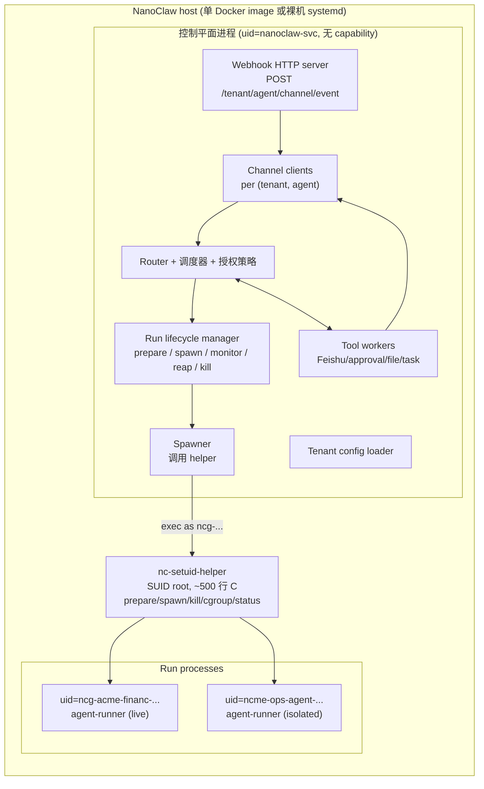
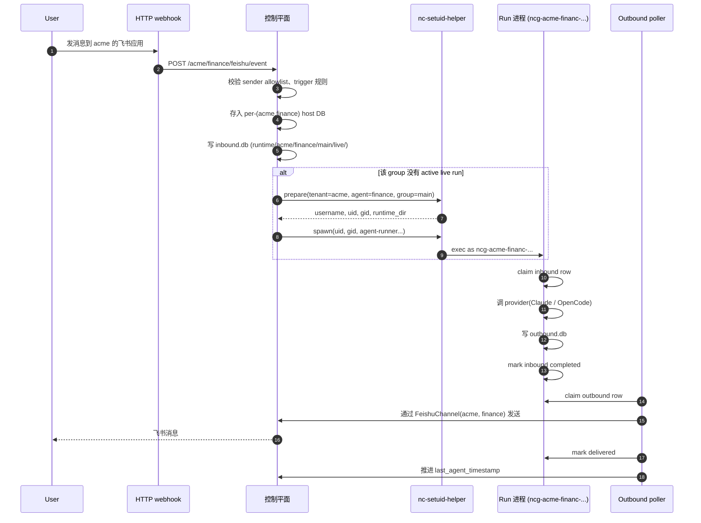

# NanoClaw 2.0 设计概览

这份文档面向想要理解 NanoClaw 2.0 运行时设计的工程师和运维。读完这份文档,你应该能回答以下问题:

- 2.0 解决了什么 1.x 解决不了的问题?
- 整体架构长什么样?
- 安全边界在哪里,靠什么实现?
- 一个消息从进入系统到交付回复走的是哪条路径?
- 部署一个 2.0 实例需要什么?
- 这套设计不能做什么?

如果要进一步看细节,文档末尾列了去哪找。这份文档不讲实现任务——实现细节在 `docs/superpowers/plans/` 下的 7 个分阶段计划里。

---

## 1. 为什么要做 2.0

NanoClaw 1.x 在单租户场景工作得不错,但当我们想用一个 NanoClaw 实例服务多个租户、多个 agent 时,遇到了几个根本性的问题:

**问题一:每个 group 一个 Docker 容器,扩展性差**

1.x 的运行时模型是「每个 chat group 启动一个 Docker 容器」。一个 NanoClaw 实例同时跑 10 个活跃 group 就有 10 个容器,idle group 也要保留容器状态。容器启动慢(秒级),内存占用固定。对于「很多 group、每个 group 偶尔有消息」的真实负载,这个模型很浪费。

**问题二:租户隔离靠「不同 NanoClaw 实例」**

如果 tenant A 和 tenant B 想用同一个 NanoClaw 部署,1.x 做不到——只能开两个 NanoClaw 实例。运维成本翻倍,升级、监控、日志都要分别搞。

**问题三:外部 channel 身份是全局单例**

1.x 的飞书 channel 是个单例,一份 `app_id/app_secret`,所有 group 共享。同一部署里 tenant A 想用自己的飞书应用、tenant B 想用另一个,根本没法表达。

**问题四:工具调用走文件 IPC,脆弱**

1.x 的 agent 容器通过写文件的方式请求 host 调飞书 API(因为容器拿不到飞书凭证)。文件 IPC 在 warm 进程、isolated task、并发场景下很脆弱,没有重试和审计。

2.0 的目标:**一个 NanoClaw 实例服务多租户、多 agent,隔离边界清晰,部署简单,工具调用可靠**。

---

## 2. 核心思路

2.0 的关键洞察是:**Linux 的用户隔离已经足够做安全边界,Docker 不再是隔离单元,而是可选的部署外壳**。

具体说:

- **每个 `(tenant, agent, group)` 元组对应一个 Linux 用户** `ncg-<tenant8>-<agent8>-<hash10>`。不同 tuple 的进程互相读不到对方的文件、不能互相发信号。
- **一个 NanoClaw 进程(控制平面)跑所有的路由、调度、工具执行**。它不持任何 Linux capability。
- **特权操作集中在一个 SUID root 的小 C binary 里**(`nc-setuid-helper`),只接受白名单参数。控制平面调它来创建用户、spawn run 进程、发信号、设 cgroup。
- **整个 NanoClaw 可以打包进一个 Docker 镜像**,但 Docker 只是部署便利,不是安全边界。同一个 image 内部还是靠 Linux user 隔离。
- **每个 `(tenant, agent)` 可以有自己的外部身份**(自己的飞书应用、Slack bot 等)。Webhook URL `/<tenant>/<agent>/<channel>/event` 是路由键。
- **工具调用走 SQLite 队列**(`tools.db`),host 侧 worker 消费、鉴权、执行、写回结果。不再用文件 IPC。

这个思路反转了原 plan 的 ADR-005(每个 agent service 一个 Docker 容器)。我们意识到 Docker 在这个场景下没有提供 Linux user 之上的额外隔离——两者共享 kernel,Docker 的 network namespace 默认也没用上。把 Docker 拿掉、Linux user 留下,部署反而简单了。

---

## 3. 架构全景



### 各组件职责

**控制平面进程** (`uid=nanoclaw-svc`)——单进程,持有所有 channel 连接、路由策略、调度器、工具 worker、tenant 配置、run 生命周期。**不持任何 Linux capability**——这是设计上的硬约束,不是默认。

**`nc-setuid-helper`**——SUID root 的 C binary,~500 行,是整个系统唯一的特权入口。暴露 5 个操作:
- `prepare`:为 `(tenant, agent, group)` 创建 Linux user、runtime dir、ACL
- `spawn`:以指定 uid/gid exec agent-runner
- `kill`:校验 PID 身份后发信号(防 PID reuse)
- `cgroup`:创建 cgroup v2、设 mem/pids/cpu 限制
- `status`:校验 PID 身份,报告死活

每次调用都做严格参数校验:UID 必须是 `^ncg-` 开头且在 helper 自己的 `users.db` 里有记录;runtime_dir 必须匹配记录;kill/status 还要校验 PID start-time ticks 防止 PID reuse 攻击。

**Run 进程**——每个活跃 `(tenant, agent, group)` 一个进程,以对应的 `ncg-*` 用户身份跑 agent-runner。从 `inbound.db` 读工作、调 provider、写 `outbound.db` 和 `tools.db`。看不到其他 run 的文件,看不到任何凭证文件。

**Channel clients**——每个声明了 channel 的 `(tenant, agent)` 一个 channel 实例,各自持自己的凭证和连接。不再有全局单例。

**Webhook HTTP server**——一个共享的 HTTP server,按 URL path 路由到对应 channel 实例。

---

## 4. 关键设计决策

这 7 个决策定义了 2.0 的形状。每条后面括号里是对应的 ADR 编号,完整论证在 `ADR.md`。

### 4.1 隔离单元是 Linux user,不是 Docker 容器 (ADR-005')

每个 `(tenant, agent, group)` 元组映射到一个 Linux user。Docker 是可选的部署外壳——打包整个 NanoClaw(控制平面 + helper + run 进程)进一个 image,只是为了运维方便,不是因为安全。

**为什么不靠 Docker?** Docker 不提供 Linux user 之上的额外隔离。两者共享 kernel,内核漏洞两者都防不住。Docker 的 network namespace 在我们的场景里用不上(所有 run 都走控制平面出去)。所以保留 Docker 只是增加部署复杂度,没换来安全。

### 4.2 控制平面不持特权,所有特权操作走 helper (ADR-008')

控制平面以 `uid=nanoclaw-svc` 跑,没有任何 Linux capability。要 spawn run、要 kill、要设 cgroup——全部通过 SUID helper。Helper 自己只接受白名单参数,被攻破的控制平面也不能任意 root escalation。

**为什么不用 sudoers?** sudoers 给整个控制平面 root 权限,helper 只给「以 ncg-* 身份执行特定操作」的权限。特权面小得多,可审计得多。

### 4.3 两级凭证威胁模型 (ADR-024)

NanoClaw 调 LLM 走的是**内部网关**——credential 泄露到外部网络没用。所以 LLM 凭证直接通过 env 注入给 run 进程,不需要 credential proxy。

但**飞书、Slack 等 channel 凭证是真实外部凭证**——泄露就能冒充租户、读租户数据。所以 channel 凭证**永远只在控制平面进程内存 + 0600 文件**里。Run 进程要调飞书?写 `tools.db` 请求,控制平面 worker 执行,run 拿不到原始凭证。

**为什么这样分?** 把所有凭证同等对待就要上 credential proxy / scoped token / SO_PEERCRED 这些重型机制,而内部网关的 LLM 凭证根本不需要这么强。把威胁分级处理,复杂度只加在真正需要的地方。

### 4.4 每个 `(tenant, agent)` 一套外部身份 (ADR-021)

不再是「全局一个飞书应用」。每个 agent 声明自己的 channel 配置,各自有独立的 `app_id/app_secret`。Channel registry 用复合 key `(tenant_id, agent_id, channel_type)`,而不是字符串单例。

Webhook URL 是路由键:`POST /acme/finance/feishu/event` 只触发 `FeishuChannel(acme, finance)` 实例。同一个 NanoClaw 实例的 `acme/finance` 和 `acme/ops` 完全独立,即使它们都用飞书。

### 4.5 共享 webhook HTTP server,按 path 路由 (ADR-022)

一个 HTTP server,每个 `(tenant, agent, channel)` 元组注册自己的 path prefix。如果每个 channel 实例起自己的 HTTP server,N 个 tenant 就要 N 个端口——部署噩梦。

WebSocket 模式下不需要 path 路由(每个 channel 实例自己连出去,NanoClaw 靠「事件从哪条连接进来」区分来源)。Webhook 模式下 path 就是路由键。

### 4.6 Runtime 数据走 SQLite 队列 (ADR-003)

不再用文件 IPC。每个 run 有 4 个 SQLite DB:
- `inbound.db`——控制平面写,run 读(待处理的工作)
- `outbound.db`——run 写,控制平面读(待交付的回复)
- `state.db`——run 自己的 continuation 和控制状态
- `tools.db`——run 写请求,控制平面 worker 写结果

SQLite 给我们持久化、原子 claim、重试、审计——文件 IPC 都没有。

### 4.7 干净替换,不保留旧 runtime (ADR-002 反转)

1.x 的 docker-per-group runtime 不保留。迁移是一次性的。如果出问题,恢复靠**文件级备份还原**,不是「切回旧 runtime」。

**为什么不保留 fallback?** 同时维护两套 runtime 会让每个跨领域改动都翻倍。测试面翻倍。每加一个特性都要想「新 runtime 怎么搞、旧 runtime 怎么搞」。一次性切干净,然后向前走。

---

## 5. 数据流:一条消息的旅程

以「tenant acme 的 finance agent 在飞书群 main 里收到用户消息」为例:



关键规则:

- **控制平面是消息历史的权威来源**(per-`(tenant,agent)` SQLite DB)。Runtime DB 只是 run-local 队列。
- **Cursor 回滚规则**:run 在交付输出前失败 → 回滚 cursor 让下一次重试;输出已经交付后失败 → 不回滚(否则重复回复)。
- **Idle run 自动 reap**:live runner 超过 idle timeout 没有新 inbound 就退出。下一次消息来时控制平面再 spawn 一次。

---

## 6. 安全模型

### 信任域

```
完全可信:控制平面进程 + SUID helper binary
        │
        │  ↓ Linux user 边界
        ▼
不可信但受控:Run 进程(每个 (t,a,g) 一个 user)
        │
        │  ↓ IPC 协议
        ▼
完全可信:控制平面的 tool worker(在控制平面进程内)
```

Run 进程被假设为「可能被 provider 返回的内容攻破」——所以它只能通过 `tools.db` 请求操作,不能直接访问任何凭证。

### 被保护什么、靠什么保护

| 资产 | 威胁 | 保护机制 |
|------|------|---------|
| Channel 凭证(飞书 app_secret 等) | run 进程读取后泄露 | 只存在于 `auth/tenants/<t>/<a>/<channel>/credentials.json`(0600,owner=nanoclaw-svc)+ 控制平面内存。Run 进程的 user 读不到。 |
| 其他 run 的 runtime state | run A 读 run B 的 chat 历史 | Runtime dir `mode=0700` + owner=`ncg-B`,POSIX ACL 只给 `nanoclaw-svc` 加 rwx。其他 ncg-* users 没有 ACL entry,fall through 到 other,什么都没有。 |
| LLM 凭证 | run 进程泄露 | 低风险——指向内部网关,泄露到外部没用。直接 env 注入。 |
| 控制平面进程被攻破 | 攻击者提权到 root | 控制平面无 capability。Helper 只接受白名单参数(uid 必须 ncg-*、runtime_dir 必须匹配记录),控制平面被攻破也不能任意 root。 |
| PID reuse | helper kill 到错误进程 | kill/status 校验 PID + start_time_ticks + expected_uid + runtime_dir + cgroup_path 五重身份。PID reuse 会被识别为 stale record。 |

### 不保护什么

2.0 的安全模型有以下**显式不保证**——这些必须在部署文档里写明:

- **内核漏洞**:run 进程通过内核漏洞提权到 root——我们防不住(任何容器方案也防不住)。如果要防,需要上 SELinux/AppArmor 或更强的隔离(seccomp、user namespace)。
- **同租户跨 agent 互访**:同一个 tenant 下的不同 agent 共享 `tenant.json`,但 runtime data 还是隔离的。如果要更强的租户级隔离,需要额外的 cgroup network namespace 限制。
- **Side-channel**:CPU/cache timing attack、磁盘 I/O pattern——同样超出范围。

---

## 7. 部署形态

2.0 的参考部署是**单个 Docker image**,跑一个长期运行的容器:

```bash
docker run -d --name nanoclaw \
  --privileged \
  --security-opt no-new-privileges:false \
  --cgroupns=host \
  -v /srv/nanoclaw:/var/lib/nanoclaw \
  -v /sys/fs/cgroup:/sys/fs/cgroup:rw \
  nanoclaw:<version>
```

为什么 `--privileged`?因为 helper 要做 `useradd`、`setuid`、写 cgroup。**这是有意的设计选择,不是配置错误**。如果你要 hardened profile,可以收紧 capability 列表(`CAP_SETUID`, `CAP_SETGID`, `CAP_KILL`, `CAP_SYS_ADMIN`),但必须保留 SUID execution。Operator 只有在 helper 操作 + 隔离测试套件都通过后,才可以收紧。

Kubernetes 部署形态等价:每个 NanoClaw 实例一个 pod,带等价 `securityContext`、persistent volume、POSIX ACL 支持的 filesystem、可写或委派的 cgroup v2 subtree。

### 文件系统要求

底层 filesystem **必须支持 POSIX ACL**(ext4/xfs 默认支持,btrfs 也行)。btrfs 的 copy-on-write 对 runtime DB 性能可能不友好——建议 SQLite 文件用 `chattr +C` 关掉 CoW。

### Tenant repo 布局

Operator 在 `/etc/nanoclaw/tenants/` 下维护 tenant 配置:

```
/etc/nanoclaw/tenants/
  tenants/
    acme/
      tenant.json
      agents/
        finance/
          agent.json
          instructions.md
          channels/
            feishu.json
        ops/
          agent.json
          instructions.md
```

`agent.json` 里声明 provider、model、skills、channels、envRefs。Secret 值不在 repo 里——只有 `llm:NAME` / `channel:NAME` 这样的引用,实际值在 `/var/lib/nanoclaw/auth/tenants/<t>/<a>/<channel>/credentials.json`(0600)。

---

## 8. 局限与未来扩展

### 当前版本不做的

- **不提供 per-group kernel namespace**——所有 run 共享 host 的 kernel 和 network namespace。如果跑不可信租户,需要额外的隔离层。
- **不保留 1.x docker-per-group fallback**——迁移是一次性的,出问题靠文件级备份恢复。
- **Webhook URL 暴露在公网时没有内置 rate limiting**——应该在反向代理层(nginx/Cloudflare)处理。
- **没有内置 multi-instance 集群**——一个 NanoClaw 实例一个 host。横向扩展需要外部负载均衡 + 共享存储(目前没设计)。

### 预留的升级路径

如果将来需要更强的隔离或更多能力,设计里留了这些扩展点:

1. **独立 supervisor 进程**——把 helper 调用从控制平面挪到一个长生命周期 supervisor 进程,进一步缩小特权面。代码结构已经为这个留了空间。
2. **Per-run Unix socket credential proxy**——如果开始跑不可信租户,把 LLM 凭证从 env 注入升级为每个 run 一个 Unix socket(基于 `SO_PEERCRED` 的 kernel-enforced 访问控制)。
3. **Skill hot-reload**——目前改 tenant skill 要重启 agent。未来可以加 `skills.reload` 让 tenant skill 变更不重启就生效。
4. **Systemd transient services**——把 run 进程从「helper spawn」换成 systemd transient units,资源限制、journal logging、cgroup 都白送。但强依赖 systemd,和「单 Docker image」部署目标冲突。

---

## 9. 去哪找更多

| 想了解什么 | 看哪 |
|----------|------|
| 每个决策的完整论证 | [ADR.md](./ADR.md) |
| 组件职责、目录布局、消息/任务/工具/技能流细节 | [TARGET_ARCHITECTURE_DETAILS.md](./TARGET_ARCHITECTURE_DETAILS.md) |
| 跨阶段契约(消息元数据、cursor 规则、授权闸、工具清单、迁移数据、验收门槛) | [CROSS_CUTTING_CONTRACTS.md](./CROSS_CUTTING_CONTRACTS.md) |
| 设计 rationale(为什么这么选,2.0 相对原 plan 反转了什么) | [spec](../superpowers/specs/2026-06-16-multi-tenant-host-direct-isolation-design.md) |
| 实施计划(7 个分阶段 plan,A 到 G) | [plans 目录](../superpowers/plans/) |
| 1.x 的老设计(已归档,只读) | [runtime-rework-archived/](../runtime-rework-archived/) |

---

## 10. TL;DR

NanoClaw 2.0 把每个 chat group 跑成 host 上的一个独立 Linux user 进程,所有 run 共享一个 NanoClaw 控制平面。Docker 降级为可选的部署外壳。一个 NanoClaw 实例支持多租户、多 agent,每个 `(tenant, agent)` 可以有自己的外部身份。LLM 凭证直接 env 注入(内部网关,低风险),channel 凭证留在控制平面(run 进程通过 SQLite 队列请求操作)。所有特权操作集中在一个 SUID helper binary,控制平面本身不持任何 capability。干净替换 1.x,不保留 fallback。
