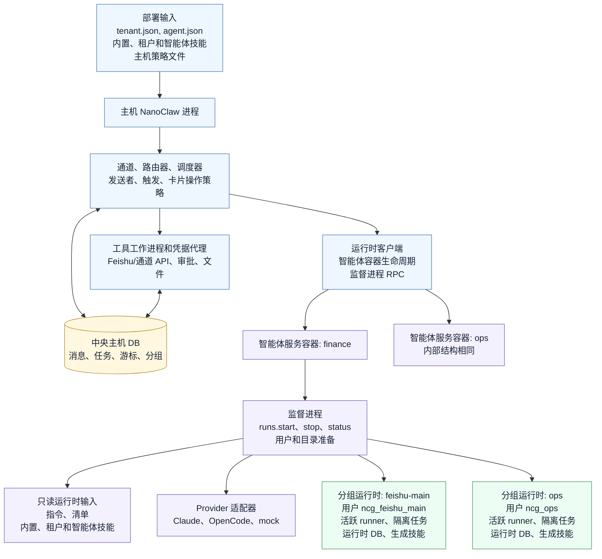
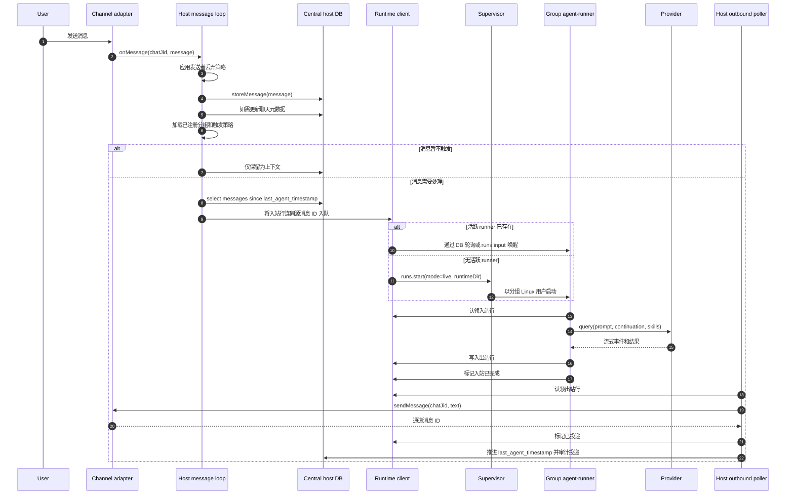
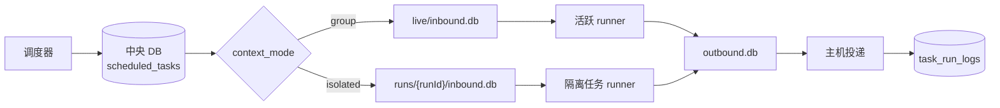
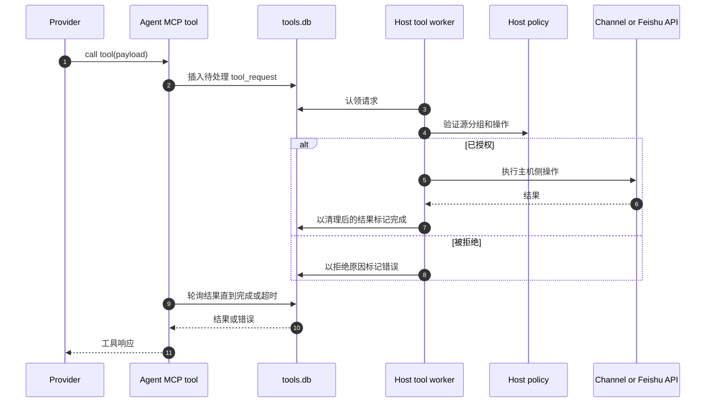
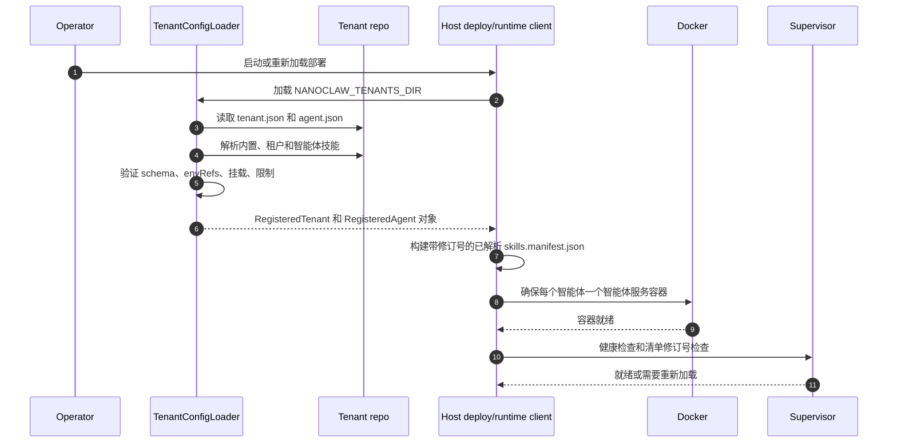
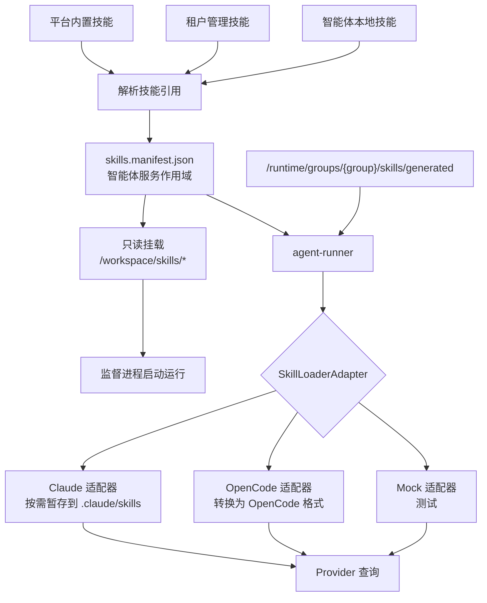

# 目标架构详情

本文档展开说明 Version 2.0 的目标架构。它是最终运行时如何连接、消息如何在系统中流转、以及租户配置和技能如何部署、加载和使用的参考文档。

## 架构概览

最终运行时形态：

- 主机 NanoClaw 进程拥有通道、路由、策略、中央状态、部署配置加载、工具工作进程和运行时控制。
- 每个智能体服务获得一个 Docker 容器。
- 智能体容器拥有一个监督进程并运行一个或多个分组进程。
- 每个分组进程在该智能体容器内以独立的 Linux 用户身份运行。
- 普通消息、工具请求、Provider 续接和控制信号使用 DB-backed IPC。
- 租户和智能体技能以只读方式挂载。分组生成的技能是运行时本地的，仅该分组用户可写。



概览采用垂直主干加若干侧边能力的布局。下方的消息、定时任务、工具和技能加载章节展示了详细的交互流程。

## 组件职责

主机进程：

- 接收通道事件并存储权威消息历史
- 应用发送者白名单、触发规则、卡片操作路由和主分组权限
- 拥有 `registered_groups`、任务状态、路由器游标和通道元数据
- 加载租户和智能体配置，解析技能清单，启动/更新智能体服务容器
- 写入运行时入站行并轮询运行时出站行
- 运行主机侧工具工作进程，处理通道、Feishu、审批、文件和任务操作
- 拥有 Provider 和通道凭据，通过凭据代理或每次运行的作用域令牌管理

智能体服务容器：

- 为一个已配置的智能体服务运行监督进程
- 承载 Provider 适配器代码和 agent-runner 运行时代码
- 以只读方式挂载已解析的内置、租户和智能体技能根目录
- 在 `/runtime/supervisor/supervisor.sock` 下暴露监督进程套接字
- 创建和管理每分组的 Linux 用户
- 使用 `setpriv`、`gosu` 或 `su-exec` 启动活跃和隔离任务进程
- 在智能体运行时根目录下记录进程元数据和日志

分组进程：

- 以自己的 Linux 用户身份运行
- 从其运行时目录读取入站工作
- 使用配置的技能加载器调用选定的 Provider
- 将出站响应和工具请求写入运行时 DB
- 仅在其分组运行时目录下写入生成的技能
- 无法读取其他分组的运行时 DB 或生成技能

## 运行时单元与数据归属

租户：

- 部署、配置和技能管理层
- 可拥有多个智能体服务
- 不是运行时隔离单元

智能体服务：

- 一个 Docker 服务/容器
- 一个 Provider/模型/默认限制集
- 一个已解析的只读技能清单
- 多个分组

分组：

- 智能体服务容器内的一个 Linux 用户
- 一个活跃运行时目录
- 零个或多个隔离任务运行时目录
- 分组本地的生成技能和记忆

运行（Run）：

- 一个活跃或隔离的进程生命周期
- 一组运行时 DB
- 一个 Provider 续接命名空间

## 运行时目录布局

主机路径：

```text
data/runtime/agents/<agent>/
  supervisor/
    supervisor.sock
    runs.json
  groups/
    <group>/
      live/
        inbound.db
        outbound.db
        state.db
        tools.db
        files/
        downloads/
      runs/
        <runId>/
          inbound.db
          outbound.db
          state.db
          tools.db
          files/
          downloads/
      skills/
        generated/
  logs/
    <group>/
```

容器路径：

```text
/runtime/
  supervisor/
  groups/
  logs/
/workspace/
  agent/
    agent.json
    instructions.md
    skills.manifest.json
  skills/
    builtin/
    tenant/<tenant>/
    agent/<agent>/
```

## 普通消息处理流程

普通入站消息从通道事件流向主机 DB，再到运行时 DB，再到 Provider，再到出站运行时 DB，最后到通道投递。



关键规则：

- 主机 DB 保持源消息历史和游标的权威性。
- 运行时入站行携带源消息 ID 以支持幂等重试。
- 如果运行在用户可见输出投递之前失败，主机回滚 `last_agent_timestamp[chat_jid]`。
- 如果输出已投递且后续 Provider 出错，主机不回滚游标。
- 活跃的后续消息写入为新入站行。支持推送的 Provider 可在活跃查询期间接收；其他 Provider 在下一轮循环中处理。

## 定时任务流程

分组上下文定时任务：

1. 调度器从中央主机 DB 读取到期任务。
2. 主机将任务格式化为目标分组的合成入站消息。
3. 主机使用与普通消息相同的活跃运行时路径。
4. 任务可使用现有活跃对话续接。
5. 任务结果通过主机出站轮询器投递。

隔离定时任务：

1. 调度器从中央主机 DB 读取到期任务。
2. 主机在分组运行时目录下创建 `runs/<runId>/`。
3. 主机将任务提示词写入该运行的 `inbound.db`。
4. 监督进程以相同分组 Linux 用户启动 `isolated-task` runner。
5. Runner 不读取活跃对话历史或活跃续接。
6. Runner 在结果或错误后退出。
7. 主机记录 `task_run_logs` 并更新 `scheduled_tasks`。



## 工具请求流程

工具由 Provider 可见的 MCP 工具调用，但主机能力仍驻留在主机侧。



工具工作进程验证源运行时身份，而非信任请求载荷中的分组 ID。文件工具返回运行时文件 ID 或运行目录下的容器路径，而非主机路径。

## 租户配置部署流程

租户配置是部署输入。它被读取、验证、规范化后转化为智能体服务部署计划。

推荐源布局：

```text
nanoclaw-tenants/
  tenants/
    acme/
      tenant.json
      skills/
        acme-approval/
          SKILL.md
          manifest.json
      agents/
        finance/
          agent.json
          instructions.md
          skills/
            finance-local/
              SKILL.md
        ops/
          agent.json
          instructions.md
```

示例 `agent.json`：

```json
{
  "id": "finance",
  "tenant": "acme",
  "provider": "opencode",
  "model": "anthropic/claude-sonnet-4",
  "instructions": "./instructions.md",
  "skills": [
    "builtin:welcome",
    "tenant:acme-approval",
    "agent:finance-local"
  ],
  "envRefs": ["ANTHROPIC_API_KEY"],
  "limits": {
    "memoryMb": 1024,
    "pids": 256,
    "concurrentTasksPerGroup": 1
  }
}
```

部署序列：



加载器应在缺少技能、ID 重复、无效密钥值、无效挂载范围或清单修订号不匹配时快速失败，除非运维人员显式启用兼容模式。

## 技能部署与加载流程

已解析的技能成为智能体服务的只读输入。分组生成的技能在运行启动时追加。



加载步骤：

1. 租户加载器解析 `builtin:`、`tenant:` 和 `agent:` 引用。
2. 主机写入或挂载规范化的 `skills.manifest.json`。
3. 运行时驱动启动或更新智能体服务容器，带只读技能挂载。
4. 监督进程在启动运行前验证清单修订号。
5. agent-runner 读取清单并解析分组生成技能根目录。
6. Provider 特定的 `SkillLoaderAdapter` 准备 Provider 原生技能路径。
7. Provider 查询以准备好的技能配置运行。

清单结构：

```json
{
  "tenant": "acme",
  "agent": "finance",
  "revision": "sha256:...",
  "skills": [
    {
      "id": "welcome",
      "scope": "builtin",
      "containerPath": "/workspace/skills/builtin/welcome",
      "entry": "SKILL.md",
      "readonly": true
    },
    {
      "id": "acme-approval",
      "scope": "tenant",
      "containerPath": "/workspace/skills/tenant/acme/acme-approval",
      "entry": "SKILL.md",
      "readonly": true
    }
  ],
  "generatedSkillRoot": "/runtime/groups/${group}/skills/generated"
}
```

## 技能编写与提升流程

分组生成技能：

1. 分组进程或 reporter/本地 API 写入 `/runtime/groups/<group>/skills/generated/<skill>/`。
2. 仅该分组用户和监督进程可读写。
3. 该技能对该分组的后续运行可见。
4. 不会自动复制到租户仓库。

提升为租户技能：


提升必须是显式的，以确保租户仓库保持共享业务行为的真实来源。

## 技能重载语义

初始实现：

- 租户或智能体技能变更时重启受影响的智能体服务容器
- 如果挂载的清单修订号与主机配置不匹配，拒绝启动新运行
- 允许现有运行完成或通过监督进程策略停止

后续优化：

- 监督进程 `skills.reload` 可在不重启容器的情况下更新清单，但仅在 Provider 适配器能安全重载时。

## 故障与恢复行为

主机重启：

- 中央 DB 保留消息、任务、分组和游标
- 运行时 DB 行保留在磁盘上
- 主机扫描待处理入站/出站行和中央游标状态
- 过期的监督进程运行记录在重连时被协调

智能体容器重启：

- 监督进程启动，读取 `runs.json`，标记过期 PID 为已退出
- 主机可按需重启活跃分组运行
- 待处理入站行保持可认领
- 待处理出站行保持可投递

Provider 故障：

- Provider 适配器发出结构化错误
- 入站行根据重试策略标记为 `error` 或返回 `pending`
- 主机游标回滚遵循"输出是否已投递"规则

工具工作进程故障：

- 待处理工具行在超时前可重试
- 租约超时后已认领的行返回待处理或变为超时
- 被拒绝的请求以明确的工具错误完成

## 运维状态视图

最终状态命令应报告：

- 主机进程健康状态
- 已连接通道
- 中央 DB 路径和游标摘要
- 已配置租户和智能体服务
- 智能体容器健康状态
- 监督进程套接字健康状态
- 每个智能体和分组的活跃运行数
- 运行时 DB 队列深度
- 每分组用户和权限检查
- 技能清单修订号
- 旧版文件 IPC 兼容状态
- 回滚驱动可用性

## 最终实现检查

- 每个智能体服务存在一个 Docker 服务，而非每个分组
- 分组活跃运行共享智能体服务容器但以不同用户运行
- 运行时 DB 文件不可被全局写入
- 租户和智能体技能在容器中为只读
- 生成技能为分组本地
- 普通消息保留触发、发送者、卡片操作、附件和游标语义
- 定时任务上下文模式与 NanoClaw 1.0 行为对等
- 工具请求执行主机侧授权
- Provider 凭据不出现在分组可读的文件或 DB 行中
- OpenCode 和 Claude 均满足相同的 `AgentProvider` 事件契约
- `docker-per-group` 回滚保持可选用
