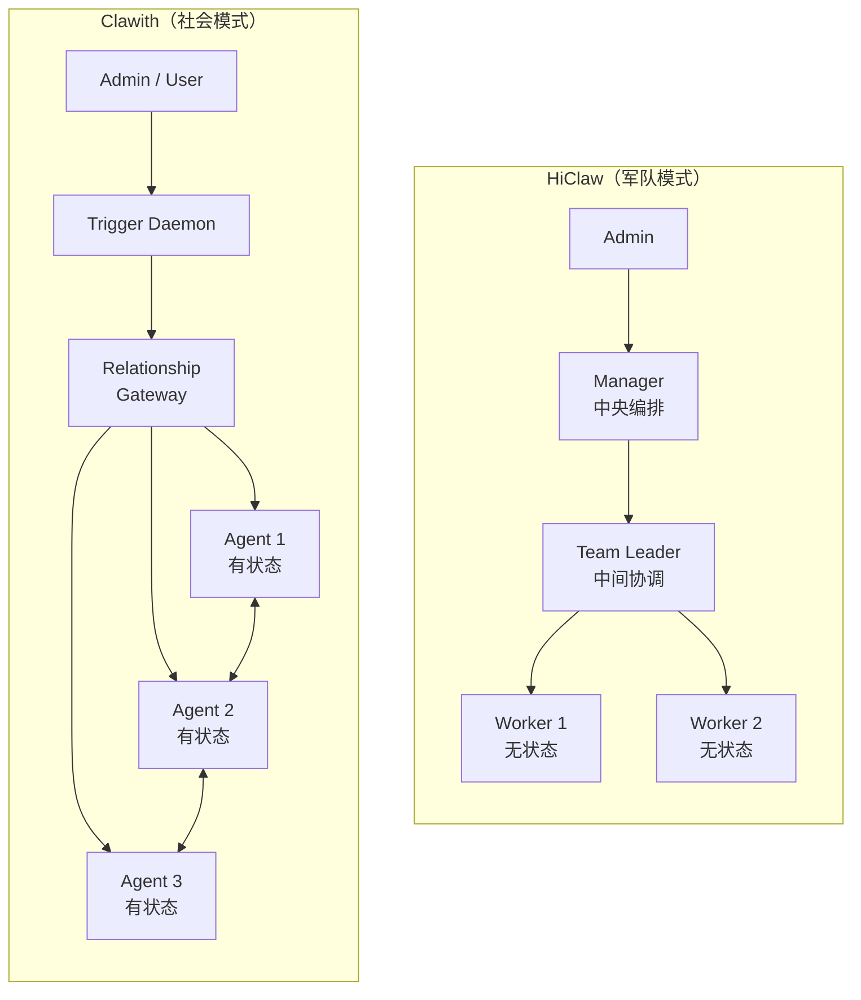

# Agent Collaboration Patterns

## Intuition

多 Agent 协作的核心矛盾：**可控性 vs 自治性**。HiClaw 选军队模式（集中指挥），Clawith 选社会模式（自主结盟）。

## Key Ideas

- Agent 角色体系决定协作拓扑：层级式 vs 对等网
- 任务分发可以是中心化 Push、触发器驱动、或 Agent 自主创建
- 通讯机制需要解决寻址、路由、可靠投递、权限控制四个问题
- 状态一致性方案取决于 Agent 是否无状态（文件锁 vs DB 事务）

## HiClaw：层级式集中编排

### 角色体系

- **Manager**：中央编排器，不执行具体任务
- **Team Leader**：中间层协调者，负责任务拆分和结果聚合
- **Worker**：无状态容器执行器，所有状态存 MinIO

### 任务分发

- 中心化 Push：Manager 通过 `find-worker.sh` 选择空闲 Worker，Matrix @mention 下发
- 有限任务（finite）：创建 `tasks/{task-id}/meta.json` + `spec.md` → 分配 → 完成
- 无限任务（infinite）：cron 周期触发，Heartbeat 检测到期后唤醒 Worker
- 团队委派：Manager → Team Leader → 多 Worker DAG 并行/串行执行

### 通讯机制

- 基于 Matrix 协议，所有对话对 Admin 可见（Human-in-the-Loop）
- 结构化 @mention 协议：`@{coordinator}:{domain} TASK_COMPLETED: 
`
- 每个 Worker 独立房间，成员 = Admin + Manager + Worker
- 设计原则：Agent 间不允许私密对话

### 协调机制

- `.processing` 标记文件实现分布式锁
- MinIO + `mc mirror --watch` 实时文件同步
- Heartbeat 定期检查任务进度，自动停止空闲 Worker

## Clawith：对等网关系驱动

### 角色体系

- **native Agent**：平台托管 LLM Agent
- **openclaw Agent**：远程运行在用户机器上的 Agent
- 无层级区分，通过 [[Agent Agent Relationship|关系]] 控制协作权限

### 任务分发

- Trigger Daemon：15 秒 tick 评估所有触发器（cron/interval/poll/webhook/on_message）
- Agent 可自主创建任务并分配给自己
- A2A 委派：`task_delegate` 消息类型，源 Agent 设 focus + trigger，目标 Agent 异步执行
- 三种自治等级 L1-L3 控制操作权限范围

### 通讯机制

- 三种消息语义：
  - `notify`：fire-and-forget，消息入库后异步唤醒
  - `task_delegate`：异步 + 回调机制
  - `consult`：同步请求-响应（默认）
- 关系门控：`AgentAgentRelationship` 双向关系检查
- Agent 对自动创建 `ChatSession`，消息持久化到 DB
- 多通道：WebSocket（实时）、REST Gateway（远程 Agent）、Webhook（飞书/钉钉/企微）
- Gateway Poll-Report：远程 OpenClaw Agent 通过 HTTP 轮询获取消息

### 协调机制

- DB 事务保证一致性
- 30 秒去重窗口防止重复触发
- Participant 统一身份模型（user/agent 统一寻址）

## 架构对比

## 设计取舍对比

| 维度 | HiClaw | Clawith |
|------|--------|---------|
| 可控性 | 极高，Admin 全局可见 | 按关系和自治等级灵活控制 |
| 扩展性 | Worker 容器弹性伸缩 | 受 Trigger Daemon 吞吐限制 |
| 通讯可靠性 | Matrix 协议保证投递 | DB 持久化 + WebSocket 推送 |
| 协作复杂度上限 | 层级清晰，适合明确分工 | 网状协作，适合动态跨领域场景 |
| 状态一致性 | MinIO + `.processing` 文件锁 | DB 事务 |
| 人机交互 | 强制公开透明 | 按通道灵活路由 |
| Agent 自治度 | 低，完全听从指挥 | 高，可自主创建任务和发起协作 |

## 关键源码位置

### HiClaw

- Manager Soul：`manager/agent/SOUL.md`
- Worker Agent：`manager/agent/worker-agent/`
- Team Leader 模板：`manager/agent/team-leader-agent/SOUL.md.tmpl`
- 任务管理技能：`manager/agent/skills/task-management/`
- 团队委派参考：`manager/agent/skills/team-management/references/team-task-delegation.md`
- 协调协议：`manager/agent/skills/task-coordination/SKILL.md`
- 容器 API：`manager/scripts/lib/container-api.sh`

### Clawith

- Agent 模型：`backend/app/models/agent.py`
- Task 模型：`backend/app/models/task.py`
- A2A 通讯：`backend/app/services/agent_tools.py`
- Trigger Daemon：`backend/app/services/trigger_daemon.py`
- WebSocket 编排：`backend/app/api/websocket.py`
- Gateway API：`backend/app/api/gateway.py`
- 关系模型：`backend/app/models/participant.py`

## Related

- [[Multi Agent Isolation]]
- [[System Layers]]
- [[Clawith Analysis]]
- [[Pairing Mechanism]]
- [[Group Chat Memory Mechanism]]

## Tags

#agent-architecture #collaboration-patterns #hiclaw #clawith
