# 企业 Agent 平台 — 全局架构设计

> 日期：2026-04-14
> 状态：草稿
> 范围：覆盖所有子系统的顶层架构及接口关系，不深入实现细节

---

## 1. 概述

### 1.1 平台目标

构建一个企业级 Agent 平台，支持两类 Agent：

- **个人 Agent**：与员工身份绑定，作为私人助理（类似 openclaw）。不需要 group 隔离，直连 IM 平台，共享 AI Gateway。
- **企业 Agent**：独立的数字员工，可响应多个用户的私聊请求，也可在多个群中响应用户请求。需要 group 级别的数据隔离。

### 1.2 核心需求

| 需求 | 说明 |
|------|------|
| 多 SDK 混合 | 平台层抽象统一接口，不同 Agent 可使用不同 SDK |
| IM 平台 | 钉钉、飞书、企业微信 |
| 部署方式 | Docker 先行，预留 K8s 演进路径 |
| 管理平台 | Web UI 管理后台 |
| LLM 支持 | 国产模型（通义/文心等）、OpenAI GPT、Anthropic Claude、OpenAI/Anthropic 兼容协议 |
| MCP 协议 | Agent 通过 MCP 协议调用外部工具服务 |
| 存储 | 混合方案：PostgreSQL（对话历史/元数据）+ MinIO/S3（资源文件） |
| 版本管理 | 基于 Git 的资源版本管理（仅企业 Agent） |
| 个人 Agent | 无 group 隔离，平台不管理其资源版本，用户自行管理 |

### 1.3 参考项目

| 项目 | 参考内容 |
|------|---------|
| NanoClaw | 容器级 group 隔离、凭证代理（AI Gateway）、Claude Agent SDK |
| HiClaw | 消息网关（Matrix/Tuwunel）、AI 网关（Higress + Consumer Token）、Manager-Worker 架构 |
| Hermes | Profile 进程隔离、group 隔离设计（ContextVar vs per-group 进程） |

---

## 2. 系统总体架构

### 2.1 系统全景

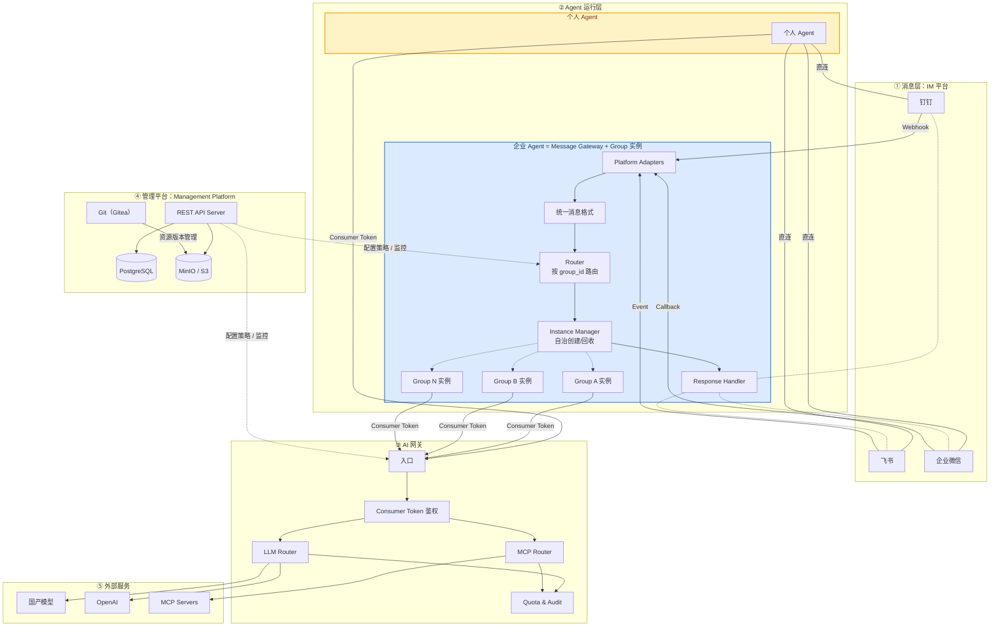

### 2.2 子系统职责

| 子系统 | 职责 | 对外接口 |
|--------|------|---------|
| **Management Platform** | Agent 生命周期管理、企业 Agent 资源版本管理与推送、镜像管理、监控 | REST API（管理前端 + Message Gateway 调用）、Git 协议 |
| **Message Gateway** | 每个企业 Agent 一个实例，持有 IM Bot SDK，接收消息并路由到对应 group 实例 | IM Platform API（入站）、Agent IPC（出站） |
| **Agent Runtime** | 运行 agent 实例，加载人设/记忆/skill，调用 LLM/MCP | Agent SDK API（Gateway 入站）、AI Gateway API（出站） |
| **AI Gateway** | LLM/MCP 调用的集中鉴权、路由、限流、计量 | OpenAI/Anthropic 兼容 API（给 Agent）、MCP Proxy |
| **Storage** | PostgreSQL（对话历史/元数据）、MinIO/S3（资源/附件）、Git（版本管理） | SQL / S3 API / Git 协议 |

### 2.3 Agent 类型对比

| | 个人 Agent | 企业 Agent |
|---|---|---|
| 绑定对象 | 1 个员工 | 1 个企业（数字员工身份） |
| 消息接入 | 直连 IM 平台 | 通过 Message Gateway |
| Group 隔离 | 不需要 | 需要（多人多群） |
| 共享层 | 无（全部私有） | 公共人设/记忆/skill（管理员维护，只读） |
| 私有层 | 全部（用户自行管理） | per-group：session/记忆/skill（可读写） |
| 运行实例 | 1 个容器/进程 | 多个 group 实例 |
| 资源版本管理 | 用户本地自行管理 | 通过管理平台（Git） |
| 管理平台中的角色 | 仅元信息（agent_id、用户绑定、监控、Consumer Token） | 完整管理（元信息 + 资源 + 镜像 + 监控） |

---

## 3. 企业 Agent 的 Group 隔离设计

### 3.1 数据分层

每个企业 Agent 的数据分为两层：

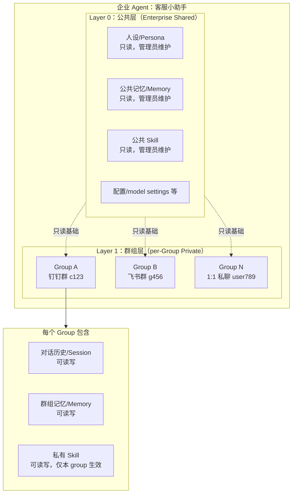

### 3.2 方案 A：容器级隔离

每个 group 运行在独立容器中。公共层以只读方式挂载，群组层以读写方式挂载。

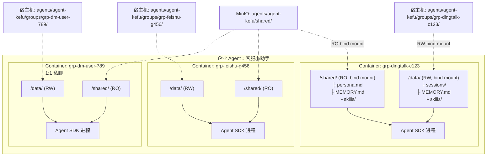

**容器路径映射：**

| 容器内路径 | 宿主机路径 | 读写 |
|-----------|-----------|------|
| `/shared/` | `agents/{agent_id}/shared/`（MinIO 同步） | RO |
| `/data/` | `agents/{agent_id}/groups/{group_id}/` | RW |

**生命周期：**

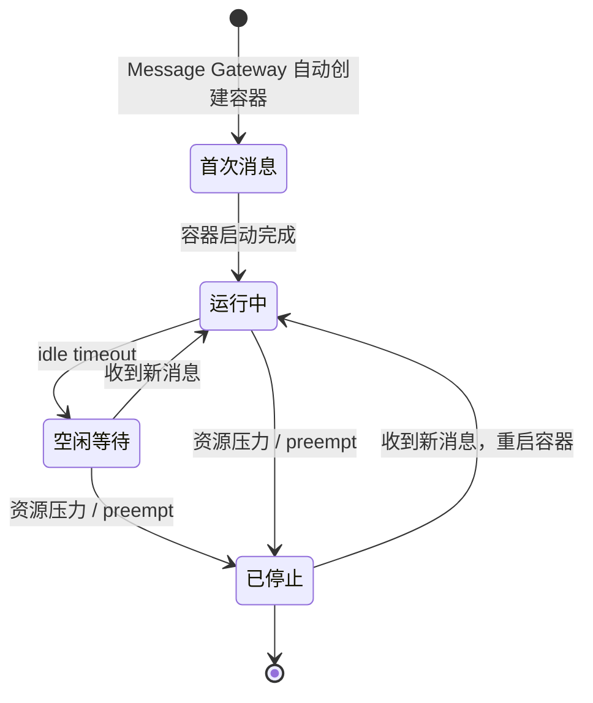

**优势：**
- OS 级隔离（最强）
- 多 SDK 天然支持（容器完全隔离）
- K8s 演进路径清晰（容器直接映射为 Pod）
- 个人 Agent 可复用同一模型（1 容器 = 1 group）

**劣势：**
- 资源开销高（每个 group 一个容器）
- 冷启动秒级
- 不支持热重载（需重建容器）

### 3.3 方案 B：进程级隔离

每个企业 Agent 对应一个或多个进程，通过进程级别的 `HERMES_HOME` 环境变量或 ContextVar 实现 group 隔离。

#### B1：多进程（每 group 一个进程）

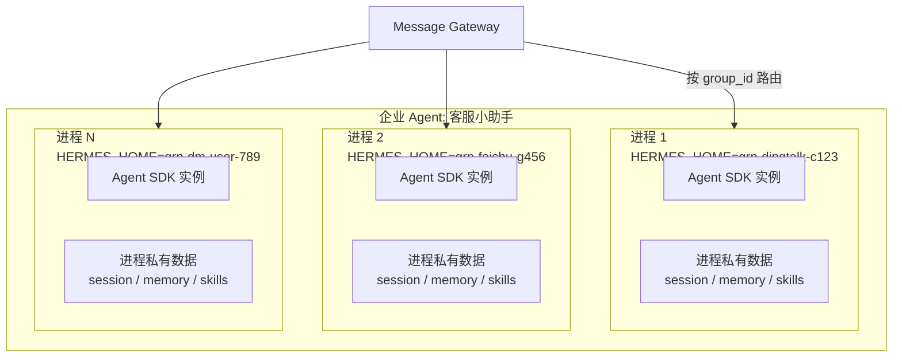

- 每个 group 一个独立进程，`HERMES_HOME` 指向各自的 group 数据目录
- 进程级隔离，crash 不影响其他 group
- 参考 Hermes 的 profile 隔离策略
- Message Gateway 按 group_id 路由到对应进程

#### B2：单进程多实例（进程内逻辑隔离）

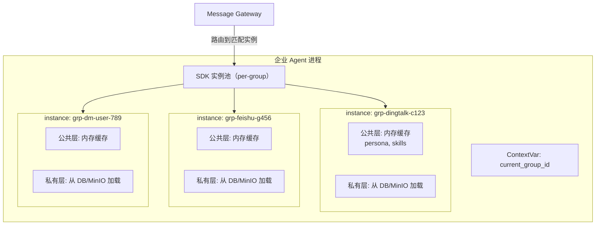

- 一个进程内维护多个 SDK 实例，通过 ContextVar 切换当前 group 上下文
- 实例长期驻留，数据常驻内存
- 同进程内 crash 互相影响

### 3.4 方案对比

| | A: 容器隔离 | B1: 多进程 | B2: 单进程多实例 |
|---|---|---|---|
| 隔离强度 | OS 级 | 进程级 | 进程内逻辑隔离 |
| 内存开销 | 高（每 group 一个容器） | 中（每 group 一个进程） | 低（多实例共享进程） |
| 冷启动 | 秒级 | 毫秒级 | 无 |
| 多机扩展 | 容器编排天然支持 | 需 sharding + 消息队列 | 需 sharding + 消息队列 |
| 故障隔离 | 最强 | 强（进程 crash 不互相影响） | 弱（同进程 crash 连带） |

### 3.5 选型策略

三种方案不互斥，可按实际需求选择：

| 需求 | 推荐方案 |
|------|---------|
| 安全性要求高，资源充足 | 方案 A：容器隔离 |
| 需要进程级故障隔离，资源适中 | 方案 B1：多进程 |
| group 数量多，资源有限 | 方案 B2：单进程多实例 |

---

## 4. Message Gateway

### 4.1 定位

**每个企业 Agent 部署一个 Message Gateway 实例**，它是企业 Agent 的组成部分（而非独立的共享组件）。个人 Agent 直连 IM 平台，不经过 Message Gateway。

一个企业 Agent 的完整部署单元：

```
企业 Agent = Message Gateway 实例 + Group 实例（0..N）
                │
                ├── 钉钉 Bot SDK 实例（对应钉钉上的一个机器人）
                ├── 飞书 Bot SDK 实例（对应飞书上的一个机器人）
                └── 企微 Bot SDK 实例（对应企微上的一个机器人）
```

### 4.2 架构图

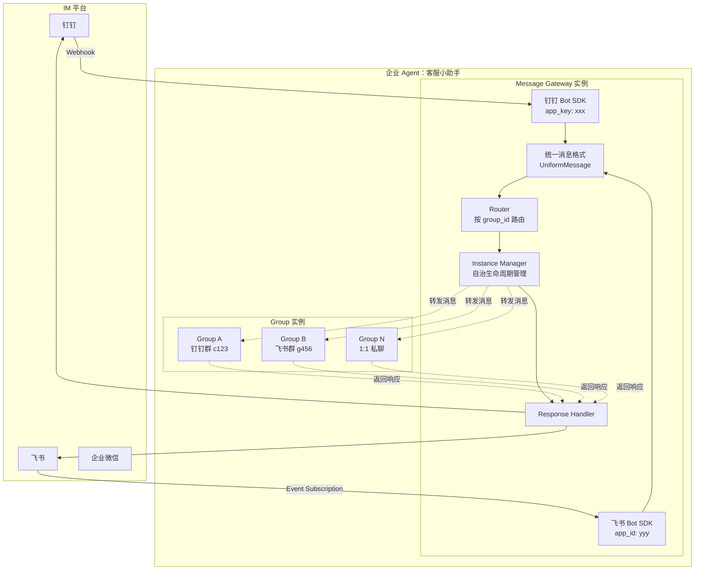

### 4.3 统一消息格式

各 IM 平台消息被 Gateway 归一化为统一格式：

```typescript
interface UniformMessage {
  id: string;                    // 消息唯一 ID
  group_id: string;              // group key: "{platform}:{chat_id}"
  platform: "dingtalk" | "feishu" | "wework";
  chat_type: "group" | "dm";    // 群聊或 1:1
  sender: {
    user_id: string;
    display_name: string;
  };
  content: {
    type: "text" | "file" | "image" | ...;
    text?: string;
    file_url?: string;
  };
  timestamp: number;
  reply_to?: string;             // 引用回复的消息 ID
}
```

> 注意：`agent_id` 不再需要，因为每个 Gateway 实例天然属于一个企业 Agent。

### 4.4 路由与实例管理

Gateway **自主管理** group 实例的生命周期，Management Platform 也可手动创建/销毁实例。

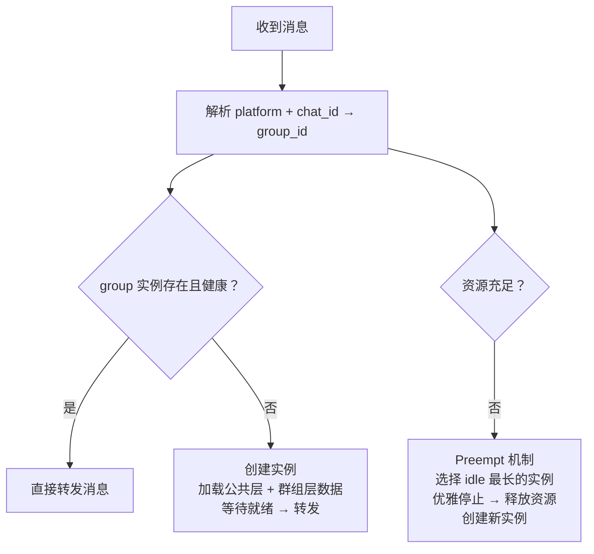

### 4.5 实例生命周期

```mermaid
stateDiagram-v2
    [*] --> Running: 首次消息 / 手动创建
    Running --> Running: 正常处理消息
    Running --> Idle: idle timeout
    Idle --> Running: 收到新消息，重启
    Idle --> Preempted: 资源压力，抢占回收
    Running --> Preempted: 资源压力，抢占回收
    Running --> Stopped: 手动停止
    Preempted --> Stopped: 优雅停止完成
    Idle --> Stopped: 优雅停止
    Stopped --> Running: 收到新消息 / 手动启动
    Stopped --> [*]
```

**管理策略（通过 Management Platform 配置）：**
- `max_instances`：每台机器最大实例数
- `idle_timeout`：空闲多久后停止
- `preempt_strategy`：LRU / 优先级
- `health_check`：定期探测实例健康状态

### 4.6 演进路径

| 阶段 | 部署方式 | 路由方式 |
|------|---------|---------|
| **Phase 1：单机** | Gateway + Group 实例在同一台机器 | Docker network / localhost |
| **Phase 2：多机** | Gateway 和 Group 实例分布在多台机器 | Redis Pub/Sub / NATS 消息总线 |
| **Phase 3：弹性** | K8s 集群 | K8s Service + 自定义 Operator |

### 4.7 Management Platform 的角色

Management Platform **支持手动创建/销毁实例**，同时 Gateway 也可自治管理实例生命周期，其职责为：

- 管理 Agent 镜像（构建/推送/版本）
- 管理企业 Agent 公共层资源（人设/记忆/skill 版本管理与推送）
- 手动创建/销毁/重启实例
- 配置实例管理策略（max_instances、idle_timeout 等）
- 监控实例状态

---

## 5. AI Gateway

### 5.1 职责

AI Gateway 是所有 Agent（个人 + 企业）调用 LLM 和 MCP 服务的统一入口：

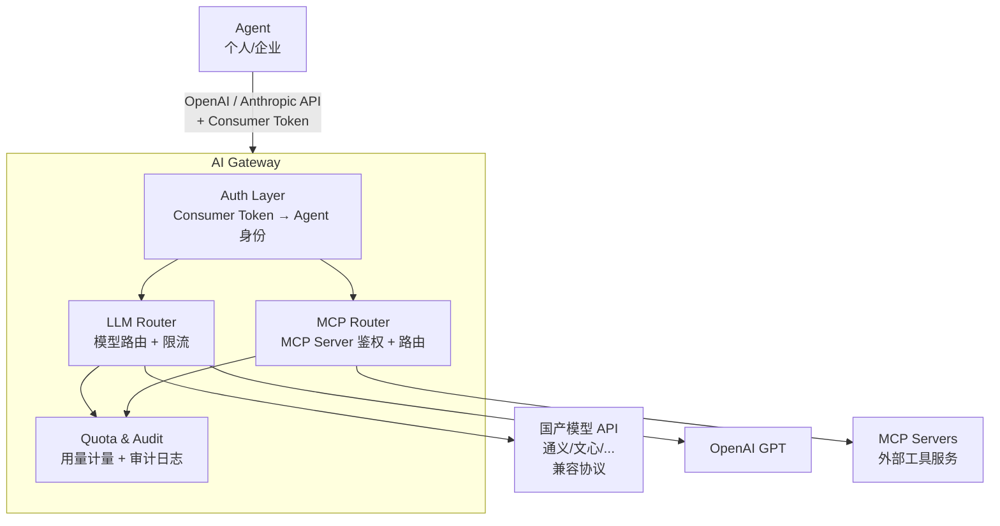

### 5.2 Consumer Token 机制

每个 Agent 分配一个 Consumer Token，用于 AI Gateway 鉴权：

```yaml
consumers:
  - name: "agent-客服小助手"
    token: "hc_xxxx"           # Consumer Token
    agent_id: "agent-kefu"
    agent_type: "enterprise"    # enterprise | personal
    permissions:
      llm:
        - model: "qwen-max"
          rpm_limit: 60
          tpm_limit: 100000
        - model: "gpt-4o"
          rpm_limit: 30
      mcp:
        - server: "web-search"
          allowed_tools: ["search", "extract"]
        - server: "database"
          allowed_tools: ["query"]
    quota:
      daily_llm_tokens: 500000
      monthly_cost_limit: 1000  # USD
```

**安全模型：**
- 真实 API Key 只在 AI Gateway 内部，Agent 只持有 Consumer Token
- AI Gateway 按 Consumer Token 做鉴权、限流、计量
- 支持按 agent / 按 group 粒度的限流

### 5.3 LLM Router

```yaml
routes:
  - name: "qwen-max"
    type: "openai_compatible"
    base_url: "https://dashscope.aliyuncs.com/compatible-mode/v1"
    api_key: "${DASHSCOPE_API_KEY}"    # 从环境变量读取，不暴露给 agent
    models: ["qwen-max", "qwen-plus"]
    fallback: "gpt-4o"                 # 降级模型

  - name: "gpt-4o"
    type: "openai"
    base_url: "https://api.openai.com/v1"
    api_key: "${OPENAI_API_KEY}"
    models: ["gpt-4o", "gpt-4o-mini"]

  - name: "claude-opus"
    type: "anthropic"
    base_url: "https://api.anthropic.com"
    api_key: "${ANTHROPIC_API_KEY}"
    models: ["claude-opus-4-6", "claude-sonnet-4-6"]
```

Agent 使用 OpenAI 或 Anthropic 协议调用，AI Gateway 负责协议转换并转发到正确的后端。

### 5.4 MCP Router

Agent 通过 MCP 协议调用外部工具服务，AI Gateway 作为 MCP Proxy：

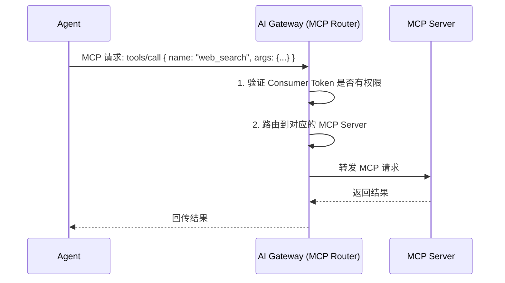

### 5.5 参考实现

- HiClaw 的 Higress AI Gateway + Consumer Token 鉴权
- 或基于 OpenAI/Anthropic 兼容 API 规范自建轻量代理（LiteLLM、One API 等）

---

## 6. 管理平台

### 6.1 功能概览

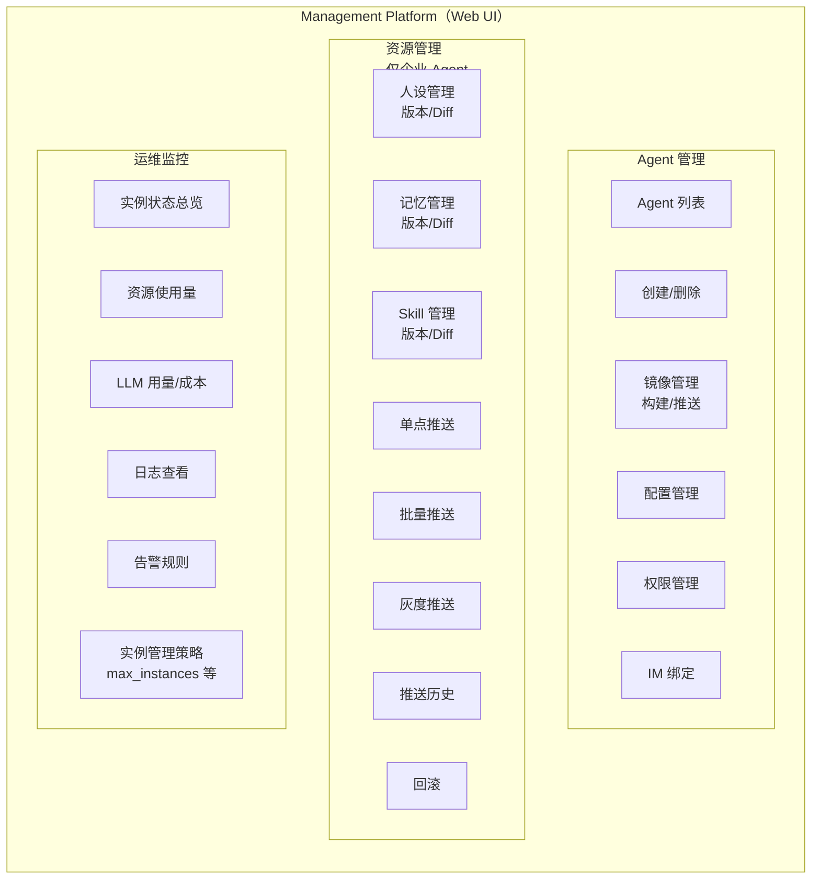

> **注意：** 资源版本管理（人设/记忆/skill）仅适用于**企业 Agent**。个人 Agent 的资源由用户本地自行管理。

### 6.2 Agent 镜像管理（一键部署）

```yaml
agent:
  id: "agent-kefu"
  name: "客服小助手"
  type: "enterprise"           # enterprise | personal
  sdk: "claude-agent-sdk"      # 可选: hermes-python, openai-agent, custom
  image: "registry.local/agents/kefu:v1.2.0"
  config:
    isolation: "container"     # container | process-multi | process-reload
    max_instances: 20
    idle_timeout: "30m"
    preempt_strategy: "lru"
  im_bindings:
    - platform: "dingtalk"
      app_key: "${DINGTALK_APP_KEY}"
    - platform: "feishu"
      app_id: "${FEISHU_APP_ID}"
```

**镜像生命周期：**

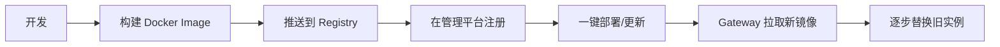

### 6.3 资源版本管理与推送

资源（人设/记忆/skill）通过 Git 管理，管理平台提供 Web 操作界面。

**Git 仓库结构：**

```
agents/
└── agent-kefu/
    ├── shared/                    ← Layer 0 公共层
    │   ├── persona.md
    │   ├── MEMORY.md
    │   └── skills/
    │       ├── faq-answering.md
    │       └── order-query.md
    └── groups/                    ← Layer 1 群组层（可选）
        ├── grp-dingtalk-c123/
        │   ├── MEMORY.md
        │   └── skills/
        │       └── group-specific.md
        └── grp-feishu-g456/
            └── ...
```

**推送流程：**

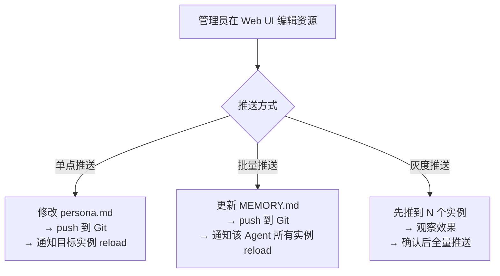

**版本查看：**
- Diff 对比（任意两个版本）
- 回滚到历史版本
- 推送审计日志（谁、何时、推了什么、到哪些实例）

### 6.4 监控与告警

| 指标 | 数据源 |
|------|--------|
| 运行中的实例数 | Message Gateway |
| 实例 CPU/内存 | Docker stats / 进程监控 |
| LLM 调用量/延迟/错误率 | AI Gateway |
| LLM Token 用量 / 成本 | AI Gateway |
| MCP 工具调用统计 | AI Gateway |
| 活跃 group 数 | Message Gateway |
| 消息吞吐量 | Message Gateway |

### 6.5 技术选型建议

| 组件 | 建议 | 理由 |
|------|------|------|
| 前端 | React + Ant Design | 企业级 UI 组件库 |
| 后端 API | Python (FastAPI) | 与 hermes 生态一致 |
| Git 服务 | Gitea | 轻量自托管 |
| 数据库 | PostgreSQL | 对话历史 + 元数据 |
| 对象存储 | MinIO | 资源文件 + 附件 |
| 监控 | Prometheus + Grafana | 标准监控栈 |

---

## 7. 存储架构与数据流

### 7.1 存储分层

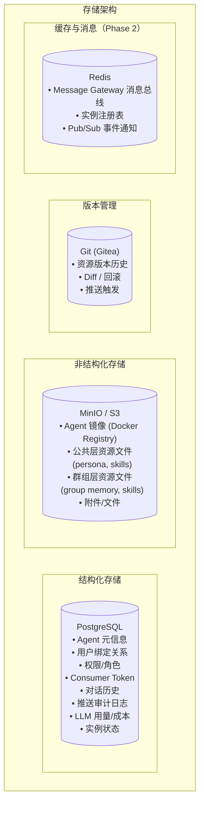

### 7.2 数据流：消息处理全链路

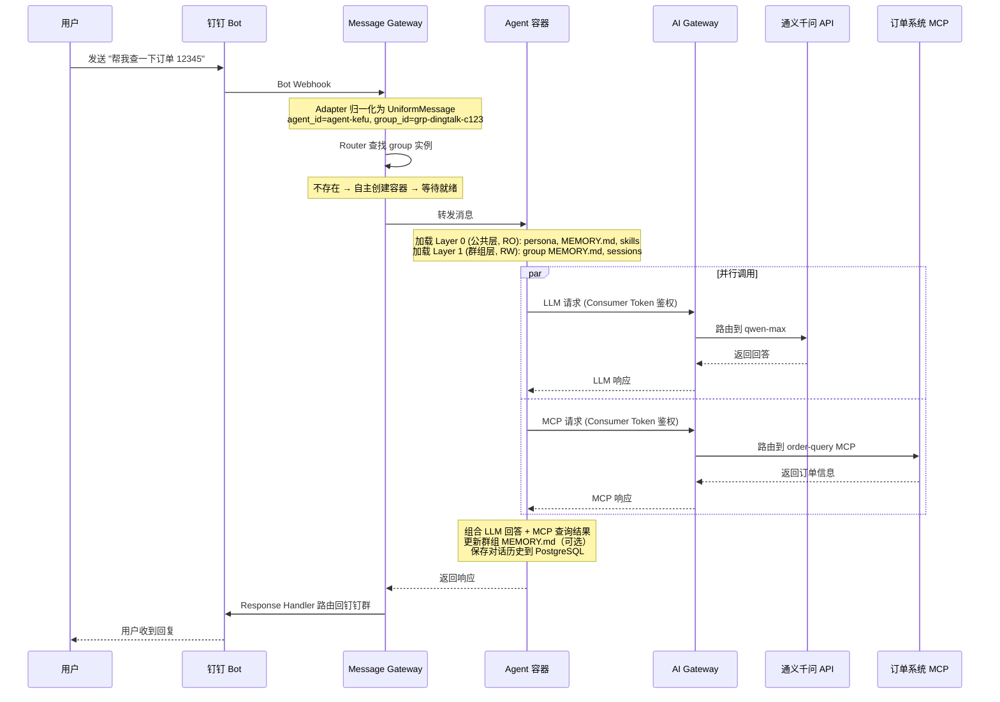

### 7.3 数据流：资源推送

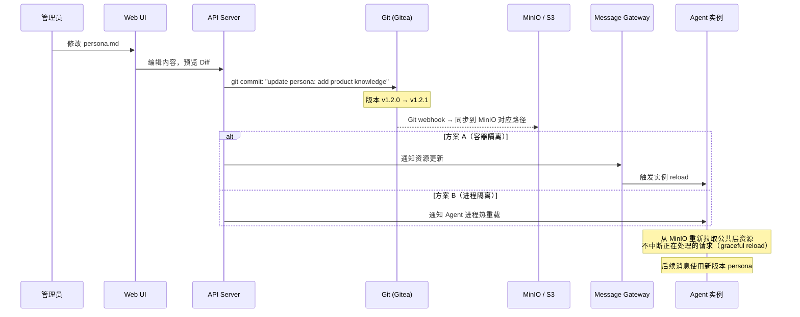

### 7.4 个人 Agent 数据流

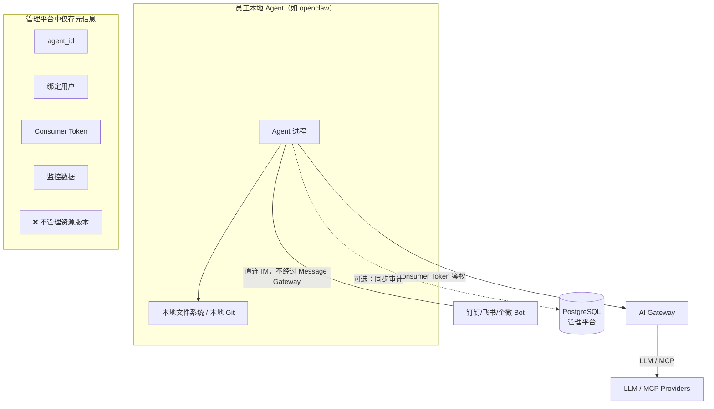

个人 Agent 在管理平台中只存在**元信息**（agent_id、绑定用户、Consumer Token、监控数据），不存在资源版本管理。

---

## 8. 接口总览

### 8.1 子系统间接口

| 来源 | 目标 | 接口 | 协议 |
|------|------|------|------|
| IM 平台 | Message Gateway | 入站消息 | Webhook / WebSocket |
| Message Gateway | IM 平台 | 出站响应 | IM Platform SDK |
| Message Gateway | Agent 实例 | 转发消息 | Docker exec / IPC / HTTP |
| Agent 实例 | Message Gateway | 返回响应 | HTTP callback / IPC |
| Agent 实例 | AI Gateway | LLM 调用 | OpenAI / Anthropic 兼容 API |
| Agent 实例 | AI Gateway | MCP 调用 | MCP 协议 (SSE) |
| Management Platform | Message Gateway | 配置/策略 | REST API |
| Management Platform | Git (Gitea) | 资源版本管理 | Git 协议 |
| Management Platform | PostgreSQL | 元数据查询 | SQL |
| Management Platform | MinIO | 资源文件 | S3 API |
| Management Platform | Docker Registry | 镜像管理 | Docker Registry API |
| Message Gateway | PostgreSQL | 对话历史 | SQL |
| Agent 实例 | PostgreSQL | 对话历史 | SQL |
| Agent 实例 | MinIO | 资源文件 | S3 API |

### 8.2 外部依赖

| 依赖 | 用途 | 备注 |
|------|------|------|
| 钉钉开放平台 | Bot 消息通道 | Webhook |
| 飞书开放平台 | Bot 消息通道 | 事件订阅 |
| 企业微信开放平台 | Bot 消息通道 | 回调 |
| LLM 提供商（通义/文心等） | LLM 推理 | OpenAI/Anthropic 兼容 API |
| OpenAI | LLM 推理 | GPT 模型，OpenAI 协议 |
| Anthropic | LLM 推理 | Claude 模型，Anthropic 协议 |
| MCP Servers | 外部工具服务 | MCP 协议 |
| Docker Registry | Agent 镜像存储 | Docker Registry HTTP API v2 |
