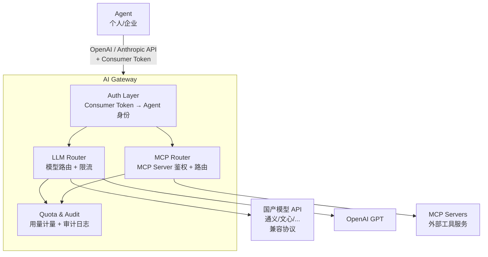
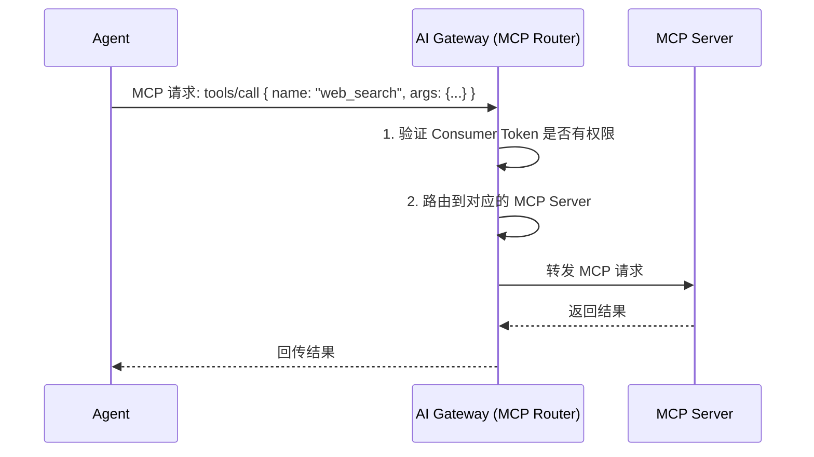
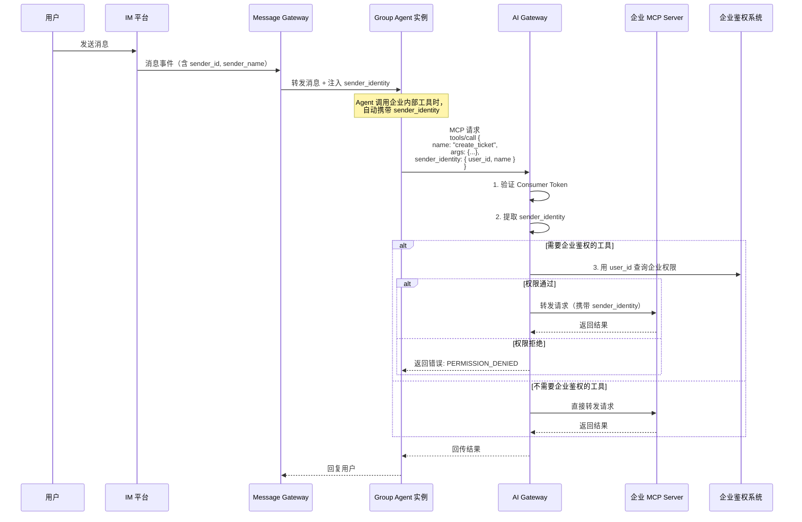

# AI Gateway Design

> 属于 [[Enterprise Agent Platform Overview]] 的子系统设计

## 5. AI Gateway

### 5.1 职责

AI Gateway 是所有 Agent（个人 + 企业）调用 LLM 和 MCP 服务的统一入口：



### 5.2 Consumer Token 机制

每个 Agent 分配一个 Consumer Token，用于 AI Gateway 鉴权：

```yaml
consumers:
  - name: "agent-客服小助手"
    token: "hc_xxxx"           # Consumer Token
    agent_id: "agent-kefu"
    agent_type: "enterprise"    # enterprise | personal
    permissions:
      llm:
        - model: "qwen-max"
          rpm_limit: 60
          tpm_limit: 100000
        - model: "gpt-4o"
          rpm_limit: 30
      mcp:
        - server: "web-search"
          allowed_tools: ["search", "extract"]
        - server: "database"
          allowed_tools: ["query"]
    quota:
      daily_llm_tokens: 500000
      monthly_cost_limit: 1000  # USD
```

**安全模型：**
- 真实 API Key 只在 AI Gateway 内部，Agent 只持有 Consumer Token
- AI Gateway 按 Consumer Token 做鉴权、限流、计量
- 支持按 agent / 按 group 粒度的限流

### 5.3 LLM Router

```yaml
routes:
  - name: "qwen-max"
    type: "openai_compatible"
    base_url: "https://dashscope.aliyuncs.com/compatible-mode/v1"
    api_key: "${DASHSCOPE_API_KEY}"    # 从环境变量读取，不暴露给 agent
    models: ["qwen-max", "qwen-plus"]
    fallback: "gpt-4o"                 # 降级模型

  - name: "gpt-4o"
    type: "openai"
    base_url: "https://api.openai.com/v1"
    api_key: "${OPENAI_API_KEY}"
    models: ["gpt-4o", "gpt-4o-mini"]

  - name: "claude-opus"
    type: "anthropic"
    base_url: "https://api.anthropic.com"
    api_key: "${ANTHROPIC_API_KEY}"
    models: ["claude-opus-4-6", "claude-sonnet-4-6"]
```

Agent 使用 OpenAI 或 Anthropic 协议调用，AI Gateway 负责协议转换并转发到正确的后端。

### 5.4 MCP Router

Agent 通过 MCP 协议调用外部工具服务，AI Gateway 作为 MCP Proxy：



### 5.5 企业工具调用鉴权

Agent 调用企业内部 MCP 工具（如查询内部数据库、创建工单、操作 OA 系统等）时，需要携带原始消息发送者的身份信息，由 AI Gateway 或 MCP Server 进行企业身份鉴权。

**核心思路**：消息发送者的身份从 IM 平台经过 Message Gateway → Agent → AI Gateway 全链路透传，在工具调用时用于权限验证。

#### 5.5.1 身份透传机制



#### 5.5.2 sender_identity 结构

```typescript
interface SenderIdentity {
  platform: "dingtalk" | "feishu" | "wework";
  user_id: string;          // IM 平台的用户 ID
  user_name: string;        // IM 平台的显示名
  group_id: string;         // 来源群组 ID
  message_id: string;       // 原始消息 ID（审计追溯）
  timestamp: number;        // 消息时间戳
}
```

#### 5.5.3 透传路径

```
IM 平台消息事件
  │  sender_id, sender_name
  ▼
Message Gateway → 归一化为 UniformMessage → 注入 SenderIdentity
  │
  ▼
Group Agent 实例 → Agent SDK 持有当前对话的 SenderIdentity
  │  Agent 在调用 MCP 工具时自动注入（程序行为，Agent 无感知）
  ▼
AI Gateway (MCP Router) → 从请求中提取 SenderIdentity → 查询企业鉴权系统
  │
  ▼
企业 MCP Server → 执行工具操作
```

**关键设计：**
- `SenderIdentity` 由 Message Gateway 从 IM 消息中提取，Agent 不可篡改
- 注入是程序行为（类似 nanoclaw 的 `sourceRequestId` 注入），Agent 不需要知道该字段的存在
- 鉴权在 AI Gateway 层统一执行，MCP Server 不需要各自实现鉴权逻辑

#### 5.5.4 企业鉴权配置

```yaml
# AI Gateway 企业鉴权配置
enterprise_auth:
  enabled: true
  # 鉴权方式
  provider: "feishu"          # feishu / dingtalk / wework / custom
  # 鉴权服务地址（custom 类型时使用）
  auth_endpoint: "${ENTERPRISE_AUTH_URL}"
  # 需要鉴权的工具列表（未列出的工具直接放行）
  protected_tools:
    - server: "internal-oa"
      tools: ["create_ticket", "approve_request", "query_salary"]
    - server: "internal-db"
      tools: ["write", "delete"]
  # 不需要鉴权的工具（公开工具，如搜索）
  public_tools:
    - server: "web-search"
      tools: ["*"]
    - server: "knowledge-base"
      tools: ["query"]
  # 鉴权缓存（减少查询频率）
  cache_ttl: 300              # 秒
```

#### 5.5.5 错误处理

鉴权失败时，AI Gateway 返回结构化错误，Agent 可根据错误类型决定如何回复用户：

```json
{
  "content": [
    {
      "type": "text",
      "text": "[工具调用被拒绝] 用户 张三 没有权限执行 create_ticket 操作"
    }
  ],
  "is_error": true,
  "error": {
    "type": "PERMISSION_DENIED",
    "sender": "张三",
    "tool": "create_ticket",
    "reason": "用户不在审批人列表中"
  }
}
```

#### 5.5.6 安全考虑

1. **身份不可伪造**：`SenderIdentity` 由 Message Gateway 从 IM 平台 SDK 事件中提取，Agent 无法修改
2. **最小鉴权**：只在 `protected_tools` 列表中的工具触发鉴权，公开工具直接放行
3. **鉴权缓存**：同一用户的权限查询结果缓存，减少对企业鉴权系统的压力
4. **审计日志**：所有鉴权请求（通过和拒绝）记录到审计日志，支持事后追溯

### 5.6 参考实现

- HiClaw 的 Higress AI Gateway + Consumer Token 鉴权
- 或基于 OpenAI/Anthropic 兼容 API 规范自建轻量代理（LiteLLM、One API 等）

---


## Related

* [[Enterprise Platform Overview]]
* [[Message Gateway Design]]
* [[Management Platform Design]]

## Tags

#enterprise #ai-gateway #llm #mcp #auth
