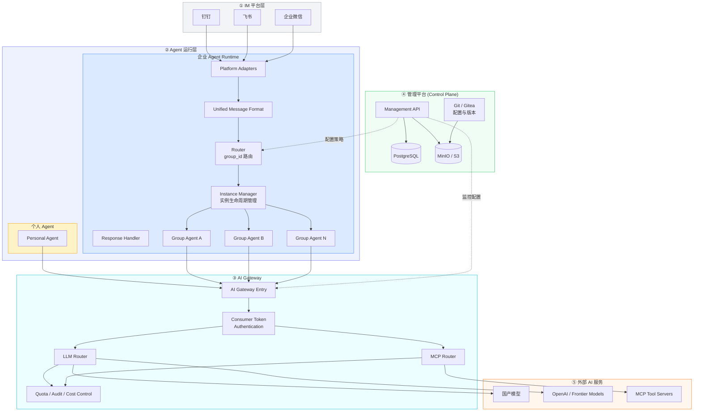
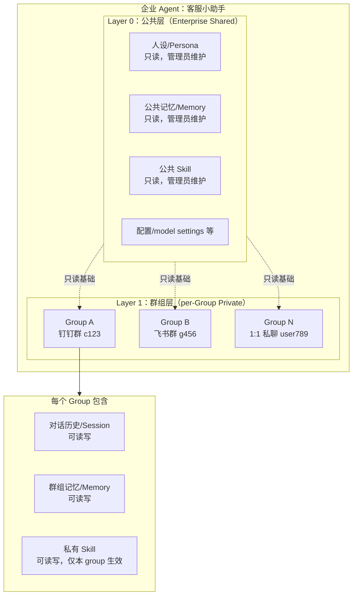
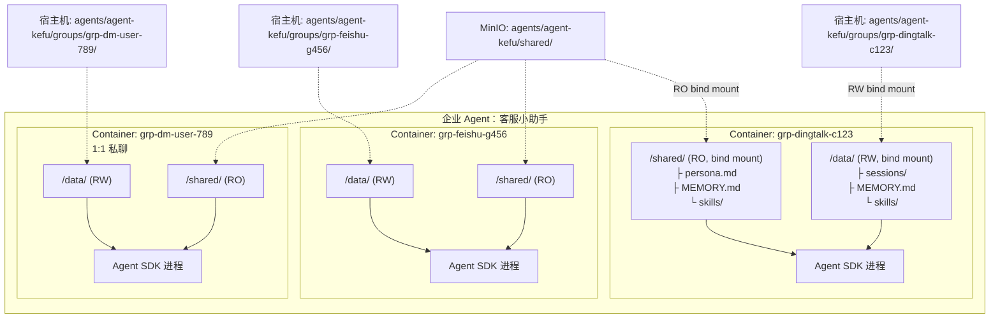
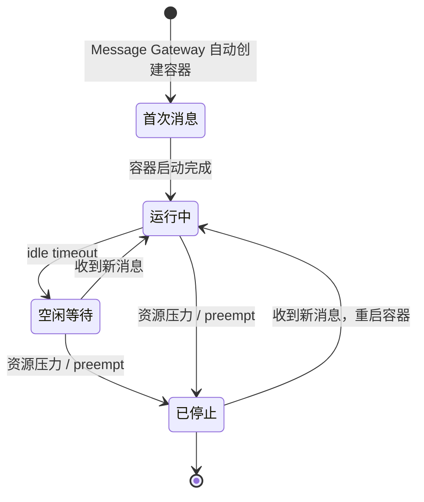
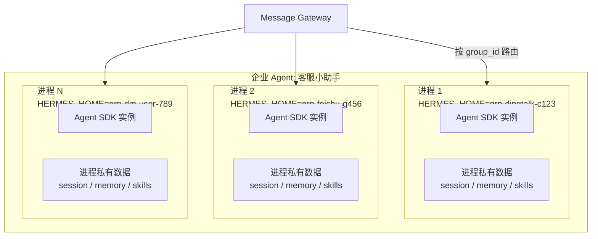
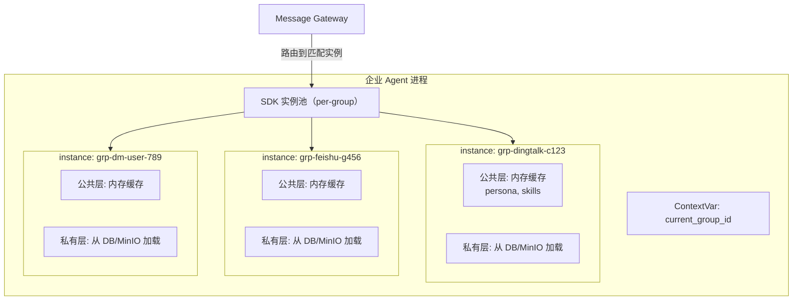

# Enterprise Agent Platform Overview

> 日期：2026-04-14
> 状态：草稿
> 子文档：[[Message Gateway Design]] | [[AI Gateway Design]] | [[Memory Service Design]] | [[Management Platform Design]] | [[Storage Architecture]]

## 1. 概述

### 1.1 平台目标

构建一个企业级 Agent 平台，支持两类 Agent：

- **个人 Agent**：与员工身份绑定，作为私人助理（类似 openclaw）。不需要 group 隔离，直连 IM 平台，共享 AI Gateway。
- **企业 Agent**：独立的数字员工，可响应多个用户的私聊请求，也可在多个群中响应用户请求。需要 group 级别的数据隔离。

### 1.2 核心需求

| 需求 | 说明 |
|------|------|
| 多 SDK 混合 | 平台层抽象统一接口，不同 Agent 可使用不同 SDK |
| IM 平台 | 钉钉、飞书、企业微信 |
| 部署方式 | Docker 先行，预留 K8s 演进路径 |
| 管理平台 | Web UI 管理后台 |
| LLM 支持 | 国产模型（通义/文心等）、OpenAI GPT、Anthropic Claude、OpenAI/Anthropic 兼容协议 |
| MCP 协议 | Agent 通过 MCP 协议调用外部工具服务 |
| 存储 | 混合方案：PostgreSQL（对话历史/元数据）+ MinIO/S3（资源文件） |
| 版本管理 | 基于 Git 的资源版本管理（仅企业 Agent） |
| 个人 Agent | 无 group 隔离，平台不管理其资源版本，用户自行管理 |

### 1.3 参考项目

| 项目 | 参考内容 |
|------|---------|
| NanoClaw | 容器级 group 隔离、凭证代理（AI Gateway）、Claude Agent SDK |
| HiClaw | 消息网关（Matrix/Tuwunel）、AI 网关（Higress + Consumer Token）、Manager-Worker 架构 |
| Hermes | Profile 进程隔离、group 隔离设计（ContextVar vs per-group 进程） |

---

## 2. 系统总体架构

### 2.1 系统全景

### 2.2 子系统职责

| 子系统 | 职责 | 对外接口 |
|--------|------|---------|
| **Management Platform** | Agent 生命周期管理、企业 Agent 资源版本管理与推送、镜像管理、监控 | REST API（管理前端 + Message Gateway 调用）、Git 协议 |
| **Message Gateway** | 每个企业 Agent 一个实例，持有 IM Bot SDK，接收消息并路由到对应 group 实例 | IM Platform API（入站）、Agent IPC（出站） |
| **Agent Runtime** | 运行 agent 实例，加载人设/记忆/skill，调用 LLM/MCP | Agent SDK API（Gateway 入站）、AI Gateway API（出站） |
| **AI Gateway** | LLM/MCP 调用的集中鉴权、路由、限流、计量 | OpenAI/Anthropic 兼容 API（给 Agent）、MCP Proxy |
| **Memory Service** | 对话记忆的提取、存储、检索与定期总结更新 | REST API（给 Agent Runtime）、Cron 触发 |
| **Storage** | PostgreSQL（对话历史/元数据）、MinIO/S3（资源/附件）、Git（版本管理） | SQL / S3 API / Git 协议 |

### 2.3 Agent 类型对比

| | 个人 Agent | 企业 Agent |
|---|---|---|
| 绑定对象 | 1 个员工 | 1 个企业（数字员工身份） |
| 消息接入 | 直连 IM 平台 | 通过 Message Gateway |
| Group 隔离 | 不需要 | 需要（多人多群） |
| 共享层 | 无（全部私有） | 公共人设/记忆/skill（管理员维护，只读） |
| 私有层 | 全部（用户自行管理） | per-group：session/记忆/skill（可读写） |
| 运行实例 | 1 个容器/进程 | 多个 group 实例 |
| 资源版本管理 | 用户本地自行管理 | 通过管理平台（Git） |
| 管理平台中的角色 | 仅元信息（agent_id、用户绑定、监控、Consumer Token） | 完整管理（元信息 + 资源 + 镜像 + 监控） |

---

## 3. 企业 Agent 的 Group 隔离设计

### 3.1 数据分层

每个企业 Agent 的数据分为两层：

### 3.2 方案 A：容器级隔离

每个 group 运行在独立容器中。公共层以只读方式挂载，群组层以读写方式挂载。

**容器路径映射：**

| 容器内路径 | 宿主机路径 | 读写 |
|-----------|-----------|------|
| `/shared/` | `agents/{agent_id}/shared/`（MinIO 同步） | RO |
| `/data/` | `agents/{agent_id}/groups/{group_id}/` | RW |

**生命周期：**

**优势：**
- OS 级隔离（最强）
- 多 SDK 天然支持（容器完全隔离）
- K8s 演进路径清晰（容器直接映射为 Pod）
- 个人 Agent 可复用同一模型（1 容器 = 1 group）

**劣势：**
- 资源开销高（每个 group 一个容器）
- 冷启动秒级
- 不支持热重载（需重建容器）

### 3.3 方案 B：进程级隔离

每个企业 Agent 对应一个或多个进程，通过进程级别的 `HERMES_HOME` 环境变量或 ContextVar 实现 group 隔离。

#### B1：多进程（每 group 一个进程）

- 每个 group 一个独立进程，`HERMES_HOME` 指向各自的 group 数据目录
- 进程级隔离，crash 不影响其他 group
- 参考 Hermes 的 profile 隔离策略
- Message Gateway 按 group_id 路由到对应进程

#### B2：单进程多实例（进程内逻辑隔离）

- 一个进程内维护多个 SDK 实例，通过 ContextVar 切换当前 group 上下文
- 实例长期驻留，数据常驻内存
- 同进程内 crash 互相影响

### 3.4 方案对比

| | A: 容器隔离 | B1: 多进程 | B2: 单进程多实例 |
|---|---|---|---|
| 隔离强度 | OS 级 | 进程级 | 进程内逻辑隔离 |
| 内存开销 | 高（每 group 一个容器） | 中（每 group 一个进程） | 低（多实例共享进程） |
| 冷启动 | 秒级 | 毫秒级 | 无 |
| 多机扩展 | 容器编排天然支持 | 需 sharding + 消息队列 | 需 sharding + 消息队列 |
| 故障隔离 | 最强 | 强（进程 crash 不互相影响） | 弱（同进程 crash 连带） |

### 3.5 选型策略

三种方案不互斥，可按实际需求选择：

| 需求 | 推荐方案 |
|------|---------|
| 安全性要求高，资源充足 | 方案 A：容器隔离 |
| 需要进程级故障隔离，资源适中 | 方案 B1：多进程 |
| group 数量多，资源有限 | 方案 B2：单进程多实例 |

---

## Related

* [[Message Gateway Design]]
* [[AI Gateway Design]]
* [[Memory Service Design]]
* [[Management Platform Design]]
* [[Storage Architecture]]
* [[Enterprise Agent Service Model]]
* [[Group Isolation Design]]

## Tags

#enterprise #platform #architecture #overview
