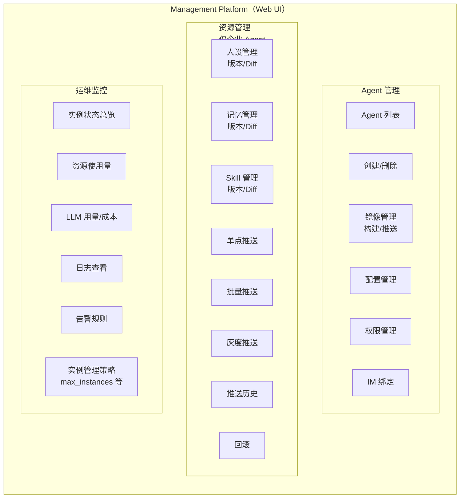
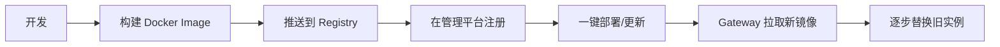
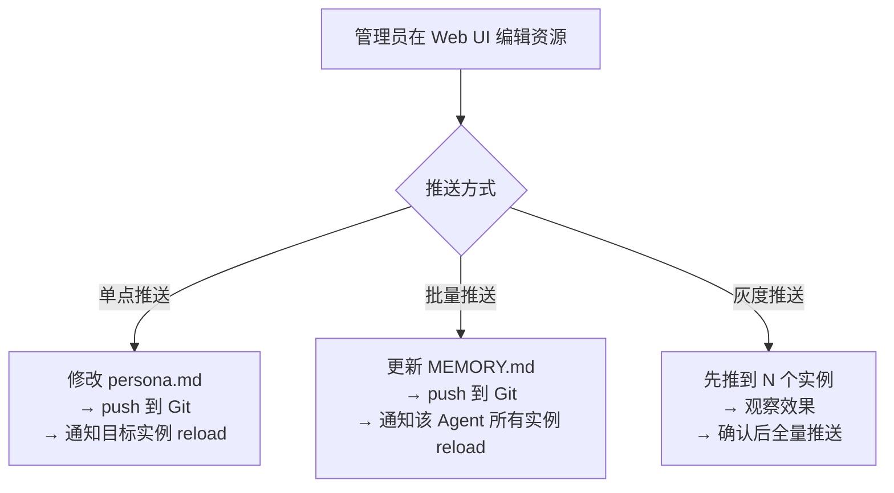

# Management Platform Design

> 属于 [[Enterprise Agent Platform Overview]] 的子系统设计

## 7. 管理平台

### 6.1 功能概览



> **注意：** 资源版本管理（人设/记忆/skill）仅适用于**企业 Agent**。个人 Agent 的资源由用户本地自行管理。

### 6.2 Agent 镜像管理（一键部署）

```yaml
agent:
  id: "agent-kefu"
  name: "客服小助手"
  type: "enterprise"           # enterprise | personal
  sdk: "claude-agent-sdk"      # 可选: hermes-python, openai-agent, custom
  image: "registry.local/agents/kefu:v1.2.0"
  config:
    isolation: "container"     # container | process-multi | process-reload
    max_instances: 20
    idle_timeout: "30m"
    preempt_strategy: "lru"
  im_bindings:
    - platform: "dingtalk"
      app_key: "${DINGTALK_APP_KEY}"
    - platform: "feishu"
      app_id: "${FEISHU_APP_ID}"
```

**镜像生命周期：**



### 6.3 资源版本管理与推送

资源（人设/记忆/skill）通过 Git 管理，管理平台提供 Web 操作界面。

**Git 仓库结构：**

```
agents/
└── agent-kefu/
    ├── shared/                    ← Layer 0 公共层
    │   ├── persona.md
    │   ├── MEMORY.md
    │   └── skills/
    │       ├── faq-answering.md
    │       └── order-query.md
    └── groups/                    ← Layer 1 群组层（可选）
        ├── grp-dingtalk-c123/
        │   ├── MEMORY.md
        │   └── skills/
        │       └── group-specific.md
        └── grp-feishu-g456/
            └── ...
```

**推送流程：**



**版本查看：**
- Diff 对比（任意两个版本）
- 回滚到历史版本
- 推送审计日志（谁、何时、推了什么、到哪些实例）

### 6.4 监控与告警

| 指标 | 数据源 |
|------|--------|
| 运行中的实例数 | Message Gateway |
| 实例 CPU/内存 | Docker stats / 进程监控 |
| LLM 调用量/延迟/错误率 | AI Gateway |
| LLM Token 用量 / 成本 | AI Gateway |
| MCP 工具调用统计 | AI Gateway |
| 活跃 group 数 | Message Gateway |
| 消息吞吐量 | Message Gateway |

### 6.5 技术选型建议

| 组件 | 建议 | 理由 |
|------|------|------|
| 前端 | React + Ant Design | 企业级 UI 组件库 |
| 后端 API | Python (FastAPI) | 与 hermes 生态一致 |
| Git 服务 | Gitea | 轻量自托管 |
| 数据库 | PostgreSQL | 对话历史 + 元数据 |
| 对象存储 | MinIO | 资源文件 + 附件 |
| 监控 | Prometheus + Grafana | 标准监控栈 |

---


## Related

* [[Enterprise Platform Overview]]
* [[Storage Architecture]]
* [[AI Gateway Design]]
* [[Message Gateway Design]]

## Tags

#enterprise #management #monitoring #git
