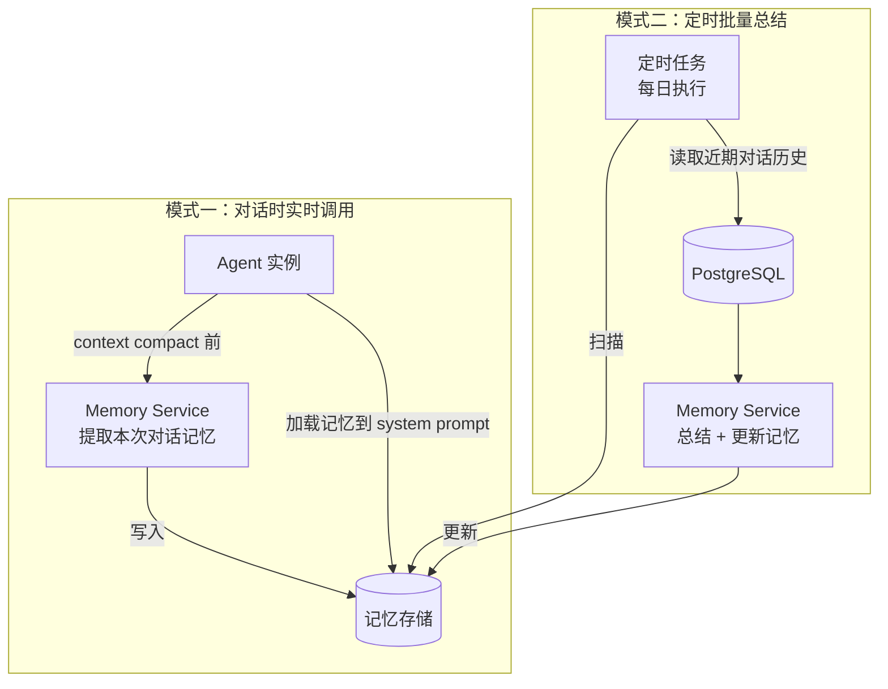
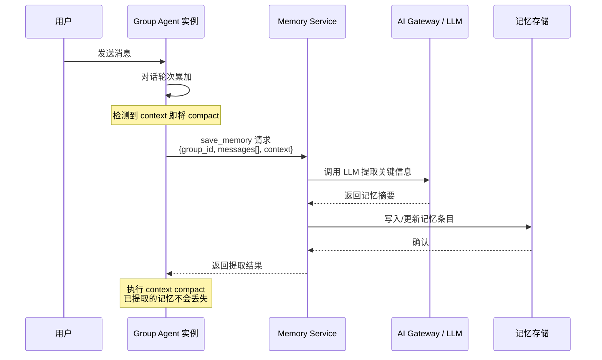
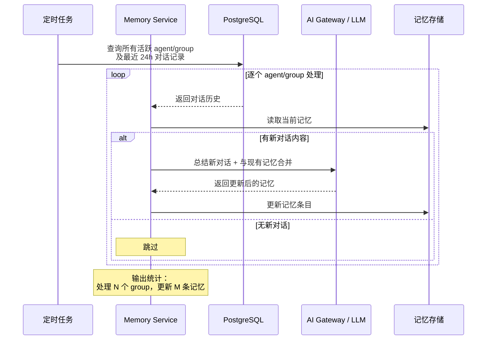
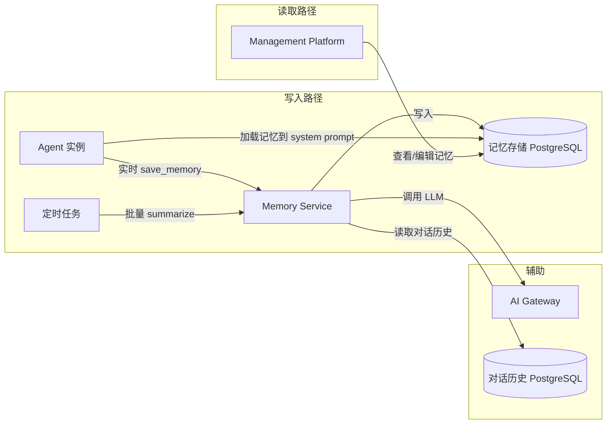

# Memory Service Design

> 属于 [[Enterprise Agent Platform Overview]] 的子系统设计

## 6. Memory Service

### 6.1 定位

Memory Service 是独立于 Agent 实例的记忆管理服务，负责对话记忆的提取、存储、检索与定期总结更新。企业 Agent 的每个 group 和个人 Agent 都有各自独立的记忆空间。

### 6.2 两种调用模式



#### 模式一：对话时实时调用

Agent 在处理对话过程中，当上下文即将达到限制需要执行 context compact（上下文压缩）之前，调用 Memory Service 将当前对话中的重要信息提取并持久化到记忆存储。



**触发时机：**
- Agent 检测到对话轮次或 token 数接近 context window 上限时
- 在 context compact 执行之前调用，确保关键信息不丢失

#### 模式二：定时批量总结

每日定时扫描所有 agent/group 的近期对话历史，使用 LLM 进行总结，更新对应记忆。



**触发时机：**
- 每日固定时间执行（如凌晨 2:00）
- 可通过 Management Platform 配置执行时间和扫描范围

### 6.3 记忆存储结构

```sql
CREATE TABLE memories (
    id            BIGSERIAL PRIMARY KEY,
    agent_id      VARCHAR(64)  NOT NULL,       -- 企业/个人 agent ID
    group_id      VARCHAR(128) NOT NULL,       -- group key（个人 agent 固定值）
    category      VARCHAR(32)  NOT NULL,       -- 类别：fact / preference / instruction / summary
    content       TEXT         NOT NULL,       -- 记忆内容
    source_type   VARCHAR(16)  NOT NULL,       -- 来源：realtime / scheduled
    source_refs   JSONB,                        -- 来源引用（消息 ID 列表）
    importance    SMALLINT     NOT NULL DEFAULT 5,  -- 重要程度 1-10
    token_count   INT,                          -- 该记忆的 token 用量
    created_at    TIMESTAMPTZ  NOT NULL DEFAULT NOW(),
    updated_at    TIMESTAMPTZ  NOT NULL DEFAULT NOW(),
    expires_at    TIMESTAMPTZ,                  -- 过期时间（NULL 表示不过期）
    is_active     BOOLEAN      NOT NULL DEFAULT TRUE
);

-- 核心查询索引
CREATE INDEX idx_memory_agent_group
    ON memories (agent_id, group_id, category, is_active);
CREATE INDEX idx_memory_importance
    ON memories (agent_id, group_id, importance DESC);
```

**记忆类别：**

| category | 说明 | 示例 |
|----------|------|------|
| `fact` | 事实信息 | "张三负责华东区销售，电话 138xxxx" |
| `preference` | 用户偏好 | "用户喜欢简洁的回答风格" |
| `instruction` | 用户指令 | "每周一早上生成周报" |
| `summary` | 对话总结 | "本周处理了 15 个工单，解决了 3 个客诉" |

### 6.4 Memory Service API

```yaml
# REST API
endpoints:
  # 模式一：Agent 实时调用
  POST /api/memory/save:
    description: 提取并保存对话记忆
    params:
      agent_id: string
      group_id: string
      messages: array          # 需要提取的对话消息列表
      context: string          # 当前对话上下文（辅助提取）
    response:
      saved: int               # 新增记忆条数
      updated: int             # 更新记忆条数
      tokens_used: int         # LLM 消耗的 token 数

  GET /api/memory/load:
    description: 加载指定 group 的活跃记忆
    params:
      agent_id: string
      group_id: string
      max_tokens: int          # 返回记忆的最大 token 数（用于控制 system prompt 长度）
    response:
      memories: array          # 记忆条目列表，按 importance 排序
      total_tokens: int        # 总 token 数

  # 模式二：定时任务调用
  POST /api/memory/summarize:
    description: 触发指定 agent/group 的记忆总结更新
    params:
      agent_id: string
      group_id?: string        # 不传则总结该 agent 所有 group
      since: string            # ISO 时间戳，只总结该时间之后的对话
    response:
      processed_groups: int
      updated_memories: int
```

### 6.5 记忆加载策略

Agent 启动或 context compact 后重新加载记忆时，需要控制记忆总量以避免占用过多 context window：

```yaml
memory_config:
  max_tokens: 2000             # 记忆最大占用 token 数
  max_age_days: 90             # 超过 90 天的记忆自动降权或归档
  category_weights:            # 不同类别记忆的优先级
    instruction: 10            # 用户指令优先级最高，始终加载
    fact: 7
    preference: 5
    summary: 3                 # 总结类记忆优先级最低
  dedup: true                  # 对相似记忆去重，避免重复内容
```

**加载流程：**

```
1. 查询所有 is_active=true 的记忆
2. 按 importance × category_weight 排序
3. 累积 token 数直到达到 max_tokens 上限
4. 低于阈值的记忆被跳过（留给下次 compact 时补充）
5. 注入到 Agent 的 system prompt 中
```

### 6.6 与现有系统的关系



- **Memory Service 通过 AI Gateway 调用 LLM**（提取/总结记忆需要 LLM 能力）
- **Memory Service 读取对话历史**（从 PostgreSQL 的 `agent_{enterprise_id}_messages` 表）
- **Management Platform 可查看和编辑记忆**（作为资源管理的一部分）

---


## Related

* [[Enterprise Platform Overview]]
* [[AI Gateway Design]]
* [[Storage Architecture]]
* [[Group Chat Memory Mechanism]]
* [[Clawith Memory Analysis]]

## Tags

#enterprise #memory #service #design
