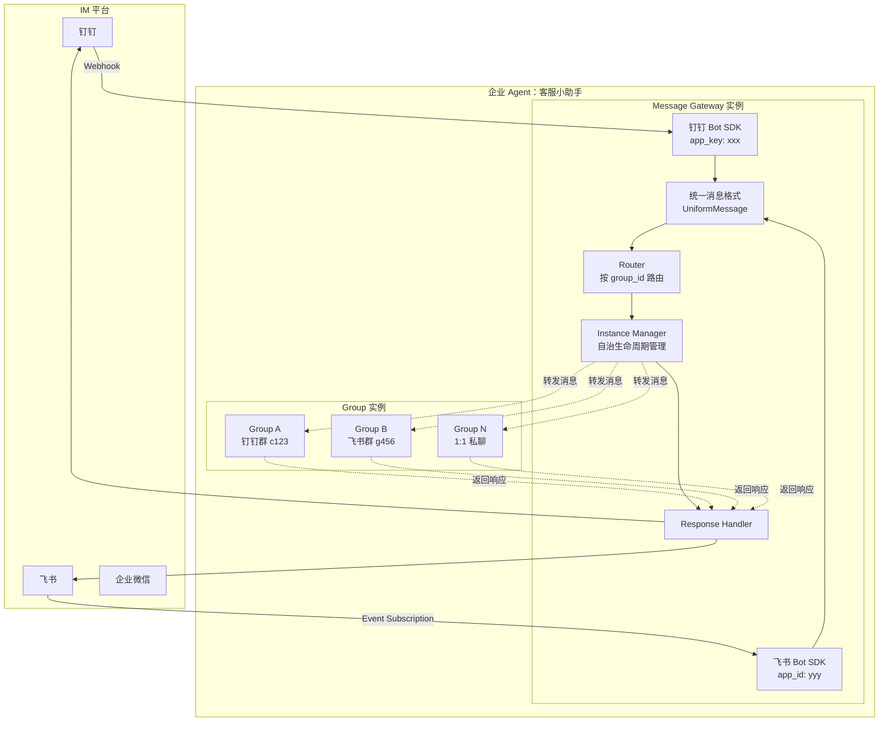
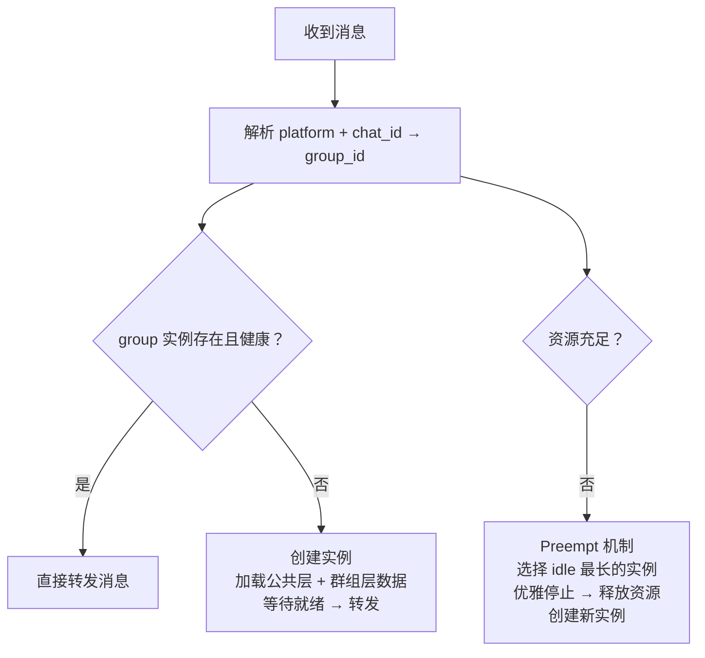
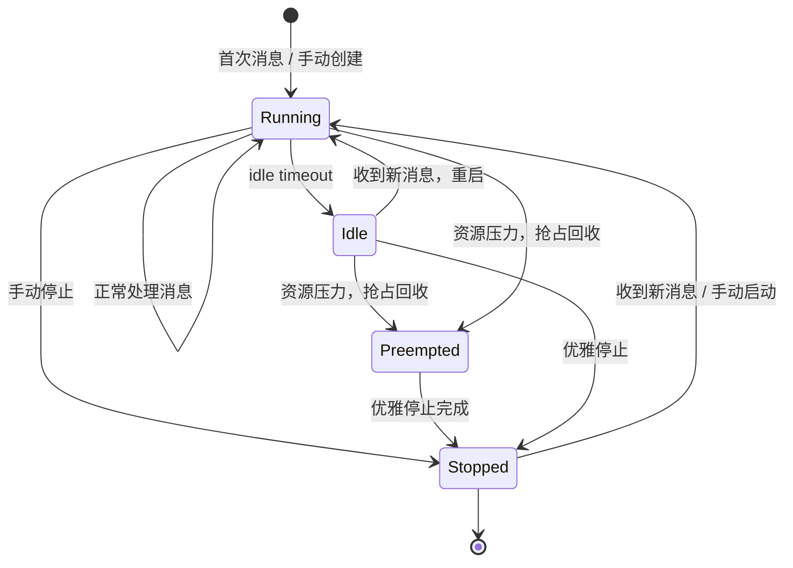

# Message Gateway Design

> 属于 [[Enterprise Agent Platform Overview]] 的子系统设计

## 4. Message Gateway

### 4.1 定位

**每个企业 Agent 部署一个 Message Gateway 实例**，它是企业 Agent 的组成部分（而非独立的共享组件）。个人 Agent 直连 IM 平台，不经过 Message Gateway。

一个企业 Agent 的完整部署单元：

```
企业 Agent = Message Gateway 实例 + Group 实例（0..N）
                │
                ├── 钉钉 Bot SDK 实例（对应钉钉上的一个机器人）
                ├── 飞书 Bot SDK 实例（对应飞书上的一个机器人）
                └── 企微 Bot SDK 实例（对应企微上的一个机器人）
```

### 4.2 架构图



### 4.3 统一消息格式

各 IM 平台消息被 Gateway 归一化为统一格式：

```typescript
interface UniformMessage {
  id: string;                    // 消息唯一 ID
  group_id: string;              // group key: "{platform}:{chat_id}"
  platform: "dingtalk" | "feishu" | "wework";
  chat_type: "group" | "dm";    // 群聊或 1:1
  sender: {
    user_id: string;
    display_name: string;
  };
  content: {
    type: "text" | "file" | "image" | ...;
    text?: string;
    file_url?: string;
  };
  timestamp: number;
  reply_to?: string;             // 引用回复的消息 ID
}
```

> 注意：`agent_id` 不再需要，因为每个 Gateway 实例天然属于一个企业 Agent。

### 4.4 路由与实例管理

Gateway **自主管理** group 实例的生命周期，Management Platform 也可手动创建/销毁实例。



### 4.5 实例生命周期



**管理策略（通过 Management Platform 配置）：**
- `max_instances`：每台机器最大实例数
- `idle_timeout`：空闲多久后停止
- `preempt_strategy`：LRU / 优先级
- `health_check`：定期探测实例健康状态

### 4.6 演进路径

| 阶段 | 部署方式 | 路由方式 |
|------|---------|---------|
| **Phase 1：单机** | Gateway + Group 实例在同一台机器 | Docker network / localhost |
| **Phase 2：多机** | Gateway 和 Group 实例分布在多台机器 | Redis Pub/Sub / NATS 消息总线 |
| **Phase 3：弹性** | K8s 集群 | K8s Service + 自定义 Operator |

### 4.7 Management Platform 的角色

Management Platform **支持手动创建/销毁实例**，同时 Gateway 也可自治管理实例生命周期，其职责为：

- 管理 Agent 镜像（构建/推送/版本）
- 管理企业 Agent 公共层资源（人设/记忆/skill 版本管理与推送）
- 手动创建/销毁/重启实例
- 配置实例管理策略（max_instances、idle_timeout 等）
- 监控实例状态

---


## Related

* [[Enterprise Platform Overview]]
* [[AI Gateway Design]]
* [[Group Isolation Design]]
* [[Hermes Distributed Architecture]]
* [[Multi Agent Isolation]]

## Tags

#enterprise #message-gateway #routing #im
