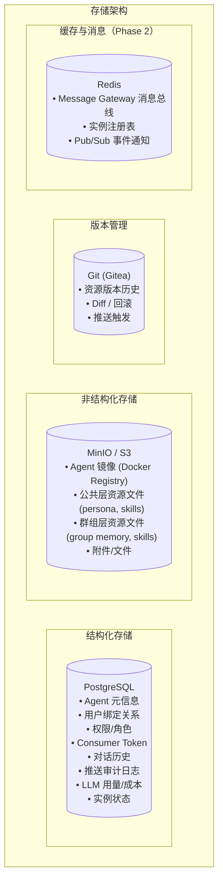
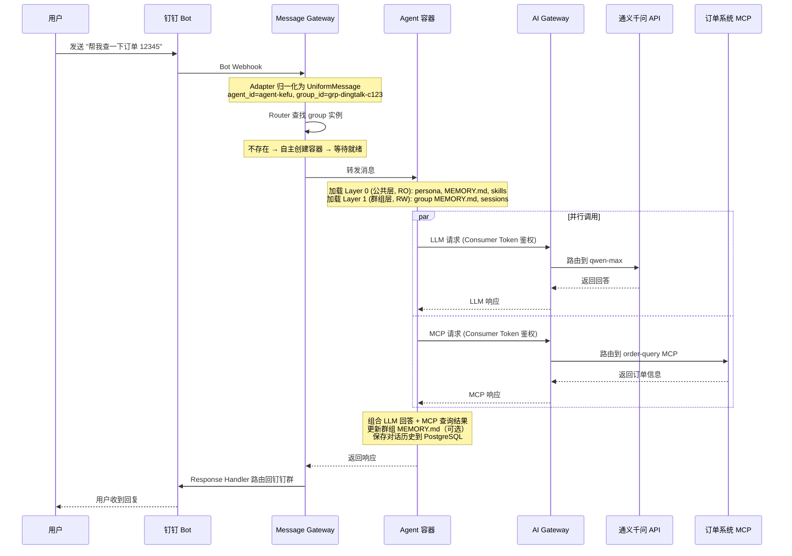
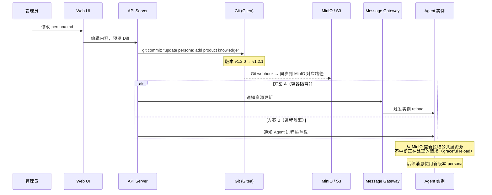
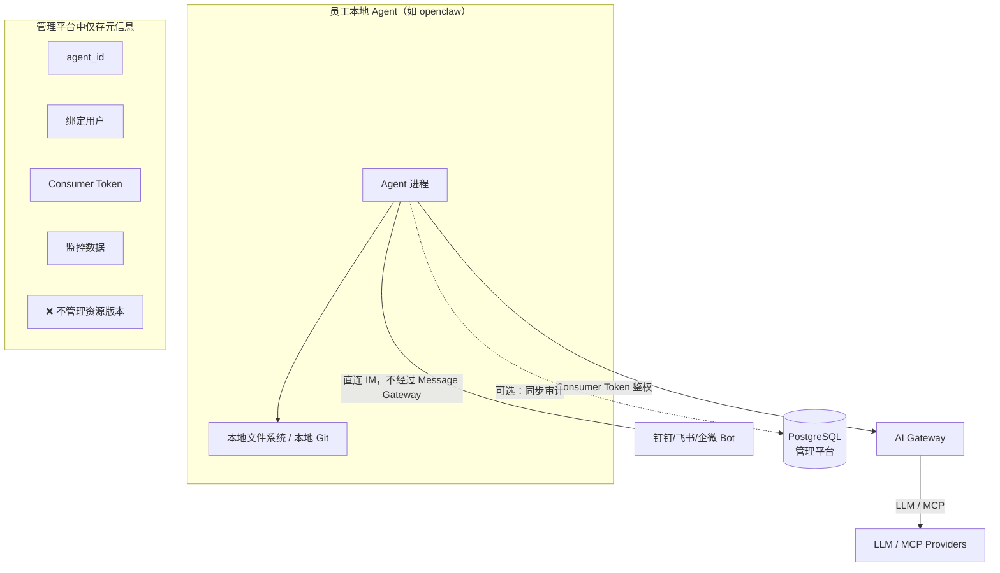

# Storage Architecture

> 属于 [[Enterprise Agent Platform Overview]] 的子系统设计

## 8. 存储架构与数据流

### 8.1 存储分层



### 8.2 对话历史存储

每个企业的对话历史存在一张独立的 PostgreSQL 表中，按 `agent_id` 和 `group_id` 区分查询。

**表结构：**

```sql
CREATE TABLE agent_{enterprise_id}_messages (
    id            BIGSERIAL PRIMARY KEY,
    agent_id      VARCHAR(64)  NOT NULL,       -- 企业 agent ID
    group_id      VARCHAR(128) NOT NULL,       -- group key: "{platform}:{chat_id}"
    platform      VARCHAR(16)  NOT NULL,       -- dingtalk / feishu / wework
    chat_type     VARCHAR(8)   NOT NULL,       -- group / dm
    role          VARCHAR(16)  NOT NULL,       -- user / assistant / system
    sender_id     VARCHAR(64),                 -- 发送者 user_id（user 角色时）
    sender_name   VARCHAR(128),                -- 发送者 display_name
    content_type  VARCHAR(16)  NOT NULL,       -- text / image / file / ...
    content_text  TEXT,                         -- 文本内容
    content_meta  JSONB,                        -- 附件 URL、文件名等元数据
    token_count   INT,                          -- 该消息的 token 用量
    model         VARCHAR(64),                 -- 使用的 LLM 模型
    created_at    TIMESTAMPTZ  NOT NULL DEFAULT NOW(),

    -- 按时间和群组查询
    CONSTRAINT uq_message_id UNIQUE (id)
);

-- 核心查询索引
CREATE INDEX idx_agent_group_time
    ON agent_{enterprise_id}_messages (agent_id, group_id, created_at);
```

**关键设计：**

- **一企一表**：每个企业一张独立的消息表，天然数据隔离，便于独立备份/归档/清理
- **按 group 隔离**：所有查询通过 `(agent_id, group_id)` 过滤，同一企业不同 group 的对话完全隔离
- **管理平台查询**：管理平台可跨 group 统计分析（按 `agent_id` 聚合），也可查看指定 group 的对话详情
- **写入路径**：Agent 实例在每次对话完成后写入，或由 Message Gateway 统一写入

### 8.3 数据流：消息处理全链路



### 8.4 数据流：资源推送



### 8.5 个人 Agent 数据流



个人 Agent 在管理平台中只存在**元信息**（agent_id、绑定用户、Consumer Token、监控数据），不存在资源版本管理。

---

## 9. 接口总览

### 9.1 子系统间接口

| 来源 | 目标 | 接口 | 协议 |
|------|------|------|------|
| IM 平台 | Message Gateway | 入站消息 | Webhook / WebSocket |
| Message Gateway | IM 平台 | 出站响应 | IM Platform SDK |
| Message Gateway | Agent 实例 | 转发消息 | Docker exec / IPC / HTTP |
| Agent 实例 | Message Gateway | 返回响应 | HTTP callback / IPC |
| Agent 实例 | AI Gateway | LLM 调用 | OpenAI / Anthropic 兼容 API |
| Agent 实例 | AI Gateway | MCP 调用 | MCP 协议 (SSE) |
| Management Platform | Message Gateway | 配置/策略 | REST API |
| Management Platform | Git (Gitea) | 资源版本管理 | Git 协议 |
| Management Platform | PostgreSQL | 元数据查询 | SQL |
| Management Platform | MinIO | 资源文件 | S3 API |
| Management Platform | Docker Registry | 镜像管理 | Docker Registry API |
| Message Gateway | PostgreSQL | 对话历史 | SQL |
| Agent 实例 | Memory Service | 保存/加载记忆 | REST API |
| 定时任务 | Memory Service | 批量总结记忆 | REST API |
| Memory Service | AI Gateway | 调用 LLM 提取/总结 | OpenAI / Anthropic 兼容 API |
| Memory Service | PostgreSQL | 读取对话历史、存储记忆 | SQL |
| Agent 实例 | PostgreSQL | 对话历史 | SQL |
| Agent 实例 | MinIO | 资源文件 | S3 API |

### 9.2 外部依赖

| 依赖 | 用途 | 备注 |
|------|------|------|
| 钉钉开放平台 | Bot 消息通道 | Webhook |
| 飞书开放平台 | Bot 消息通道 | 事件订阅 |
| 企业微信开放平台 | Bot 消息通道 | 回调 |
| LLM 提供商（通义/文心等） | LLM 推理 | OpenAI/Anthropic 兼容 API |
| OpenAI | LLM 推理 | GPT 模型，OpenAI 协议 |
| Anthropic | LLM 推理 | Claude 模型，Anthropic 协议 |
| MCP Servers | 外部工具服务 | MCP 协议 |
| Docker Registry | Agent 镜像存储 | Docker Registry HTTP API v2 |

## Related

* [[Enterprise Platform Overview]]
* [[Memory Service Design]]
* [[Management Platform Design]]
* [[Message Gateway Design]]

## Tags

#enterprise #storage #postgresql #minio #data-flow
